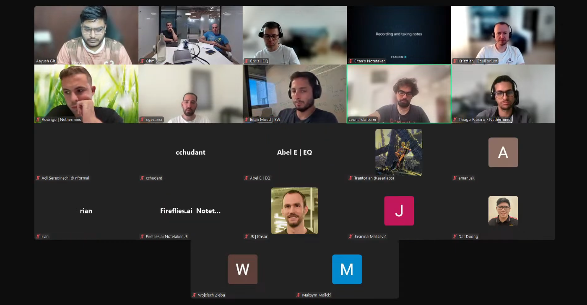

# Starknet All Core Devs Meeting #31
## Meeting Details

- **Date & Time:** Thursday, July 17, 2025, 11:00-11:30 AM UTC
- **Duration:** 30 minutes
- **YouTube:** https://www.youtube.com/live/7askHSXeP3s
- **Agenda:** https://github.com/starknet-io/pm/issues/21
- **Moderator:** [Aayush Giri](https://github.com/Giri-Aayush)

## Meeting Screenshot

## Executive Summary

This critical checkpoint meeting occurred 8 days after testnet v0.14.0 deployment (July 9th) and 11 days before the originally planned July 28th mainnet deployment. Key outcomes included:
- **Mainnet deployment delayed by 1-2 weeks** from July 28th due to readiness concerns and need for additional stress testing
- Pathfinder v0.18 released with 1-hour mainnet database migration confirmed; WebSocket opt-in requirement causing ecosystem friction
- Juno Tendermint implementation completed beyond MVP scope with successful 4-node consensus testing
- Kasar Labs behind schedule on testnet v0.14.0 sync support due to database updates for pre-confirmed blocks
- Testnet upgrade remarkably smooth with stable network performance
- DNS infrastructure migration to decentralized gateway completed successfully
- **v0.15 P2P authentication mechanism introduced**: staker-only consensus network with cryptographic identity verification
- Consensus testing strategy formalized: two-tier approach separating consensus-level from execution-level interoperability
- **Jasmina Malicevic introduced** as new Malachite team lead from Informal Systems

## Meeting Notes

The meeting opened with [Aayush Giri](https://github.com/Giri-Aayush) emphasizing the significance of this gathering as an exciting inflection point—exactly 8 days since v0.14.0 testnet went live and approximately 11 days from planned mainnet deployment. He characterized this as the final checkpoint before one of the most significant upgrades in Starknet's ecosystem, noting the next call would occur after mainnet deployment. Aayush requested participants turn on cameras for a more lively session and outlined today's mission: assess current standing after a week of real-world testnet usage, address blockers, and make a final call on the July 28th mainnet timeline.

### 1. Client Team Mainnet Readiness Updates

**Pathfinder** ([Krisztian Kovacs](https://github.com/kkovaacs)):

Krisztian reported that since the previous week, Pathfinder v0.18 was released as essentially a bug fix release over v0.17. However, it includes an additional database migration that makes it technically incompatible with the old version. The team has not heard about problems with the database migration itself. As included in release notes, the migration takes about one hour to perform on mainnet, which multiple users have confirmed. Ultimately, the migration has been successful without reported issues.

One surprising breaking change has been causing problems for node operators: on Pathfinder v0.17, the WebSocket API is disabled unless explicitly enabled via command line option. The team has since included this information in both staking documentation and Pathfinder documentation. As a heads-up, anyone experiencing issues with the WebSocket API after upgrading Pathfinder to v0.17 or v0.18 should simply enable the WebSocket interface, and it should continue working fine.

Regarding JSON-RPC 0.9 completion and production readiness, Krisztian explained the team is still discussing how to handle pre-confirmed data for JSON-RPC subscription methods. Other than that, pre-confirmed blocks should not present problems—the rest of the JSON-RPC API methods except subscription methods should work fine. Discussion remains underway on how exactly they would like to handle pre-confirmed data in general for subscriptions. This particular area has not been implemented yet for Pathfinder. The team will handle this with priority in the coming weeks once they agree on a plan for handling this in the JSON-RPC subscription API.

**Juno** ([Rodrigo Pino](https://github.com/rodrodros)):

Rodrigo began by addressing the mid-to-late July Tendermint target. He clarified he would not call it an MVP because the implementation goes beyond that scope. The team is in good shape with internal testing based on Kurtosis, a tool for testing sequencers. Juno implemented their own testing framework and established four Juno nodes that start transactions, reach consensus, and produce blocks—representing fairly complete functionality.

The missing elements include some Tendermint features not yet established, such as voting power, which will come later and be incorporated as they become available. Rodrigo identified one potential issue: P2P syncing, noting that all nodes currently use different specs. For example, Pathfinder uses v0.1.0 (the latest stable release) while Juno uses an older commit. He expressed hope that Starkware could release a v0.2.0 specification so all teams can migrate to the same version, particularly one matching consensus functionality. The final missing piece is Malachite decentralization, with specs somewhat outdated. Once teams agree on updated specs, Juno will implement those features as well.

Regarding the Juno-Malachite interoperability meeting, Rodrigo reported it included the Juno team, Madara team, and he believed representation from Starkware though he hoped for broader participation in future sessions. The 30-minute meeting was productive, and he suggested scheduling a longer session of an hour to an hour and a half with all stakeholders present.

For Malachite-specific testing, Juno might not pursue that path independently because Pathfinder is already close to Malachite integration. Rodrigo proposed that once Pathfinder completes integration, they could test Malachite through cross-client sessions involving Juno, Pathfinder, Madara, and Starkware. However, each team first needs to achieve consensus with their own nodes before cross-client testing.

Concerning Juno v0.15 on testnet, the team has been finding and fixing small issues. RC4 was released that same day (July 17th), which Rodrigo characterized as very good progress. The team aims for a full stable release later that week or early the following week. As soon as no more issues emerge, they will proceed with the full release.

[Shahak Shama](https://github.com/ShahakShama) interjected regarding P2P specifications, suggesting consensus should take priority over P2P sync. In v0.15, consensus will be necessary while sync support will come in a subsequent version. He expressed hope for releasing a consensus specification version soon, noting it currently misses elements like vote signatures. The plan involves releasing a version with partial features that all teams can work with, then adding signatures and other components in subsequent versions as teams implement them.

**Kasar Labs** ([Trantorian](https://github.com/Trantorian1)):

Trantorian confirmed work has resumed as usual post-ETHCC, with everything back to normal operations. Regarding v0.14.0 sync support, the team is behind schedule for testnet. Implementation is currently in progress with delays due to database updates required for pre-confirmed blocks. The team has published a quick fix for the gateway enabling sync of pre-v0.14.0 blocks, but testnet v0.14.0 sync is not yet available.

For Blockifier and Cairo Native integration, this work has been merged into Madara and is now fully supported and available. Trantorian also reported that L2 gas updates have been merged as well.

**Key Discussion Points:**
- Pathfinder: v0.18 released with 1-hour mainnet migration; WebSocket API opt-in causing user issues
- Pathfinder: JSON-RPC 0.9 subscription methods for pre-confirmed blocks still under discussion
- Juno: Tendermint implementation complete beyond MVP with 4-node consensus working
- Juno: P2P spec version fragmentation across clients (Pathfinder on v0.1.0, Juno on older commit)
- Juno: v0.15 RC4 released, stable release targeting late July/early August
- Kasar Labs: Behind schedule on v0.14.0 testnet sync due to pre-confirmed block database updates
- Kasar Labs: Cairo Native, Blockifier, and L2 gas updates fully merged

**Action Items:**
- [Krisztian Kovacs](https://github.com/kkovaacs): Finalize pre-confirmed data handling approach for JSON-RPC subscriptions (Target: Coming weeks)
- [Shahak Shama](https://github.com/ShahakShama): Release P2P v0.2.0 specification with consensus support (Target: Soon)
- [Rodrigo Pino](https://github.com/rodrodros): Release Juno v0.15 stable (Target: Late July/early August 2025)
- [Rodrigo Pino](https://github.com/rodrodros): Coordinate extended Juno-Malachite interop meeting with all stakeholders (Target: Post-Call #31)
- [Trantorian](https://github.com/Trantorian1): Complete v0.14.0 testnet sync support (Target: Post-database updates)

**Blockers Identified:**
- Pathfinder: Pre-confirmed block subscription handling not yet finalized
- Juno: P2P specification version fragmentation across client implementations
- Kasar Labs: Pre-confirmed block database updates delaying v0.14.0 sync implementation

---

### 2. Starknet v0.14.0 Testnet Assessment & Mainnet Timeline

Aayush invited [Leonardo Lerer](https://github.com/leo-starkware) to provide critical updates on testnet performance after a full week and address the mainnet timeline decision everyone awaited.

Leonardo reported that the upgrade from v0.13.6 to v0.14.0 on testnet went remarkably smooth, which he characterized as great news. The environment is mostly stable. Bug fixes on Starkware's end are ongoing and will continue over the next couple of days, but overall the situation looks good.

Regarding external readiness, Leonardo believes the vast majority of integrations and ecosystem participants are already sending transactions with RPC 0.8 as required. Some users may still be using previous versions of various software, representing an ongoing communication effort that will continue until mainnet upgrade and beyond.

About pre-confirmations, Leonardo explained this provides early feedback from the block builder about transactions to be included in proposals. Importantly, this occurs after execution, so users receive the receipt, events, and side effects of the transaction. This change appears in RPC 0.9, meaning consumption of this data requires RPC 0.9 compatibility. This is particularly important for wallets currently in the process of integration.

Regarding the mainnet timeline, Leonardo stated the upgrade will probably be delayed due to both external and internal readiness factors. The team also wants to run additional stress testing. While the final date has not been determined, Leonardo expected finalization either that day or early the following week. He estimated the delay at one to two weeks from the original July 28th target date.

When Aayush asked about pre-confirmed block state validation issues with deploy account transactions discussed on Slack, Leonardo acknowledged he may have missed that specific discussion and was not aware of any issue with pre-confirmations at that moment.

**Key Discussion Points:**
- Testnet v0.13.6 to v0.14.0 upgrade remarkably smooth
- Network mostly stable with ongoing bug fixes
- Vast majority of ecosystem sending RPC 0.8 transactions correctly
- Pre-confirmation provides post-execution feedback (receipts, events, side effects)
- Pre-confirmation consumption requires RPC 0.9 wallet integration
- **Mainnet deployment delayed 1-2 weeks from July 28th**
- Delay due to external readiness, internal readiness, and stress testing requirements
- Final date to be announced by July 17th or early the following week

**Decisions Made:**
- Mainnet v0.14.0 deployment delayed approximately 1-2 weeks from July 28th
- Final deployment date to be confirmed by July 17th or early the following week

---

### 3. Infrastructure Migration & P2P Updates

Aayush invited [Shahak Shama](https://github.com/ShahakShama) to discuss significant infrastructural changes, particularly DNS infrastructure transition and P2P specification enhancements.

Shahak explained that DNS changes have already occurred. During the upgrade, they changed the gateway DNS to point to a different IP. In the old IP, they maintained a service routing traffic to the new IP. A few days prior to this call, they scaled down that routing service. The team assumes by this point that no users have any DNS cache with the old IP, eliminating the need to reroute them to the new IP.

Regarding P2P specification enhancements with the pre-send feature, Shahak reminded participants (having discussed this previously) that the proposer sends transactions before executing them. This allows the proposer and validator to execute transactions simultaneously. The specification change involves the proposer being able to mark the end of the proposal after sending—essentially truncating it if they discover they executed too many transactions and want to remove the last few.

Aayush also highlighted the v0.15 P2P update for decentralized validation with an authentication mechanism. Shahak introduced Guy, who was attending his first meeting, to provide details.

Guy provided a high-level overview with more details to follow. In general, v0.15 will limit nodes that can connect to the consensus network, restricting access to stakers only. As part of this, the system will verify staker status. The verification mechanism works as follows: after the security upgrade in libp2p (either with Noise or TLS) where both sides prove their P2P identities, an extra handshake step occurs. Each side sends their Starknet ID (public key) and a challenge. The other side must prove ownership of this Starknet identity by signing the challenge and the libp2p P2P identity. This creates a binding between the P2P identity and Starknet identity. The system can then verify staker status by checking information available in the staking contract.

The system will enforce one connection per staker. If someone connects with multiple peer IDs using the same Starknet ID, the system will disconnect and keep only the latest connection, as there is no legitimate reason for multiple simultaneous connections. However, the system will allow replacing P2P IDs if the private key was stolen or the node needs changing for any reason.

Guy noted that protocol buffers and the complete protocol specification will be released soon, describing this as a heads-up. The sync network will remain inactive for v0.15, and the mempool network status is under debate.

**Key Discussion Points:**
- DNS migration to decentralized gateway completed successfully
- Old IP routing service scaled down after DNS cache expiration period
- P2P pre-send feature enables parallel execution by proposer and validator
- Proposal truncation mechanism for removing excess transactions
- v0.15 P2P authentication: staker-only consensus network access
- Cryptographic binding between libp2p identity and Starknet identity
- One connection per staker enforced with latest connection precedence
- Protocol buffers and specifications to be released soon
- Sync network inactive in v0.15; mempool network status under discussion

**Action Items:**
- Guy / [Shahak Shama](https://github.com/ShahakShama): Release v0.15 P2P protocol buffers and complete specification (Target: Soon)

---

### 4. Consensus Implementation Progress

Aayush asked [Adi Seredinschi](https://github.com/adizere) about the July 7th coordination meeting with Juno and requested concrete next steps, realistic timelines for meaningful interoperability testing, and any technical documentation or integration requirements other teams should know about.

Adi noted Rodrigo had covered most meeting details but would reiterate and emphasize points Shahak mentioned regarding P2P and testing specifications. Adi agreed on the necessity to test both execution and consensus independently. It appears all teams are on board with this approach, pending confirmation from the Pathfinder team in a discussion scheduled for that same day.

Adi proposed distinguishing between two sets of interoperability tests. First, consensus-level and P2P testing. Second, execution-level and full-stack testing (block building) including digital signature checks and the complete execution layer. Only full node teams can perform the second category of testing.

Adi explained it falls within the Malachite team's and Juno team's responsibility to test consensus and P2P if desired. Theoretically, execution tests should cover consensus tests, but there is reason to maintain separate consensus/P2P testing within Malachite to avoid unwillingly introducing breaking changes. Even if Pathfinder, Madara, or other teams building on Malachite conduct execution-level or full-stack testing and successfully build blocks together, Malachite should still perform consensus and P2P testing internally. This prevents introducing breaking changes unwillingly before releases and before full node teams conduct their own testing.

Adi summarized the distinction between full-stack/execution interoperability testing and consensus interop testing, with the Malachite team focusing on consensus and P2P level testing. This aligns with Rodrigo's earlier comments. Shahak appears on board, and Adi discussed this approach with Leonardo and Eitan the previous week, perceiving convergence from their side as well. Only a deeper discussion with the Pathfinder team remains to determine how to split responsibilities.

Adi provided a small technical release update: Malachite released v0.4.0 the previous week, including block sync changes. While not relevant for Starknet sequencer operations, Adi wanted to demonstrate that block sync is not straightforward. The team completed three iterations of block sync protocol design, with v0.4.0 including one of the latest iterations supporting parallel block syncing. One more iteration for improvement involves batching in block sync. Adi emphasized this is by no means a simple protocol, though again not relevant for Starknet. He shared this to keep teams informed, as they will use the blocks protocol at the execution layer, not consensus layer.

Regarding documentation and other items, the team will wait on Pathfinder feedback to determine what documentation they can write or what API refinements are needed. They have not proactively identified anything specific requiring changes, so no additional updates were flagged.

Adi introduced Jasmina from Informal Systems, who joined the call for the first time. She is onboarding as lead on the Malachite team and will likely continue joining these calls and future meetings with various teams.

[Jasmina Malicevic](https://github.com/jmalicevic) thanked Adi for the introduction and expressed appreciation for the interesting discussion. She noted there is significant material to digest but committed to catching up quickly.

**Key Discussion Points:**
- Two-tier interoperability testing strategy formalized:
  - Tier 1: Consensus-level and P2P testing (Malachite team responsibility)
  - Tier 2: Execution-level and full-stack testing (Full node teams responsibility)
- Rationale: Prevent unwilling introduction of breaking changes in Malachite before full node team testing
- All teams appear aligned on approach pending Pathfinder confirmation
- Malachite v0.4.0 released with block sync protocol improvements (parallel syncing support)
- Block sync protocol underwent three design iterations; batching improvement in progress
- Jasmina Malicevic introduced as new Malachite team lead
- Documentation and API refinements await Pathfinder team feedback

**Action Items:**
- [Adi Seredinschi](https://github.com/adizere): Confirm two-tier testing strategy with Pathfinder team (Target: July 17, 2025)
- [Adi Seredinschi](https://github.com/adizere): Await Pathfinder feedback on documentation and API requirements (Ongoing)
- [Jasmina Malicevic](https://github.com/jmalicevic): Onboard to Malachite team and full node collaboration (Ongoing)

---

### 5. AOB (Any Other Business)

Aayush confirmed the agenda had been completed and opened the floor for any additional topics before wrapping up. With no items raised, he noted the next call is scheduled for July 31st, 2025. By then, participants would either be celebrating mainnet deployment or, given the delay, awaiting it. He thanked everyone for the critical work they are performing and looked forward to seeing everyone in two weeks.

---

## Key Decisions Summary

1. **Mainnet v0.14.0 Deployment Delayed**
   - Delayed approximately 1-2 weeks from July 28th, 2025
   - Final date to be announced by July 17th or early the following week
   - Reasons: External readiness, internal readiness, additional stress testing requirements

2. **Two-Tier Consensus Testing Strategy**
   - Tier 1: Consensus-level and P2P testing (Malachite team focus)
   - Tier 2: Execution-level and full-stack testing (Full node teams)
   - Prevents introducing breaking changes in Malachite before full node integration

3. **P2P Specification Priorities**
   - Consensus implementation takes priority over P2P sync
   - v0.2.0 specification release planned with partial consensus features
   - Incremental feature additions (signatures, etc.) in subsequent versions

4. **v0.15 P2P Authentication Mechanism**
   - Consensus network limited to stakers only
   - Cryptographic identity binding between libp2p and Starknet identities
   - One connection per staker enforced

5. **DNS Infrastructure Migration Complete**
   - Old IP routing service scaled down
   - Decentralized gateway transition successful

---

## Action Items Tracker

| Owner | Action | Target Date/Call | Status |
|-------|--------|------------------|--------|
| Leonardo Lerer | Announce final mainnet v0.14.0 deployment date | July 17 or early week of July 21, 2025 | Open |
| Krisztian Kovacs | Finalize pre-confirmed data handling for JSON-RPC subscriptions | Coming weeks | Open |
| Shahak Shama | Release P2P v0.2.0 specification with consensus support | Soon | Open |
| Shahak Shama / Guy | Release v0.15 P2P protocol buffers and complete specification | Soon | Open |
| Rodrigo Pino | Release Juno v0.15 stable | Late July/early August 2025 | In Progress |
| Rodrigo Pino | Coordinate extended Juno-Malachite interop meeting with all stakeholders | Post-Call #31 | Open |
| Trantorian | Complete v0.14.0 testnet sync support | Post-database updates | In Progress |
| Adi Seredinschi | Confirm two-tier testing strategy with Pathfinder team | July 17, 2025 | Open |
| Adi Seredinschi | Await Pathfinder feedback on documentation and API requirements | Ongoing | Open |
| Jasmina Malicevic | Onboard to Malachite team and full node collaboration | Ongoing | In Progress |

---

## Attendees

- **Moderator:** Aayush Giri | Nethermind
- Olm (Guy) | Starkware
- Chris | Equilibrium
- Krisztian Kovacs | Equilibrium
- Rodrigo Pino | Nethermind
- egecaner
- Eitan Moed | Starkware
- Leonardo Lerer | Starkware
- Thiago Ribeiro | Nethermind
- Adi Seredinschi | Informal Systems
- cchudant
- Abel | Equilibrium
- Trantorian | Kasar Labs
- amanusk
- Rian Hughes | Nethermind
- JB | Kasar Labs
- Jasmina Malicevic | Informal Systems
- Dat Duong
- Wojciech Zieba | Nethermind
- Maksym Malicki

---

## Glossary

- **Pre-confirmation**: Early feedback from block builder about transactions to be included in proposals; occurs after execution providing receipts, events, and side effects; requires RPC 0.9
- **Database Migration**: Schema and structure updates during software upgrades; Pathfinder v0.17/v0.18 migration takes ~1 hour on mainnet
- **WebSocket Opt-in**: Configuration requirement in Pathfinder v0.17+ where WebSocket API must be explicitly enabled via command line option
- **Tendermint**: Byzantine Fault Tolerant (BFT) consensus algorithm; Juno's implementation complete beyond MVP with 4-node consensus working
- **Proposal Truncation**: P2P mechanism allowing proposers to remove excess transactions discovered after execution by marking end of proposal
- **Staker-only Consensus Network**: v0.15 P2P authentication limiting consensus network access to verified stakers only
- **Cryptographic Identity Binding**: v0.15 mechanism tying libp2p P2P identity to Starknet identity via challenge-response signature verification
- **Two-Tier Testing**: Consensus testing strategy separating consensus-level/P2P testing from execution-level/full-stack testing
- **Block Sync Protocol**: Malachite protocol for synchronizing blocks; v0.4.0 supports parallel syncing with batching improvements in progress

---

**Next Meeting:** Thursday, July 31, 2025, 11:00 AM UTC

**Note:** These Starknet All Core Devs Calls occur bi-weekly at the same time. All interested parties are encouraged to join and contribute to the ongoing discussions and development efforts.
