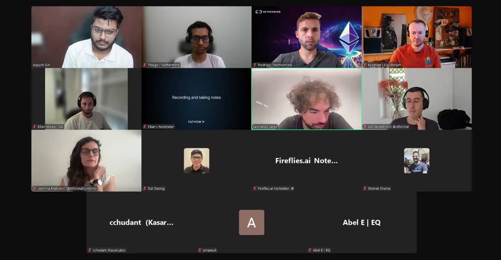

# Starknet All Core Devs Meeting #32
## Meeting Details

- **Date & Time:** Thursday, July 31, 2025, 11:00-11:30 AM UTC
- **Duration:** 30 minutes
- **YouTube:** https://www.youtube.com/live/XSCYZUVZ-d0
- **Agenda:** https://github.com/starknet-io/pm/issues/22
- **Moderator:** [Aayush Giri](https://github.com/Giri-Aayush)

## Meeting Screenshot

## Executive Summary

This checkpoint meeting occurred 3 days after the original July 28th mainnet deployment date, following the strategic 1-2 week delay decision from Call #31. Key outcomes included:

- **Mainnet v0.14.0 deployment confirmed for August 18th** - stabilization ongoing with no timeline changes
- Deprecated transaction format still represents ~15% of mainnet traffic, mostly from bots; outreach continuing but deployment will proceed regardless
- Pathfinder v0.18 migration feedback positive; JSON-RPC 0.9 subscription methods still in active development due to ongoing spec changes
- Juno v0.15.0 stable released with v0.15.1 fixing critical pending block numbering issue affecting attestations
- Madara preconfirmed block backend modifications ongoing; full v0.9 RPC support not yet released
- Consensus-level vs. execution-level testing distinction maintained; Malachite awaiting final Apology liveness subprotocol changes
- v0.15 P2P authentication specs delayed post-v0.14.0; staker-only consensus authentication protocol design confirmed but not yet documented

## Meeting Notes

The meeting opened with [Aayush Giri](https://github.com/Giri-Aayush) marking exactly 3 days since the original July 28th mainnet target date. He reminded participants that in Call #31, a strategic decision was made to delay v0.14.0 mainnet by 1-2 weeks to ensure both internal and external readiness. Today's mission: gain clarity on current status and lock in a final deployment timeline if possible. Aayush noted the call was being recorded and broadcast live on YouTube, requested participants stay muted when not speaking, and encouraged camera usage for more engaging conversation. The focus would be production readiness, final timeline confirmation, and coordination for one of Starknet's most significant upgrades.

### 1. Mainnet v0.14.0 Deployment Status and Timeline Update

**Leonardo Lerer** (Starkware):

Leonardo reported that codebase stabilization is ongoing. The deployment date remains the delayed timeline from last week: **August 18th**. Regarding external readiness, the delay has provided breathing room to partners including full node teams present on the call, but also other entities like wallets and dApps.

A key concern in the overall readiness agenda is the volume of transactions still being sent on mainnet using the soon-to-be-deprecated format. Currently, approximately **15% of mainnet transactions** use the old format, with most appearing to originate from bots. Starkware is still in the process of reaching out to ecosystem participants to the best of their abilities. However, Leonardo acknowledged that no matter what outreach efforts are made, there will likely still be a percentage of these deprecated transactions on mainnet at upgrade time. At some point, the network simply needs to move forward.

**TL;DR:** Still on track for **August 18th**. Deployment will hopefully happen on that date as planned.

### 2. Client Team Production Readiness Updates

**Pathfinder** ([Krisztian Kovacs](https://github.com/kkovaacs)):

Krisztian confirmed that Pathfinder v0.18 was released as a small update compared to v0.17, though it contains a database migration making it technically a breaking change (hence the version bump). Feedback has been largely positive, as this migration doesn't take as long as the previous one—users were happy about that.

The team has already received a few reports of small JSON-RPC inconsistencies, which have been fixed. Work continues on new subscription methods for JSON-RPC 0.9 that will allow access to preconfirmed data. Unfortunately, there is still no final specification yet. Krisztian mentioned discovering an issue with the spec just 30 minutes before the call, illustrating that specification work is still in progress.

Currently, the team has an open PR for `subscribe_new_transaction_receipts`. Work continues on `subscribe_new_transactions`, and a few adjustments will be needed for other subscription methods as well. This remains very much work in progress.

The team has also accumulated several additional feature requests from Leonardo and others, such as changing configuration defaults. These are planned for implementation before cutting a new version. **Top priority** is subscription method implementation and supporting the full set of JSON-RPC methods in the latest specification. As soon as they reach that milestone, a new Pathfinder version will be released.

Importantly, the team has received **no issues about sync problems**. They believe syncing is functioning correctly on Starknet v0.14.0—it's mostly JSON-RPC deficiencies holding them back from full production readiness.

**Juno** ([Rodrigo Pino](https://github.com/rodiazet)):

Rodrigo reported that Juno made a stable release last week at the beginning of the week: **v0.15.0**. However, there were some issues specifically on mainnet starting with v0.13, related to not assigning a number to pending blocks. This was causing problems with some attestations. The issue has been fixed in **Juno v0.15.1**.

The team is now working to remain spec-compliant with the latest RPC spec and fixing any other issues that appear.

Regarding consensus, Tendermint implementation is nearly complete. The team is in fine-tuning mode—refactoring to improve performance and ensure things work correctly. They're also working on program reliability in unhappy path scenarios: bad actors, network crashes, and ensuring successful recovery.

Rodrigo highlighted a change to Juno's snapshot system. Previously, users had to download the snapshot to their machine, decompress it, then set up Juno—requiring twice the storage space. For Sepolia this wasn't a big deal (~30-50 GB), but for mainnet (~500 GB), it was significant. Now users can download and set up directly, making the process easier and more storage-efficient.

**Madara** ([cchudant](https://github.com/cchudant), reported by **JB** from Kasar Labs):

Trantorian was not on the call, so JB provided an update. During Call #31, it was mentioned that Madara was behind schedule on v0.14.0 sync support for testnet due to preconfirmed block database updates.

The status: Madara is not yet released with these features. The team has modified much of the backend to support preconfirmed blocks, especially for block production. JB expects preconfirmed support to be released along with subscription transaction functionality—essentially full v0.9 RPC support will come all at once.

Beyond that, the team is still somewhat blocked on SNOS implementation in Cairo, which affects Madara chain's full v0.14.0 support.

Regarding overall mainnet deployment readiness, JB stated they need to make a release with full v0.9 RPC support, which hasn't been completed yet.

### 3. Consensus Implementation and Cross-Client Testing Coordination

**Adi Seredinschi** (Informal Systems):

Adi reiterated the distinction established in previous calls between **consensus-level/P2P-level testing** versus **execution and full-stack testing**.

From Malachite's perspective, they cannot test the execution layer—that's outside the realm of what the Malachite consensus engine controls. They only control the consensus side of things, which is the type of interoperability Malachite will handle. This work is still ongoing.

The last remaining part is for the Apology team to finish implementation of what Adi believed was one last piece of the **liveness subprotocol changes**. This needs to be wrapped up before the PR on the Malachite repo can be finalized.

As for execution or full-stack interoperability tests, the two-part strategy was confirmed with the Pathfinder team, who agreed to own testing of full-stack interoperability (including execution).

Adi expressed gratitude for very useful feedback that Abel and Chris provided during a call exactly two weeks ago on a Thursday. The Malachite team found the input on how to improve Malachite very valuable.

Regarding **block sync**, Adi reiterated that neither Madara nor Pathfinder are using the block sync functionality that Malachite exposes, because both teams are integrating at a lower level of abstraction. Block sync is an application-level concern. While Malachite does support block sync, it's not being used by Madara or Pathfinder since they have their own implementations.

Improvements are being made to Malachite's block sync—the PR for these improvements is in final stages and being tested by another user—but this isn't super relevant to the current integration efforts.

### 4. P2P Network Evolution and v0.15 Features

**Shahak Shama** (Starkware):

Aayush referenced Call #31's introduction of significant changes with the authentication mechanism and asked about DNS infrastructure migration completion.

Shahak clarified that regarding the authentication protocol presented in the previous call, the team hasn't had time to release specs for it due to all the v0.14.0 work. He hopes that once v0.14.0 finishes, they'll be able to take care of releasing specs for this protocol.

The design remains as stated in the previous call: whenever a node makes a connection with another node, each node sends a challenge. Both sides then sign the peer ID and the challenge with their Starknet key, thereby tying the identity of the peer with the staker identity.

Aayush asked if there was anything else about implementation of the staker-only consensus requirements that client teams should know about. Shahak confirmed **no additional information right now**—the specs exist as they are today. He noted the specs will have some changes later (for example, they don't include signatures yet), but those will be addressed in due course.

### 5. Wrap-up and Next Steps

Aayush confirmed the agenda was completed and asked if anyone had anything else to discuss before closing the call. Hearing nothing, he announced the **next call would be on August 14th**—hopefully with more news about mainnet deployment by then.

Aayush thanked everyone for getting on the call and noted that the entire Starknet ecosystem is very excited about the work being done. The call would reconvene in two weeks.

(Brief audio issue interrupted Aayush's closing remarks, but he recovered and completed the sign-off.)

## Key Decisions Summary

| Decision | Rationale | Impact |
|----------|-----------|---------|
| Mainnet v0.14.0 deployment confirmed for August 18th | Codebase stabilization ongoing; external partners need additional time | Final deployment date set 3 weeks after original July 28th target |
| Proceed with deployment despite ~15% deprecated transaction traffic | Outreach efforts continuing but deployment cannot be delayed indefinitely | Some deprecated transactions will fail at upgrade time; mostly bot traffic |
| Pathfinder prioritizes JSON-RPC 0.9 subscription methods | Spec still evolving; sync working correctly but RPC compliance needed for production readiness | New Pathfinder version pending completion of subscription method implementation |
| Madara will release preconfirmed block support with full v0.9 RPC in single update | Backend modifications for preconfirmed blocks tied to subscription functionality | Full v0.9 support will come all at once rather than incremental releases |
| v0.15 P2P authentication specs delayed until after v0.14.0 | Team bandwidth focused on v0.14.0 stabilization | Staker-only consensus authentication documentation will be released post-August 18th |

## Action Items Tracker

| Action Item | Owner | Target Date | Status |
|-------------|-------|-------------|--------|
| Complete codebase stabilization for v0.14.0 | Starkware (Leonardo) | August 18, 2025 | In Progress |
| Continue outreach to ecosystem for deprecated transaction migration | Starkware | Pre-August 18, 2025 | In Progress |
| Complete JSON-RPC 0.9 subscription methods implementation | Pathfinder (Krisztian) | Pre-August 18, 2025 | In Progress |
| Release new Pathfinder version with full RPC 0.9 support | Equilibrium | TBD (post-subscription methods) | Pending |
| Address pending block numbering attestation issues in Juno v0.15.1 | Juno (Rodrigo) | Completed | ✅ Completed |
| Release Madara with preconfirmed block support and v0.9 RPC | Kasar Labs (Trantorian/JB) | TBD | Not Started |
| Complete Apology liveness subprotocol changes for Malachite | Apology team | TBD | In Progress |
| Finalize Malachite PR after Apology liveness changes | Informal Systems (Adi) | TBD (depends on Apology) | Blocked |
| Release v0.15 P2P authentication protocol specs | Starkware (Shahak) | Post-August 18, 2025 | Not Started |
| Hold next All Core Devs call with mainnet deployment update | Aayush Giri | August 14, 2025 | Scheduled |

## Attendees

- **Moderator:** Aayush Giri | Nethermind
- Thiago Ribeiro | Nethermind
- Rodrigo Pino | Nethermind
- Krisztian Kovacs | Equilibrium
- Eitan Moed | Starkware
- Leonardo Lerer | Starkware
- Adi Seredinschi | Informal Systems
- Jasmina Malicevic | Informal Systems
- Dat Duong
- Shahak Shama | Starkware
- cchudant | Kasar Labs
- amanusk
- Abel E | Equilibrium

## Glossary

- **v0.14.0**: Major Starknet protocol upgrade introducing preconfirmed blocks, consensus mechanism, and RPC 0.9
- **Preconfirmed blocks**: Blocks that are produced and shared before final confirmation, improving network responsiveness
- **JSON-RPC 0.9**: Latest version of the Starknet JSON-RPC specification with new subscription methods
- **Subscription methods**: Real-time APIs for streaming blockchain data (transactions, receipts, events)
- **Deprecated transaction format**: Older transaction structure being phased out with v0.14.0 upgrade
- **Attestations**: Cryptographic confirmations from validators in consensus protocol
- **Pending block**: Block being constructed but not yet finalized
- **Tendermint**: Byzantine Fault Tolerant consensus protocol being implemented by Juno
- **Malachite**: Consensus engine developed by Informal Systems for Starknet
- **Apology**: Consensus protocol component handling liveness aspects
- **Liveness subprotocol**: Mechanism ensuring the network continues making progress even under adverse conditions
- **Block sync**: Protocol for synchronizing blockchain state between nodes
- **P2P authentication**: Cryptographic mechanism for verifying identity of network participants
- **Staker-only consensus**: v0.15 feature restricting consensus participation to staked validators
- **Peer ID**: Unique identifier for a node in the peer-to-peer network
- **Starknet key**: Cryptographic key associated with staker identity for signing consensus messages
- **SNOS (Starknet OS)**: Operating system layer for Starknet, being reimplemented in Cairo
- **Snapshot**: Point-in-time copy of blockchain state for faster node synchronization
- **Mainnet**: Production Starknet network; **Testnet/Sepolia**: Testing network

---

*These notes were compiled by [Aayush Giri](https://github.com/Giri-Aayush) from the July 31, 2025 Starknet All Core Devs call. For the most accurate information, please refer to the [full recording](https://www.youtube.com/live/XSCYZUVZ-d0).*
