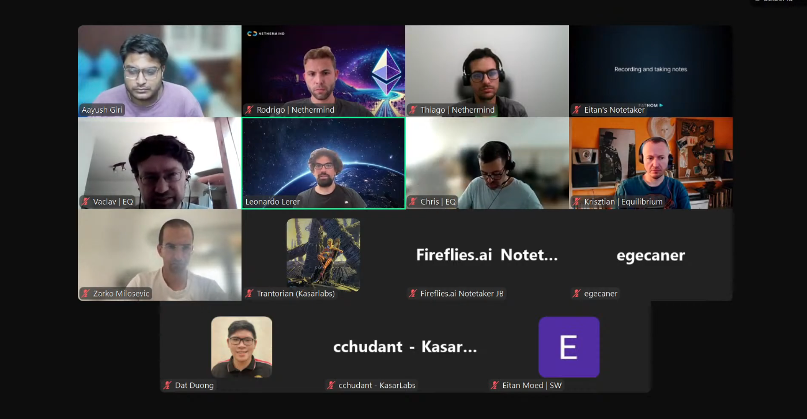

# Starknet All Core Devs Meeting #33
## Meeting Details

- **Date & Time:** Thursday, August 14, 2025, 11:00-11:30 AM UTC
- **Duration:** 30 minutes
- **YouTube:** https://www.youtube.com/live/bhly4N1B1GQ
- **Agenda:** https://github.com/starknet-io/pm/issues/23
- **Moderator:** [Aayush Giri](https://github.com/Giri-Aayush)

## Meeting Screenshot

## Executive Summary

This meeting occurred 4 days before what was supposed to be the final mainnet deployment date (August 18th), but opened with significant news: **mainnet v0.14.0 deployment delayed again to September 1st**—adding another 18 days to the timeline. Key outcomes included:

- **Mainnet v0.14.0 deployment rescheduled to September 1st** (pushed from August 18th)
- Delay driven by need for greater confidence in system reliability/resilience under stress and allowing ecosystem more time to migrate to RPC 0.9
- **Final RPC 0.9 specification released Monday, August 11th** after months of iteration
- Deprecated transaction format improved from 15% to **~5% of mainnet traffic**—mostly bot activity
- Pathfinder v0.19.0 released with full RPC 0.9 support; reorg notifications missing from subscription spec identified as potential oversight
- Juno v0.15.2 releasing with full RPC 0.9 support; Tendermint optimization and reliability work ongoing
- Madara still working toward full RPC 0.9 compliance and resolving v0.14.0 sync challenges
- **Team transition at Informal Systems**: Adi Seredinschi and part of team spun out to join Circle; **Zarko Milosevic** now representing Informal Systems
- Malachite v0.5 released; liveness subprotocol design completed and shared with Starkware for review

## Meeting Notes

The meeting opened with [Aayush Giri](https://github.com/Giri-Aayush) welcoming participants and immediately acknowledging discussions in various Telegram channels that revealed **mainnet v0.14.0 deployment has been moved to September 1st**. Instead of being 4 days away from deployment as discussed in Call #32, the community is now looking at 18 days. Aayush noted the call would be recorded for archives and requested participants stay muted when not speaking, with cameras always welcome. He characterized the situation: rather than being in final validation mode, the team is now in an extended timeline, and understanding what drove this decision would be the focus of today's call.

### 1. Mainnet v0.14.0 Timeline Update: September 1st Deployment

**Leonardo Lerer** (Starkware):

Aayush characterized this as "quite a development" and asked Leonardo to help everyone understand what changed in the two weeks since Call #32 that necessitated pushing the timeline out by another two weeks.

Leonardo explained that over the last couple of months, the vast majority of development had been completed, with some features still actively being developed—in particular, features related to **preconfirmations**. Throughout this time, Starkware continued testing and trying different deployments. With three sequencers now involved, there are infrastructure and DevOps complexities to manage.

**It's not that something specific happened that necessitated a push**, Leonardo clarified. Rather, the team agreed they need **more confidence in the reliability and resilience of the system**—for example, under stress conditions. This is the main reason. Additionally, Starkware thought that having more of the ecosystem switch to RPC 0.9 would be a significant win, and giving partners more time allows them to do so.

Only at the beginning of this week (Monday, August 11th) was the **final RPC 0.9 specification released**, and nodes have subsequently released or are in the process of releasing updates. Even to take advantage of the final version, people need to upgrade their nodes and ensure they're using updated SDKs, etc. Giving the ecosystem a couple of weeks to increase coverage of the RPC 0.9 switch seems like a good thing.

Leonardo concluded by expressing optimism for **September 1st**: "We're getting there, I think."

Aayush asked about the deprecated transaction format that was at 15% in Call #32. Leonardo reported that the percentage is **pretty variable**—the last time he checked (2-3 days ago), it was **~5% of transactions in the old format**. While still not great, this is a reasonable number. The top 50 or so senders are mostly bots, which are very hard to track down in terms of who operates them. Leonardo acknowledged that while it's not ideal to break bots, it's not like breaking an app with organic user activity—that would be worse. Starkware is still working on how to possibly track down and make these bot operators switch, but 5% is a good number.

When asked how confident he feels about September 1st as a firm target, Leonardo said it's always hard to say, but personally he thinks it's going to happen on the 1st—"We're going to get there."

### 2. Client Team Production Readiness Updates

**Pathfinder** ([Krisztian Kovacs](https://github.com/kkovaacs)):

Aayush noted that Pathfinder had been working through JSON-RPC 0.9 subscription methods and waiting on specification finalization, and asked how the additional time changes the team's approach, and whether there are things they can now do more thoroughly or features they might include that were previously at risk for the August 18th deadline.

Krisztian confirmed the final JSON-RPC 0.9 specification was released earlier this week (Monday). Pathfinder did release **Pathfinder v0.19.0** with full support of this specification.

However, since the spec release, the team has discovered some **oversights in reorg notifications for certain subscriptions**. There's still discussion about whether it's acceptable to change this after the final spec release. Specifically, the `new_transaction` and `new_transaction_receipts` subscriptions **do not send reorg notifications**—this appears to simply be missing from the spec, likely an oversight. Neither Pathfinder nor libraries like Starknet.rs implement these reorg notification messages. Ultimately, all implementations are compatible with the spec as written, but whether that's a good thing remains a question. It seems to be a missing feature at this point.

Pathfinder v0.19.0 has been released, and the team is waiting for feedback related to the new JSON-RPC spec.

The team has also started working on **upgrading the validator attestation package to JSON-RPC 0.9**, now that support for the new API version is being added to both nodes and libraries like Starknet.rs and Starknet.js.

Regarding preconfirmed data access implementation via subscription methods (discussed in Call #32), Krisztian noted this was pretty much the only change in the last few weeks in the JSON-RPC specification—figuring out specifically how to have access to preconfirmed data via WebSocket subscriptions.

When asked about default configuration changes requested by Leonardo, Krisztian confirmed **yes, all those small changes have been integrated** in the new release. This is why it's been released as Pathfinder v0.19—technically it's a breaking change, as **version 0.8.0 of the JSON-RPC API is now served by default on the root path**.

There was discussion about whether having this default is a good thing or not. It's probably not ideal, but changing it would be another seriously breaking change for some users. The team has kept it for now and will probably need to coordinate with other node teams on how and when to remove this default route.

**Juno** ([Rodrigo Pino](https://github.com/rodrodros)):

Rodrigo reported that Juno v0.15.1 has no major issues. Nonetheless, the team will release **Juno v0.15.2 today** (August 14th), which will have **full RPC 0.9 support**.

There are still some small bugs being fixed regarding Tendermint. Overall, Tendermint is in good shape. Progress is currently slower than usual—there are no new features to talk about. The team is optimizing, working on how to deal with challenges like network partitions (avoiding them as much as possible), trying to be as efficient as possible, evaluating which protocols to use, etc.

The team is also trying to **take advantage of Malachite consensus tests**, seeing how they can integrate them with Juno's own testing framework.

Regarding the new snapshot system (improved in previous releases), feedback so far has been good. Rodrigo believes it's quite beneficial for the network, and nobody seems unhappy about the improvement.

Aayush asked if there are any new features to discuss. Rodrigo confirmed: **no new features—just internal work**.

**Madara** ([Trantorian](https://github.com/Trantorian1), Kasar Labs):

Trantorian reported that regarding RPC 0.9 support, the team is **still working on some of the last methods**. There have been some slowdowns in implementation of v0.14.0 sync as well as the preconfirmed block database updates. Charlotte is currently working on these items.

In terms of mainnet deployment readiness, the **pushback of the timeline is going to help** the team work on implementing the last methods as well as v0.14.0 sync support.

### 3. Consensus Implementation and Team Transition at Informal Systems

**Zarko Milosevic** (Informal Systems):

Aayush asked if anyone from Informal Systems was present to provide an update, noting that Adi had been the usual representative.

[Zarko Milosevic](https://github.com/milosevic) introduced himself, stating he would be representing Informal Systems today. He acknowledged that participants might have seen that **Adi and part of the team have spun out and joined Circle**. [Jasmina Malicevic](https://github.com/jasmina) (who attended Call #31) will continue as the primary representative going forward, but she's off this week and unable to provide an update.

The main update: **Malachite v0.5 has been released**. Zarko shared a link in the chat. The release includes small bug fixes and minor improvements.

In the context of the Circle team transition, Informal Systems has **extracted some interoperability code outside of the Malachite core repo**—it's now part of the **`starknet-interop` repo** and is public, so all teams should have access to it.

Zarko mentioned there was a call with the Juno team (as Rodrigo noted) where they shared protobufs and discussed work from the `starknet-interop` repo. The Informal Systems team is available if anyone needs help.

Zarko apologized if the team is **a bit slower than usual** as they're still processing the transition. Hopefully, more people will be onboarded soon, and there won't be a noticeable difference in quality of responses or work—but he asked for a bit of patience and apologized if there might be a few short-term hiccups.

Regarding the **liveness subprotocol issue** reported in previous calls: the team has **finished and completed the design**. It has been shared with the Starkware team and is currently under review. Informal Systems hasn't heard back from Starkware at this point. Zarko's feeling is this is probably not something that will be considered for the September 1st mainnet deployment, but he wanted to report at a high level that the design is completed, design documents have been shared, and they're currently in review.

Aayush asked about full-stack testing coordination and progress with other client teams like Pathfinder.

Zarko explained that with Pathfinder, his understanding is that **most of the integration work has been done**. Informal Systems received very good feedback from the Pathfinder team about challenges and areas for improvement, and the team is trying to address those comments to make integration simpler for others.

With Juno, as just discussed, they've started coordination. To the best of Zarko's knowledge, they haven't really started integration work with other teams beyond Pathfinder and Juno—though he acknowledged he might be wrong. The team remains available and happy to jump on calls, provide more documentation, or offer examples if needed.

### 4. P2P Network Development Status

Aayush noted that Shahak Shama (Starkware) was not on the call today, so the P2P network development status agenda item would be skipped.

### 5. Wrap-up and Next Steps

Aayush asked if anyone had any other thoughts or concerns to raise. Hearing none, he acknowledged this wasn't the conversation about the September 1st deadline he expected to have today, but it's good the team is taking the time needed to get things right.

**September 1st gives the ecosystem 18 more days** to ensure everything is solid. The **next call will be on August 28th**, which will again put the community 4 days out from the new September 1st target—hopefully back in final readiness and validation mode.

Aayush thanked everyone for adapting to this change and said he'd see everyone in two weeks.

## Key Decisions Summary

| Decision | Rationale | Impact |
|----------|-----------|---------|
| Mainnet v0.14.0 deployment delayed to September 1st (from August 18th) | Need greater confidence in system reliability/resilience under stress; allow ecosystem more time to migrate to RPC 0.9 | Extended timeline by 18 days; final RPC 0.9 spec released August 11th gives partners 3 weeks to upgrade |
| Proceed despite ~5% deprecated transaction traffic remaining | Mostly bot traffic; top 50 senders are bots; improved from 15% two weeks ago | Some bot transactions will fail at upgrade; tracking down operators continues but won't block deployment |
| Pathfinder v0.19.0 serves RPC 0.8.0 as default on root path | Changing default would be seriously breaking change for users | Coordination needed across node teams on how/when to remove this default route |
| Reorg notifications missing from new_transaction/new_transaction_receipts subscriptions | Appears to be spec oversight; discussion ongoing about changing post-finalization | All implementations compatible with spec as written; may address as missing feature later |
| Liveness subprotocol design not targeted for September 1st | Design completed and shared with Starkware but still in review | Feature will be addressed in future release post-v0.14.0 |

## Action Items Tracker

| Action Item | Owner | Target Date | Status |
|-------------|-------|-------------|--------|
| Finalize codebase and increase confidence in system resilience under stress | Starkware (Leonardo) | September 1, 2025 | In Progress |
| Continue outreach to bot operators for deprecated transaction format migration | Starkware | Pre-September 1, 2025 | In Progress (5% remaining) |
| Gather feedback on Pathfinder v0.19.0 and JSON-RPC 0.9 implementation | Equilibrium (Krisztian) | Ongoing | In Progress |
| Coordinate with other node teams on removing RPC 0.8.0 default route | All client teams | TBD (post-v0.14.0) | Not Started |
| Address reorg notification spec oversight for subscription methods | Starkware/client teams | TBD | Under Discussion |
| Upgrade validator attestation package to JSON-RPC 0.9 | Equilibrium (Krisztian) | Pre-September 1, 2025 | In Progress |
| Release Juno v0.15.2 with full RPC 0.9 support | Juno (Rodrigo) | August 14, 2025 | ✅ Completed |
| Integrate Malachite consensus tests into Juno testing framework | Juno (Rodrigo) | Ongoing | In Progress |
| Complete final RPC 0.9 methods implementation | Madara (Trantorian) | Pre-September 1, 2025 | In Progress |
| Complete v0.14.0 sync support and preconfirmed block database updates | Madara (Charlotte) | Pre-September 1, 2025 | In Progress |
| Onboard new team members at Informal Systems post-Circle transition | Informal Systems (Zarko/Jasmina) | Ongoing | In Progress |
| Review liveness subprotocol design documentation | Starkware | TBD | In Review |
| Hold next All Core Devs call 4 days before September 1st deployment | Aayush Giri | August 28, 2025 | Scheduled |

## Attendees

- **Moderator:** Aayush Giri | Nethermind
- Rodrigo Pino | Nethermind
- Thiago Ribeiro | Nethermind
- Vaclav | Equilibrium
- Leonardo Lerer | Starkware
- Chris | Equilibrium
- Krisztian Kovacs | Equilibrium
- Zarko Milosevic | Informal Systems
- Trantorian | Kasar Labs
- egecaner
- Dat Duong
- cchudant | Kasar Labs
- Eitan Moed | Starkware

## Glossary

- **v0.14.0**: Major Starknet protocol upgrade introducing preconfirmed blocks, consensus mechanism, and RPC 0.9
- **Preconfirmations/Preconfirmed blocks**: Blocks that are produced and shared before final confirmation, improving network responsiveness
- **JSON-RPC 0.9**: Latest version of the Starknet JSON-RPC specification with new subscription methods and preconfirmed data access
- **Deprecated transaction format**: Older transaction structure being phased out with v0.14.0 upgrade (reduced to ~5% of traffic)
- **Reorg notifications**: Messages sent when blockchain reorganization occurs, informing subscribers of chain state changes
- **Subscription methods**: Real-time APIs for streaming blockchain data (transactions, receipts, events) via WebSocket
- **SDK**: Software Development Kit—tools and libraries developers use to interact with Starknet
- **Validator attestation package**: Software component handling cryptographic confirmations from validators
- **Tendermint**: Byzantine Fault Tolerant consensus protocol being implemented by Juno
- **Malachite**: Consensus engine developed by Informal Systems for Starknet
- **Liveness subprotocol**: Mechanism ensuring the network continues making progress even under adverse conditions
- **Network partition**: Network failure where nodes are divided into groups that cannot communicate
- **Starknet.rs**: Rust library for Starknet development
- **Starknet.js**: JavaScript/TypeScript library for Starknet development
- **Circle**: Company that Adi Seredinschi and part of Informal Systems team joined as spinout
- **`starknet-interop` repo**: Public repository containing interoperability code extracted from Malachite core
- **Protobufs (Protocol Buffers)**: Google's serialization format used for consensus communication between nodes
- **Snapshot system**: Tool for distributing point-in-time copies of blockchain state for faster node synchronization
- **SNOS (Starknet OS)**: Operating system layer for Starknet being reimplemented in Cairo
- **Sequencer**: Node responsible for ordering and executing transactions before consensus finalization
- **DevOps**: Development and operations practices for infrastructure management and deployment

---

*These notes were compiled by [Aayush Giri](https://github.com/Giri-Aayush) from the August 14, 2025 Starknet All Core Devs call. For the most accurate information, please refer to the [full recording](https://www.youtube.com/live/bhly4N1B1GQ).*
