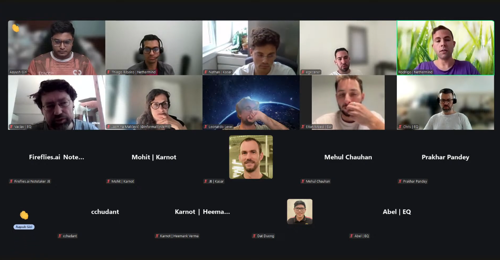

# Starknet All Core Devs Meeting #34
## Meeting Details

- **Date & Time:** Thursday, August 28, 2025, 11:00-11:30 AM UTC
- **Duration:** 30 minutes
- **YouTube:** https://www.youtube.com/watch?v=o3vvBnQNJOU&list=PLMXIoXErTTYW7_3FjybBzJXhfZwvSchPa&index=1
- **Agenda:** https://github.com/starknet-io/pm/issues/24
- **Moderator:** [Aayush Giri](https://github.com/Giri-Aayush)

## Meeting Screenshot

## Executive Summary

This final pre-deployment meeting occurred exactly 96 hours (4 days) before the September 1st mainnet v0.14.0 launch. Key outcomes included:

- **Mainnet v0.14.0 deployment confirmed for September 1st at 6:00 AM GMT** with ~15 minutes planned downtime
- All client teams ready for deployment; ecosystem urged to upgrade to latest Pathfinder and Juno versions
- Legacy transaction traffic unchanged; bot operators expected to upgrade post-deployment
- Pathfinder v0.20.0 releasing this week with reorg notification fixes and new features
- Juno v0.15.3 releasing same day with UX improvements; v0.15.2 sufficient for mainnet
- **Major announcement: Kasar Labs sunsetting Madara work post-v0.14.0**, pivoting to AI/Kojo Coder framework; Karnot taking over Madara
- Madara v0.14.0 releasing by end of next week (September 5th) with full feature set
- Informal Systems team transition complete; Jasmina now leading with two new engineers onboarded
- Malachite v0.5 stable; no blocking issues discovered for mainnet integration
- Post-deployment focus on UX features and continued ecosystem node upgrades

## Meeting Notes

The meeting opened with [Aayush Giri](https://github.com/Giri-Aayush) welcoming participants and marking the momentous occasion: **exactly 4 days away from September 1st**. Two weeks ago in Call #33, the timeline extension and rationale were discussed. Today, the community is back to final readiness validation—what was thought to be the last call before deployment. Aayush noted the call was being recorded for archives, requested participants stay muted when not speaking, and welcomed cameras. He characterized this as a significant moment: standing at the precipice of what has been months of preparation, coordination, and development from everyone. The focus: understand exactly where things stand with **96 hours to go**.

### 1. Mainnet v0.14.0 Final Readiness and Deployment Plan

**Leonardo Lerer** (Starkware):

Aayush reminded Leonardo that two weeks ago he expressed confidence about September 1st, citing the need for more system reliability testing and ecosystem readiness. He asked how things are looking now, how the three-sequencer infrastructure stress testing validation has progressed, and whether there's been any improvement with the legacy transaction bot situation.

Leonardo confirmed: **"It seems like we're going to go ahead with the upgrade."** Things are looking better and better.

**Deployment Process and Downtime:**

The upgrade itself is a complicated process. It will involve **approximately 15 minutes of downtime** during which all transactions will be rejected right at the gateway and no new blocks will be produced.

Starkware will attempt to upgrade Starknet when there is the least amount of activity. The deployment is scheduled for **around 6:00 AM GMT**. Starkware will notify everyone—they're already notifying stakeholders and will finalize announcements in all relevant channels.

Leonardo invited everyone listening to **join the relevant Telegram groups** (Starknet Core Devs, Starknet Testnet, and Starknet Mainnet) so they can have all updates available. Starkware will also update the **Starknet status page**.

Regarding readiness: **"Things are looking good."**

**Legacy Transactions:**

Regarding legacy transactions, Starkware hasn't seen much change in bot activity. Leonardo noted that assuming the operators of these bots are familiar with the SDKs they used to write their bots, it should be a really easy upgrade to adapt to transaction v3 and RPC 0.8. He maintained this perspective going into deployment.

**Ecosystem Node Upgrade Push:**

Leonardo emphasized that **everybody running nodes that are 2 months old or more should upgrade to the latest versions of Pathfinder and Juno**.

Additionally, after the upgrade, Starkware will continue pushing the ecosystem to upgrade their nodes because **relevant UX features are coming on the node side**, and they want the entire ecosystem to be able to enjoy these improvements. The community should expect **one more upgrade push shortly after the mainnet upgrade**.

Aayush confirmed the deployment timing: September 1st, 6:00 AM GMT. Leonardo confirmed yes.

### 2. Client Team Final Production Status

**Pathfinder** ([Vaclav](https://github.com/vaclav) / Chris, Equilibrium):

Aayush noted that two weeks ago, Pathfinder had just released v0.19.0 with full RPC 0.9 support but discovered some reorg notification oversights in the specifications. He asked how this has been resolved and whether there's clarity on whether the missing reorg notifications for `new_transactions` and `new_transaction_receipts` subscriptions should be addressed.

Vaclav apologized, noting he didn't plan on doing the update and doesn't have up-to-the-minute information. Since the last meeting, the team did a new Pathfinder release and performed testing and bug fixes—some are included in **release v0.20.0** but not all of them.

The team is **planning another release this week**. This will specifically include the **reorg notifications for transactions** and the other fix mentioned. These features are implemented but not yet released. The team will include them this week along with some other bug fixes and new features.

Chris noted he's been working on consensus-related work, so Vaclav is more up to date with the recent release.

Regarding the validator attestation package upgrade mentioned in Call #33, Vaclav indicated it's pretty much the same from the last call because Krisztian has been working on the package, so not much progress there.

**Juno** ([Rodrigo Pino](https://github.com/rodiazet)):

Aayush recalled that in Call #33, the team was planning to release v0.15.2 that day with full RPC compliance. He asked how that release went and whether there have been any issues or feedback. He also asked about Tendermint optimization work, particularly around network partitioning handling.

Rodrigo confirmed **Juno v0.15.2 was released with no issues so far**. Full RPC 0.9 support is online.

The team is now preparing the next release for **later today (August 28th): Juno v0.15.3**, which will improve some bug fixes and provide better UX. The team is aiming for release today, at latest tomorrow.

On the Tendermint side, there has been improvement. **Partition support has improved**—the team implemented this using **Cademia networks**. They're now looking forward to two things on the Tendermint side:

1. **Write-ahead logs (WAL)** so that nodes can be resistant when they fail. When they recover, they don't appear as bad nodes.
2. **Syncing side concerns**: What happens if a node falls behind? How do you deal with this in a P2P network?

Regarding Malachite consensus tests, there haven't been too many advancements.

Regarding the **September 1st deployment**, Rodrigo confirmed **Juno v0.15.2 is already good enough for it**. v0.15.3 will bring improvements, but they're mostly on the UX side.

**Madara** ([Nathan](https://github.com/njgheorghita) and Charlotte, Kasar Labs):

Aayush asked whether Nathan or Trantorian would provide the update. Nathan indicated Charlotte would provide technical updates, then he'd share some news.

**Charlotte (Technical Update):**

Charlotte explained that the team was very late on v0.14.0 support—they've been working on this for quite a long time. The reason: **they were focusing on appchain support for Madara**. With the new v0.14.0 support, the team had to:

- Rewrite the entire **mempool**
- Update much of the **block production** infrastructure
- Overhaul **transaction status management** (a huge effort)
- Most importantly, rewrite the **backend**, which is the core of Madara

Charlotte acknowledged they were really late, which was understandable given mainnet readiness was less important since they're focused on appchains.

The team is **about to release in the coming few days**. The release will include:

- Full **mempool support**
- **RPC 0.9 subscriptions**
- Complete **transaction status** handling
- **Gateway node, full node, sequencer modes, and devnet**—basically the full package at once

They'll see how it behaves in more production environments.

Regarding preconfirmed block database updates (mentioned in Call #33), Charlotte confirmed that was the backend rewrite. For block production, it's way different—particularly handling the ability to undo preconfirmed blocks in case of consensus failure. The team is **pretty much done**, which is really cool because when they think about consensus implementation, they have most of the package ready for that.

**Nathan (Strategic Announcement):**

Nathan shared significant news: The team will have **v0.14.0 by the end of next week** (approximately September 5th). They wanted to ensure everything is set up so that consensus and everything could be implemented later.

However: **Kasar Labs will be sunsetting their work on Madara, letting Karnot take over.**

Nathan explained they'll still be joining core development discussions, but they're **pivoting mostly to AI work**—primarily on the framework **Kojo Coder**. They will remain involved in the Starknet core debates, but not as Madara maintainers anymore.

### 3. Consensus Implementation Status

**Jasmina Malicevic** (Informal Systems):

Aayush noted that Zarko mentioned in Call #33 the transition with Adi moving to Circle, and Jasmina would be taking on this responsibility. He asked how the transition has been progressing and requested an update on Malachite v0.5.

Jasmina confirmed the transition has now been completed—**the team officially transitioned out of Informal Systems**. She is taking most of Adi's responsibilities.

**Team Onboarding:**

Informal Systems already has **two engineers who started onboarding even before the team spun out**. They should be pretty much onboarded right now on core consensus concerns:

1. One engineer is **heavily involved in the syncing work** and fixing bugs discovered there
2. One is **working with the interop tests and scripts** to see if there are questions from people she can support
3. One person (research engineer **Manu**, introduced in one of the channels) is **fully onboarded on the protocol side**—now on top of the work Nanad was doing in terms of the liveness protocol without gossip, happy to answer any questions or concerns

The team should be pretty much set to continue where they stopped.

Additionally, the team that was working on the **IBC integration for Starkware**—now that the work is close to being done—will dedicate some of their time to Malachite as well, especially given their Rust experience. Informal Systems should be decently staffed and onboarded.

**Malachite v0.5 Status:**

Regarding the v0.5 version released, **there have not been any bugs discovered**. Jasmina checked open PRs on the Malachite repo to see if there's something critical that would prevent people from integrating or should block them from waiting for v0.6. **Nothing critical was found.**

One of the bigger features in the pipeline is a small fix for **batching of sync values in the value sync protocol**, but Jasmina doesn't think that's too relevant right now for the mainnet launch.

**Starknet Interop Repository:**

Zarko mentioned last time that Informal Systems created a new **`starknet-interop` repo** with most of the relevant content from the interop PR. Jasmina is happy to schedule a meeting next week if teams want to go over it again or need help agreeing on P2P specs and protobufs.

She noted they're still waiting (though probably not relevant for mainnet) on updates regarding the protobufs on Starkware's end to support the new liveness protocol. The new spec with these changes needs to be merged at some point, but that's probably for the next release/upgrade, not relevant for Monday (September 1st).

Informal Systems is trying to keep moving forward. They've done the basic onboarding and transitioning of teams to staff Malachite, and the plan is to continue where the old team left off. They still have access to the former team members if there are blockers, though they've tried to handle most of that before the official spinout.

### 4. P2P Network Status and Post-Deployment Planning

Aayush noted this was on the agenda, but since Shahak (Starkware) could not be present again, they would wait for him to return in the next call.

### 5. Wrap-up and Next Steps

Aayush asked if anyone had anything else to discuss before wrapping up. Hearing nothing, he reflected on the significance of the moment:

**"This is quite remarkable when you think about it. Monday represents the culmination of extensive development, testing, and coordination across all of us."**

The **next call will be on September 11th**—which will be completely different. The community will be discussing how the deployment went, early observations, and what comes next for Starknet.

Aayush thanked everyone for the dedication that has brought them to this point: **"Here's to Monday being everything we have prepared it to be. See you on the other side and on the next call."**

## Key Decisions Summary

| Decision | Rationale | Impact |
|----------|-----------|---------|
| Mainnet v0.14.0 deployment confirmed for September 1st, 6:00 AM GMT | Final readiness achieved; system reliability and ecosystem coordination complete | Approximately 15 minutes planned downtime; all transactions rejected at gateway during upgrade window |
| Proceed with deployment despite unchanged legacy bot transaction traffic | Bot operators have access to SDKs and can easily upgrade post-deployment | Some bot transactions will fail; considered acceptable trade-off |
| Two-phase ecosystem node upgrade push | Latest client versions ready; post-deployment UX features coming | Pre-deployment: upgrade to latest Pathfinder/Juno; post-deployment: second push for UX features |
| Pathfinder v0.20.0 releasing week of August 28th with reorg notifications | Feature implemented; releasing this week with other bug fixes | Addresses subscription reorg notification oversight discovered after RPC 0.9 finalization |
| Juno v0.15.2 confirmed sufficient for mainnet; v0.15.3 optional UX improvements | v0.15.2 stable with full RPC 0.9 support; v0.15.3 non-critical enhancements | Teams can deploy with either version depending on timing |
| Kasar Labs sunsetting Madara work post-v0.14.0; Karnot taking over | Strategic pivot to AI/Kojo Coder framework; v0.14.0 provides foundation for Karnot | Madara v0.14.0 by Sept 5th; Kasar Labs remains in core dev discussions but not as maintainers |
| Malachite v0.5 confirmed stable for mainnet integration | No bugs discovered; no blocking PRs identified | Teams can integrate v0.5 without waiting for v0.6 |

## Action Items Tracker

| Action Item | Owner | Target Date | Status |
|-------------|-------|-------------|--------|
| Execute mainnet v0.14.0 deployment at 6:00 AM GMT | Starkware (Leonardo) | September 1, 2025 | Scheduled |
| Notify ecosystem via Telegram channels and status page during deployment | Starkware | September 1, 2025 | In Progress |
| Upgrade to latest Pathfinder and Juno versions (pre-deployment) | Ecosystem node operators | Pre-September 1, 2025 | In Progress |
| Release Pathfinder v0.20.0 with reorg notifications and bug fixes | Equilibrium (Vaclav/Chris) | Week of August 28, 2025 | In Progress |
| Release Juno v0.15.3 with UX improvements | Juno (Rodrigo) | August 28-29, 2025 | In Progress |
| Continue Tendermint write-ahead log (WAL) implementation | Juno (Rodrigo) | Ongoing | In Progress |
| Improve Tendermint P2P syncing for nodes that fall behind | Juno (Rodrigo) | Ongoing | In Progress |
| Release Madara v0.14.0 with full feature set | Kasar Labs (Charlotte/Nathan) | By September 5, 2025 | In Progress |
| Complete Karnot transition to take over Madara maintenance | Karnot/Kasar Labs | Post-September 5, 2025 | Not Started |
| Merge new liveness protocol protobufs into P2P spec | Starkware/Informal Systems | Post-v0.14.0 | Pending |
| Schedule starknet-interop repo walkthrough meeting (if needed) | Informal Systems (Jasmina) | Week of September 2, 2025 | Optional |
| Push ecosystem for second node upgrade wave (UX features) | Starkware/client teams | Post-September 1, 2025 | Not Started |
| Hold post-deployment retrospective call | Aayush Giri | September 11, 2025 | Scheduled |

## Attendees

- **Moderator:** Aayush Giri | Nethermind
- Thiago Ribeiro | Nethermind
- Nathan Gohrskey | Kasar Labs
- egecaner
- Rodrigo Pino | Nethermind
- Vaclav | Equilibrium
- Jasmina Malicevic | Informal Systems
- Leonardo Lerer | Starkware
- Eitan Moed | Starkware
- Chris | Equilibrium
- Mohit | Karnot
- JB | Kasar Labs
- Mehul Chauhan
- Prakhar Pandey
- cchudant | Kasar Labs
- Heemank Verma | Karnot
- Dat Duong
- Abel | Equilibrium

## Glossary

- **v0.14.0**: Major Starknet protocol upgrade introducing preconfirmed blocks, consensus mechanism, and RPC 0.9
- **Preconfirmed blocks**: Blocks produced and shared before final confirmation, improving network responsiveness
- **Legacy transactions**: Older transaction format being deprecated with v0.14.0 (transaction v2 and earlier)
- **Transaction v3**: New transaction format introduced with v0.14.0
- **RPC 0.8/0.9**: JSON-RPC API versions for interacting with Starknet nodes
- **Gateway**: Entry point for transactions submitted to the Starknet network
- **Downtime**: Period during which network does not accept transactions or produce blocks
- **Reorg notifications**: Messages sent when blockchain reorganization occurs, informing subscribers of chain state changes
- **Subscription methods**: Real-time APIs for streaming blockchain data via WebSocket
- **UX features**: User experience improvements coming to node software post-deployment
- **Mempool**: Memory pool holding unconfirmed transactions awaiting inclusion in blocks
- **Block production**: Process of creating new blocks containing transactions
- **Transaction status management**: System for tracking transaction lifecycle from submission to confirmation
- **Backend**: Core infrastructure layer of node software
- **Appchains**: Application-specific blockchains built using Madara framework
- **Sequencer mode**: Node configuration for ordering and executing transactions
- **Full node mode**: Node configuration for validating and storing complete blockchain state
- **Gateway node mode**: Node configuration for accepting transaction submissions
- **Devnet**: Development network for testing
- **Tendermint**: Byzantine Fault Tolerant consensus protocol being implemented by Juno
- **Write-ahead log (WAL)**: Mechanism for crash recovery by logging operations before executing them
- **Network partition**: Network failure where nodes are divided into groups that cannot communicate
- **Cademia networks**: Tool used by Juno for testing network partition scenarios
- **Malachite**: Consensus engine developed by Informal Systems for Starknet
- **Syncing**: Process of catching up node's blockchain state with the network
- **`starknet-interop` repo**: Repository containing interoperability code for consensus integration
- **Protobufs (Protocol Buffers)**: Serialization format for consensus communication between nodes
- **Liveness protocol**: Mechanism ensuring the network continues making progress under adverse conditions
- **IBC (Inter-Blockchain Communication)**: Protocol for communication between different blockchains
- **Value sync protocol**: Mechanism for synchronizing consensus values between nodes
- **Kojo Coder**: AI-focused framework that Kasar Labs is pivoting to develop
- **Karnot**: Organization taking over Madara maintenance from Kasar Labs
- **Status page**: Web page displaying current operational status of Starknet network

---

*These notes were compiled by [Aayush Giri](https://github.com/Giri-Aayush) from the August 28, 2025 Starknet All Core Devs call. For the most accurate information, please refer to the [full recording](https://www.youtube.com/watch?v=o3vvBnQNJOU&list=PLMXIoXErTTYW7_3FjybBzJXhfZwvSchPa&index=1).*
