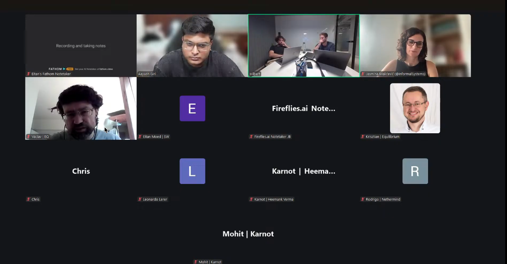

# Starknet All Core Devs Meeting #35
## Meeting Details

- **Date & Time:** Thursday, September 11, 2025, 11:00-11:30 AM UTC
- **Duration:** 30 minutes
- **YouTube:** https://www.youtube.com/live/6rrlUwF_5bU
- **Agenda:** https://github.com/starknet-io/pm/issues/25
- **Moderator:** [Aayush Giri](https://github.com/Giri-Aayush)

## Meeting Screenshot

## Executive Summary

This critical post-mortem meeting occurred exactly 10 days after the September 1st mainnet v0.14.0 deployment—the first call since the historic upgrade. The community examined actual deployment outcomes rather than preparation. Key outcomes included:

- **Deployment experienced significant challenges: two major reorgs** within days of launch
- **First reorg caused by Ethereum L1 node failures** leading to inconsistent transaction visibility across sequencers; created unprovable block but proving system prevented L1 finality on incorrect state
- **Second reorg triggered by hidden blockifier bug** revealed when reverted L1 transactions touched specific storage points
- **Cairo Zero contract class hash sync bug** discovered post-deployment; class hashes existed in sync component but not class manager, causing transaction execution inconsistencies
- Starkware exploring adding more validators and implementing extensive stress testing to prevent recurrence
- **Pathfinder severely impacted**: constant-sized block cache prevented reorg handling; hot fix released increasing cache to 10K blocks; v0.22 and v0.23 released with reorg notifications and improved preconfirmed data polling
- **Juno reorg detection issue**: won't reorg until new chain becomes longer than old chain, can cause node to get stuck; fix planned by September 13th
- **Karnot officially taking over Madara**: handover from Kasar Labs progressing; v0.14.0 support expected by next meeting; extensive replay testing underway
- Malachite v0.5 stable in production; team fully onboarded; planned minor release for potential issues
- Network running relatively smoothly since second reorg with no additional major incidents

## Meeting Notes

The meeting opened with [Aayush Giri](https://github.com/Giri-Aayush) marking a significant moment: **exactly 10 days since the September 1st mainnet deployment** and the first call since that historic event. Two weeks ago in Call #34, the community was in final readiness mode. Now, the focus shifts to understanding how everything actually went. Aayush noted the call would be recorded for archives, requested participants stay muted when not speaking, and welcomed cameras. He emphasized: **the community is no longer discussing preparation or timelines—they're examining performance and actual deployment outcomes.** The agenda would dive into how the upgrade went and how it's been performing.

### 1. Mainnet v0.14.0 Deployment Results

**Hilbert** (Starkware):

Aayush invited Leonardo to share the moment everyone had been waiting for: how did the deployment actually go, what was the downtime window, and were there any challenges or unexpected issues?

Hilbert responded, introducing himself: **"I'm stepping into the big shoes of Leo for this call."** (Note: This appears to be Hilbert's first time presenting to the All Core Devs calls in this capacity.)

**Overall Assessment:**

For all intents and purposes, **the upgrade itself went relatively smooth**—though they'd get to the reorgs in a bit.

**Cairo Zero Contract Class Hash Bug:**

The biggest hiccup Starkware saw in the upgrade itself was actually a **Cairo Zero bug** in the **class manager component** used to run transactions. Some of the oldest Cairo Zero **contract class hashes were not synced** in the class manager component, but those class hashes **were synced into the actual sync component** of the sequencer.

This created a situation where these transactions could be sent, but when Starkware tried to grab the class hash for these transactions, they were shown as **non-existent**. This resulted in transactions that, if re-executed through full nodes, would be shown as executed correctly (wouldn't show as failed), but they actually weren't passing into blocks as successful transactions.

Once noticed, Starkware tried a quick fix to get all these class hashes into the class manager component database. Later, they also solved it by **adding the ability to look up these class hashes elsewhere**—this wasn't in the code originally and there wasn't an intent to have it until they discovered not everything was synced correctly.

**One of the biggest follow-ups** on that bug was reaching out to full node teams (Pathfinder and Juno) and telling them: **for this range of blocks, they can't re-execute the transactions**. Instead, they need to **pull the traces from the feeder gateway** to see what really happened, because of this bug. Hilbert acknowledged this caused definite overhead in terms of focus that wasn't intended for everyone.

**Ethereum L1 Node Failures and First Reorg:**

The following day after deployment, **Ethereum Layer 1 nodes had some failures**. Starkware relied on these nodes to get information about transactions that came through L1.

Some of Starkware's nodes were getting these L1 transactions while others weren't. The network was progressing, but **not at full capacity—about 66%** because one node would get transactions that the other nodes wouldn't see. Every time it proposed a block, it was getting denied.

To deal with this, Starkware had **manual intervention** and thought about restarting the nodes so they would potentially get these transactions into their mempool. However, **upon restart, the nodes had several errors** because of the Ethereum node failures themselves. Starkware wasn't able to get the restarted nodes running again.

This brought down the pace of network progression even further:
- One node couldn't restart
- One node was getting transactions the others couldn't get
- One node could create blocks that the second node would agree on—**this was the only node helping progress the network**

Starkware then had manual intervention to hopefully get through these L1 errors. At that point, this resulted in a situation where **the network itself could not progress**. Starkware realized they had **created two different state diffs on the same block height**—at this point, they understood they had to **reorg to get the network running again**.

**Critical Point About the Proving System:**

Hilbert emphasized it's important to state: **they were able to identify this error**. Although there was a reorg, **due to the proving system, they were actually saved from creating a situation on L1 where they had finality on a state that was just wrong**.

The way this happened: Starkware realized they had created a **block that was unprovable**. At that point, they realized there was a bug in the system, had to take it back a bit, and figure out what happened while allowing the network to re-progress again.

**That wrapped up the first reorg.**

**Second Reorg - Hidden Blockifier Bug:**

The **second reorg was actually a result of Tuesday morning's events** (September 9th). Starkware had reverted certain transactions that came from L1, and when they later touched those same storage points of those reverted transactions, **it revealed a hidden bug that had nothing to do with v0.14.0**—it was in the **blockifier component**.

Once revealed, Starkware realized they had to **perform another reorg** and fix this issue, and **request from full node teams to release another version** to bump their blockifier dependencies.

This bug only revealed itself because Starkware had to reorg that morning, had to reorg the amount of blocks they did, and a transaction that was in this reorg came from L1 and touched a storage point that had a buggy effect.

**Current Status:**

**Since then, thankfully, the network has been running relatively smoothly.** There have been a couple hiccups identified along the way, but **thankfully no reorgs** since then. That's brought the network to where it is today.

**Future Improvements and Community Response:**

Aayush asked about Hilbert's thoughts on next upgrade coordination and systems to put in place so things like this don't happen, noting there was a lot of community backlash.

Hilbert acknowledged that any decentralized network's goal is to not be in the situation they were in. Starkware is looking at implementing different changes to stabilize the network:

1. **Maybe adding more validators to the set** to stabilize the network flow
2. **Ongoing research into these types of bugs** to ensure the issues they saw won't reappear
3. **Repeated testing in different environments** and **stress testing the system**

These activities are running in the background and have continued over the past couple days. Yesterday (September 10th), Starkware sat down with some ecosystem teams that want to release applications and asked them to **scale up the amount of transactions they're trying to run per second** to really make sure systems are resilient under stress. This is just one example of different measures being taken to ensure these types of events don't repeat.

### 2. Client Team Post-Deployment Status Updates

**Pathfinder** ([Krisztian Kovacs](https://github.com/kkovaacs)):

Aayush noted Krisztian was working toward the v0.20.0 release with reorg notification fixes. He asked how the system handled the mainnet upgrade, any surprises or issues encountered during deployment, and where things stand with reorg notification implementation.

**Reorg Handling Crisis:**

Krisztian confirmed the Starknet upgrade—**unfortunately it was larger than what they were expecting to happen pretty much ever**.

In Pathfinder, there was a **constant-sized block cache in the sync code** that **caused Pathfinder to be unable to perform a reorg**. This caused significant issues.

As soon as they found out this was an issue, they **released a hot fix** that simply **increases the block cache size to something like 10K blocks**. Pathfinder should be okay for a 10K block reorg the next time this happens.

The team was also looking into **removing this limitation altogether**, but unfortunately **due to Pathfinder's architecture** and how things work, they were unable to do so.

**This reorg was really problematic for Pathfinder nodes**, but they quickly released the hot fix so affected users could upgrade.

Interestingly, **not everyone was affected**. Whether a node stopped syncing or constantly failed trying to perform the reorg **just depended on the exact sync status** just before the reorg was performed. Not every node experienced the problem.

**Post-Reorg Releases:**

After this, Pathfinder released a couple more updates:

**Pathfinder v0.22** (approximately):
- **Reorg notifications for all subscriptions**
- **Blockifier upgrade**
- **Workaround for the problematic block range on mainnet** where re-execution leads to different results due to missing class definitions on the sequencer—for this particular block range, Pathfinder now **falls back to fetching transaction traces from the feeder gateway** instead of doing re-execution

**Pathfinder v0.23** (released September 10th):
- **Improved polling mechanism for preconfirmed data** in general
- Pathfinder now **polls both for preconfirmed and potential latest blocks**, which should avoid some latency issues with previous implementations
- Should be **much more up to date on preconfirmed data** when querying via JSON-RPC API or doing execution based on preconfirmed blocks

**Reorg Code Improvements:**

The team has tried to **fix and clean up reorg code as much as possible** so the next time this happens, they don't have any issues.

Krisztian concluded: **"We had our fair share of problems during this Starknet v0.14.0 upgrade."** But apart from this, with the current release and current state of things, he doesn't know of any issues they're still having.

Aayush added with hope: **"We hope that this thing does not happen again."** Krisztian agreed emphatically.

**Juno** ([Rodrigo Pino](https://github.com/rodiazet)):

Aayush recalled Rodrigo had just released the latest version with UX improvements planned in Call #34. He asked how the recent release went, how Tendermint optimization is performing in production (network partition handling and write-ahead logs), and overall experience during the mainnet upgrade.

**Tendermint Development:**

Rodrigo confirmed those features are working so far regarding Tendermint—they're in test labs, just in testing environments until they move further ahead. In fact, **they slowed development on Tendermint to focus more on the Starknet v0.14.0 launch**.

**Reorg Detection Issue:**

Regarding the reorg, Juno detected a flaw. The good thing: **Juno didn't have to update** (no emergency release needed). The bad thing: **Juno doesn't detect a new reorg until the new chain becomes larger than the old chain**.

This can cause **Juno to be stuck for a while**, especially with a very big reorg. Juno detects the reorg but **won't reorg until the new chain is larger**.

The team has been working on this and is **planning to provide a fix with an improved reorg mechanism by latest tomorrow** (September 13th).

**Blockifier and Feeder Gateway Fallback:**

Beyond the reorg issue, Juno made a release last Tuesday (September 9th) with:
- **New blockifier mechanism**
- **Fallback method to the sequencer for specific blocks**

**UX Improvements - Polling Mechanism:**

Regarding UX improvements (similar to what Krisztian discussed): **improving the polling mechanism to be up to date with the latest blocks**.

While developing this, the team realized **their syncing mechanism is not very clean**. Adding this improved polling makes the code a bit more complex and harder to check for correctness.

They have a first solution they're probably not going to use full-time. Nonetheless, they'll probably **make a release with this solution (which works) on Monday** (September 15th)—user experience will remain the same—then continue improving it in the background.

When asked what "sync mechanism not very clean" means, Rodrigo explained it's a technical way of saying: because they poll for preconfirmed, poll for pending, and now are polling for potential latest blocks, **the code has a bit of technical debt**. It needs to be improved and adapted to new Starkware conditions.

**Madara/Karnot** ([Mohit](https://github.com/Mohit), Karnot):

Aayush recalled Nathan mentioned in Call #34 the transition of Madara to Karnot and the pivot to Kojo Coder. He invited Mohit to discuss how the handover process is working, where they stand with v0.14.0 full implementation, and overall status.

(There was a brief technical issue with Mohit's microphone.)

**Handover Status:**

Mohit confirmed **Karnot has taken Madara's codebase into their hands** and is currently working on it to support v0.14.0.

To be super clear: **Kasar Labs team is still working on v0.14.0**. Given the recent reorgs, Karnot is also **optimizing their reorg strategy in Madara**. They identified a couple of issues with reorg speed in given scenarios and are still optimizing. They've **spec'd out the approach** and expect a good update on that front in the next meeting.

**SNOS v0.14.0 Support:**

Karnot is also working on **improving support for SNOS v0.14.0**. They've been playing around with **SNOS v0.14.0 multi-block Cairo program generation**. So far, they've **run around 200K blocks on Sepolia** and are still testing to see if there are any bugs.

Given Madara has sequencer components, a couple of updates from Karnot will relate to:
- How they're planning to build around the **sequencer logic**
- How they're **optimizing aggregator provers**

**Extensive Replay Testing:**

Karnot is doing **extensive testing on Madara to replay every transaction from v0.13.5** to make sure they're able to create the same state as mainnet. As soon as they have v0.14.0 support in Madara, they'll do the same for v0.14.0 mainnet.

**Handover Timeline:**

When asked for a timeline for full transition from Kasar Labs to Karnot, Mohit explained they've been in contact with the Kasar team. **Ideally, v0.14.0 support should be added by the start of next week** (approximately September 15th). Hopefully, when they have the next meeting (September 25th), **Karnot will have full control of the Madara codebase** and everything promised by Kasar Labs will be delivered.

### 3. Consensus Implementation Post-Deployment Assessment

**Jasmina Malicevic** (Informal Systems):

Aayush noted Jasmina just completed the team transition with new engineers onboarded. He asked how Malachite v0.5 has been performing in production, any observations or stability concerns, and how the `starknet-interop` repository coordination is going with client teams.

**Malachite v0.5 Production Performance:**

Jasmina acknowledged she needs to reach out again to full node teams because she's **not 100% sure what Malachite version they're on right now**.

In terms of Informal Systems' tests and everything else, **there have been no issues with the v0.5 version**.

They have **planned to address two minor things** that could be potential issues, and there **might be a follow-up release**. She'll write about that asynchronously on Slack to give everyone a heads-up.

**Team Onboarding:**

Regarding the team, Jasmina would say **they're now fully onboarded** and have a plan for the future.

**Starknet Interop Repository:**

In terms of the `starknet-interop` repo, Jasmina is **not sure people have been using it**. They met with Eitan just before this meeting to discuss strategy around it.

They've **dedicated the last two weeks of the team** to really run things both in the repo and in the interop PR to see if they can reproduce the tests. Currently, the issue is that **the interop repo is not using the Apollo sequencer**—that's something Jasmina plans to reach out about because they might need support to upgrade the sequencer in the branch they're using.

Shahak has been porting stuff for them into a separate branch to **disable Ethereum-related concerns** so they can run and test with a lighter version of the sequencer.

They'll plan to sync and will have more info for the next meeting. So far, in terms of transition, **things seem to be on track** and there are **no major issues** that have popped up.

### 4. P2P Network Post-Deployment Status

(This agenda item was not discussed, likely due to time constraints.)

### 5. Wrap-up and Next Steps

Aayush noted they were in a time crunch and asked if anyone had any other observations or concerns regarding the past 10 days. Hearing no questions, he reflected:

**"This has been a good call. We have moved from months of preparation to the actual upgrade."**

It sounds like **the deployment has more or less been successful** (despite the challenges).

The **next call will be on September 25th**, which will give the community **even more data after nearly a month of production operations** to analyze and discuss.

Aayush thanked everyone for the **incredible work that made September 1st possible** and for continuing to monitor and optimize network performance. **"See you all in two weeks."**

## Key Decisions Summary

| Decision | Rationale | Impact |
|----------|-----------|---------|
| Pathfinder increased block cache from constant size to 10K blocks | Constant-sized cache prevented reorg handling during 10-day-old deployment reorgs | Pathfinder can now handle reorgs up to 10K blocks; architectural limitations prevent complete removal |
| Full nodes must fetch transaction traces from feeder gateway for specific block range | Cairo Zero class hash sync bug caused re-execution inconsistencies for oldest contract classes | Temporary workaround until class manager component properly synced; affects performance for historical sync |
| Juno implementing improved reorg detection mechanism | Current implementation won't reorg until new chain exceeds old chain length, causing nodes to get stuck | Fix releasing September 13th will allow faster reorg detection and execution |
| Starkware exploring adding more validators to network | 66% capacity during L1 node failures demonstrated need for greater redundancy | Increased decentralization and network resilience under failure conditions |
| Ecosystem teams asked to scale up transaction load for stress testing | Reorgs revealed need for more rigorous stress testing before deployment | Proactive identification of bugs and performance issues in test environments |
| Karnot taking full control of Madara by September 25th meeting | Kasar Labs pivoting to AI/Kojo Coder framework; handover agreed in Call #34 | Continuity of Madara development with new maintainer; v0.14.0 support completing |
| Madara implementing extensive replay testing from v0.13.5 onwards | Ensure state consistency with mainnet through comprehensive transaction replay | Validates correctness of implementation before production use |
| Informal Systems planning minor Malachite release addressing potential issues | Two minor concerns identified during production observation | Proactive stability improvements based on real-world deployment data |

## Action Items Tracker

| Action Item | Owner | Target Date | Status |
|-------------|-------|-------------|--------|
| Continue ongoing research into bugs encountered during deployment | Starkware (Hilbert) | Ongoing | In Progress |
| Explore adding more validators to network for stability | Starkware | TBD | Under Consideration |
| Conduct repeated testing in different environments and stress testing | Starkware | Ongoing | In Progress |
| Scale up ecosystem application transaction loads for stress testing | Starkware + Ecosystem teams | Ongoing | In Progress |
| Investigate removing Pathfinder block cache limitation entirely | Equilibrium (Krisztian) | TBD | Blocked (architecture) |
| Continue cleaning up Pathfinder reorg code for future resilience | Equilibrium (Krisztian) | Ongoing | In Progress |
| Release Juno improved reorg detection mechanism | Juno (Rodrigo) | September 13, 2025 | In Progress |
| Release Juno improved polling mechanism for preconfirmed data | Juno (Rodrigo) | September 15, 2025 | In Progress |
| Refactor Juno syncing mechanism to reduce technical debt | Juno (Rodrigo) | Ongoing (background) | In Progress |
| Complete v0.14.0 support in Madara | Kasar Labs | Week of September 15, 2025 | In Progress |
| Optimize Madara reorg strategy for faster execution | Karnot (Mohit) | Report by September 25, 2025 | In Progress |
| Complete SNOS v0.14.0 multi-block Cairo program generation testing | Karnot (Mohit) | Ongoing | In Progress |
| Extend Madara replay testing to v0.14.0 mainnet transactions | Karnot (Mohit) | Post-v0.14.0 support | Not Started |
| Finalize Madara handover from Kasar Labs to Karnot | Karnot/Kasar Labs | By September 25, 2025 | In Progress |
| Verify Malachite version deployed by full node teams | Informal Systems (Jasmina) | ASAP | Not Started |
| Release minor Malachite update addressing potential issues | Informal Systems (Jasmina) | TBD | Planned |
| Upgrade sequencer in starknet-interop repo to Apollo version | Informal Systems (Jasmina) + Starkware | TBD | Not Started |
| Coordinate with full node teams on starknet-interop repo usage | Informal Systems (Jasmina) | Before September 25, 2025 | Not Started |
| Hold next All Core Devs call with one-month production data | Aayush Giri | September 25, 2025 | Scheduled |

## Attendees

- **Moderator:** Aayush Giri | Nethermind
- Hilbert | Starkware
- Jasmina Malicevic | Informal Systems
- Vaclav | Equilibrium
- Eitan Moed | Starkware
- Krisztian Kovacs | Equilibrium
- Chris | Equilibrium
- Leonardo Lerer | Starkware
- Heemank Verma | Karnot
- Rodrigo Pino | Nethermind
- Mohit | Karnot

## Glossary

- **v0.14.0**: Major Starknet protocol upgrade that deployed September 1st with significant post-deployment challenges
- **Reorg (Reorganization)**: Process of replacing blockchain history when alternate chain becomes canonical; Starknet experienced two major reorgs within 10 days of v0.14.0 deployment
- **Cairo Zero**: Earlier version of Cairo programming language; legacy contracts affected by class hash sync bug
- **Class hash**: Unique identifier for smart contract class definition
- **Class manager component**: Sequencer component responsible for managing contract class definitions for transaction execution
- **Sync component**: Sequencer component responsible for synchronizing blockchain state
- **Feeder gateway**: API endpoint providing transaction execution traces and blockchain data
- **Transaction traces**: Detailed record of transaction execution steps and state changes
- **Blockifier**: Component responsible for executing transactions and creating blocks
- **L1 (Layer 1)**: Ethereum mainnet; Starknet uses L1 for data availability and settlement
- **L1 transactions**: Transactions originating from Ethereum and bridged to Starknet
- **State diff**: Changes to blockchain state between blocks
- **Unprovable block**: Block that cannot generate valid cryptographic proof, preventing L1 finalization
- **Proving system**: Cryptographic proof generation system that validates Starknet state transitions on Ethereum
- **Sequencer**: Node responsible for ordering and executing transactions (Starknet had 3 sequencers during deployment)
- **Validator**: Node participating in consensus to validate blocks
- **Storage point**: Specific location in contract storage being read or modified
- **Block cache**: In-memory storage of recent blocks for faster access during sync and reorg operations
- **Constant-sized cache**: Fixed-size cache that cannot grow beyond predetermined limit; caused Pathfinder reorg failures
- **Hot fix**: Urgent patch released to address critical production issue
- **Reorg notifications**: Messages sent to subscribers when blockchain reorganization occurs
- **Preconfirmed data**: Block data available before final consensus confirmation
- **Polling mechanism**: Method for periodically checking for new data (blocks, transactions)
- **Tendermint**: Byzantine Fault Tolerant consensus protocol being implemented by Juno
- **Write-ahead log (WAL)**: Crash recovery mechanism logging operations before execution
- **Network partition**: Network failure dividing nodes into groups that cannot communicate
- **Technical debt**: Suboptimal code requiring future refactoring; Juno's sync mechanism has this
- **SNOS (Starknet OS)**: Operating system layer for Starknet being reimplemented in Cairo
- **Multi-block Cairo program**: Cairo program processing multiple blocks in single execution
- **Replay testing**: Re-executing historical transactions to verify state consistency
- **Sequencer logic**: Code governing transaction ordering and block production
- **Aggregator provers**: Components that aggregate multiple proofs for efficiency
- **Malachite**: Consensus engine developed by Informal Systems for Starknet
- **`starknet-interop` repo**: Repository containing interoperability code for consensus integration
- **Apollo sequencer**: Updated sequencer implementation used in production
- **Stress testing**: Testing system behavior under high transaction load and adverse conditions
- **Manual intervention**: Human operator actions to address automated system failures

---

*These notes were compiled by [Aayush Giri](https://github.com/Giri-Aayush) from the September 11, 2025 Starknet All Core Devs call. For the most accurate information, please refer to the [full recording](https://www.youtube.com/live/6rrlUwF_5bU).*
