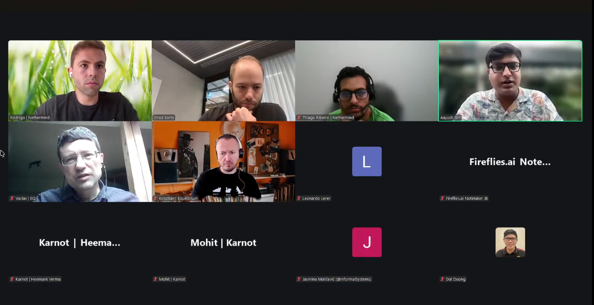

# Starknet All Core Devs Meeting #36
## Meeting Details

- **Date & Time:** Thursday, September 25, 2025, 11:00-11:30 AM UTC
- **Duration:** 30 minutes
- **YouTube:** https://www.youtube.com/live/9WLahsTnfsc
- **Agenda:** https://github.com/starknet-io/pm/issues/26
- **Moderator:** [Aayush Giri](https://github.com/Giri-Aayush)

## Meeting Screenshot

## Executive Summary

This recovery assessment meeting occurred 24 days after the September 1st mainnet v0.14.0 deployment—nearly one month of production data. The community moved from response mode to evaluating stabilization effectiveness. Key outcomes included:

- **Network achieved 10-day zero-downtime streak** as of September 25th after three post-deployment incidents
- Three downtimes occurred September 10th (30min), 12th (15min), and 15th (9min)—all root causes fixed
- **Ohad Barta introduced** as Starkware Product Manager for Starknet and SHARP roadmaps
- September 10th incident: two validators restarted simultaneously (echoing September 2nd); took 30min due to careful triple-checking to avoid another reorg; automated script now created for faster recovery
- September 12th incident: Aerospike batch write errors; reduced batch size from 1,800 to 13 elements; v0.15 will eliminate Aerospike from committer entirely
- September 15th incident: centralized sender database request stalled; automatic timeout mechanism now implemented
- Pathfinder discovered feeder gateway preconfirmed data inconsistencies causing wrong transaction receipts; workaround released same day (September 25th)
- Juno improved reorg detection: no longer waits for new chain to exceed old chain length; v0.15.7 released with syncing refactor
- **Madara v0.14.0 support merged**; RPC 0.9 remaining for complete support; 150K block replay successful; full node reorg working locally
- Malachite v0.6 release pending: fixing WAL corner case and consensus reactor/sync engine data structure interaction
- Pathfinder confirmed running latest Malachite; `starknet-interop` repo not beneficial for current testing needs; Apollo upgrade deferred

## Meeting Notes

The meeting opened with [Aayush Giri](https://github.com/Giri-Aayush) welcoming participants to Call #36. It's been exactly two weeks since the last conversation, meaning the community is now **24 days into the post-upgrade era**. Last time (Call #35), there was an in-depth discussion about different challenges, various technical issues that emerged, and how each team was responding. Aayush noted the call would be recorded for archives, requested participants stay muted when not speaking, and welcomed cameras. Today's focus: understanding **how recovery and stabilization efforts have progressed**. Two weeks ago, teams were still very much in response mode to deployment issues. Now, with **nearly a month of data**, there's a clearer picture of system stability and effectiveness of various fixes implemented.

### 1. Network Stability Assessment

**Ohad Barta** (Starkware):

Aayush introduced the first agenda item: network stability assessment. He invited Ohad to help with this, asking him to start with an introduction, then discuss network stability.

**Introduction:**

Ohad introduced himself: **"Nice to be here. I'm Ohad. I'm a Product Manager at Starkware. I'm in charge of Starknet and SHARP product roadmaps."**

(Note: This appears to be Ohad's first appearance at All Core Devs calls in this capacity.)

Ohad acknowledged they've actually had several issues and could start by referring to the very big issue on September 2nd.

Aayush interjected: They had a detailed analysis of what happened during deployment—the Cairo Zero bugs, Ethereum node issue, and two significant reorgs—in the last call (Call #35). What people want to know now is **how the network has been performing since then**. Starkware mentioned last time that stress testing was ongoing with different deals across the ecosystem. How did scaling up transaction volume result?

**Post-September 2nd Stability:**

Ohad reported: **Since September 2nd, Starkware had several much more minor incidents**, but they're still obviously unacceptable long-term.

**Three Downtime Incidents:**

1. **Wednesday, September 10th: ~30 minutes downtime**
2. **Friday, September 12th: 15 minutes downtime**
3. **Monday, September 15th: 9 minutes downtime**

**Since September 15th, Starknet is on a 10-day no-downtime streak**, which Ohad hopes will reach triple digits soon.

All of those downtimes were created by different core issues. Ohad offered to share a detailed report if interested—they have it ready. **All issues that led to those three downtimes have been fixed:**

- One was a **bug** they fixed
- Another was **not careful enough manual operation**—they added safeguards against it
- The third was **non-optimized Aerospike usage** that caused Aerospike writes to fail and enter a replay mechanism—they fixed their policy of writing into Aerospike, resolving the issue

Ohad invited follow-up questions.

**Detailed Incident Breakdown:**

Aayush asked for more detailed information about what exactly happened with these bugs and issues.

Ohad shared he'd provide the incident report they have.

**September 10th Incident (Wednesday, 30 minutes):**

Basically, **two validators were restarted at the same time**. This was due to an error in network operation—an alert triggered. Two nodes down at the same time was exactly how everything began on September 2nd, **so Starkware was really careful** in operating the network.

They **triple-checked that all three nodes operating in consensus were in sync** so they wouldn't have another reorg. **This is why it took roughly 30 minutes** to operate this issue.

**As a lesson learned** from this and September 2nd, they **created a script that will do it automatically next time**, so it will take much less time. They also **fine-tuned the alerts**. In this incident, it took **4 minutes of downtime to even get an alert**, which is unacceptable.

**September 12th Incident (Friday, 15 minutes):**

This was the one with **errors in Aerospike**. Here, an alert triggered after 2 minutes, and they very quickly changed the parameters of batch writing into Aerospike.

**FYI:** The **maximum allowed by Aerospike documentation** to write at once is **2,000 updates**. Initially, Starkware used **1,800 updates** (allowed by documentation), but for some reason it still caused things to fail.

They **reduced it significantly from 1,800 elements written in one batch to 13 elements**, which is still enough to not slow down Starknet, but Aerospike manages these shorter requests much more gracefully.

This configuration is what they now run on. This happened in the **committer**, which calculates all hashes after blocks are ready. **For version v0.15, they will replace the committer implementation to not use Aerospike**. So this issue will be behind them even at the theoretical level.

**September 15th Incident (Monday, 9 minutes):**

Starkware had a request to write to a **centralized component database called "sender"**—this is the state that the decentralized nodes agreed upon. This request **stalled and did not return**.

Here again, they just **reset this centralized component** and block production resumed very quickly. They had overall **9 minutes of downtime**.

They fixed the issue on mainnet. They now have **a mechanism where if this request isn't coming back in a few seconds, there's an automatic failure**. Previously they didn't have such a mechanism. **This issue is guaranteed not to reoccur.**

Ohad was happy to share this document with whoever is interested.

Aayush asked Ohad to share this document in the Starknet Full Node Core Devs Telegram channel after the call, thanked him for the detailed update, and moved to the next agenda item.

### 2. Client Team Recovery and Performance Updates

**Pathfinder** ([Krisztian Kovacs](https://github.com/kkovaacs)):

Aayush recalled that two weeks ago, Krisztian had released the hot fix for the reorg cache issue and was working through v0.22 and v0.23 releases. He asked how v0.23 performance has been, particularly the preconfirmed data polling improvements, and whether they're seeing latency benefits they were targeting.

**Polling Performance:**

In general, **latency has gone down**, and they haven't received reports about issues with the new polling algorithm.

**Feeder Gateway Preconfirmed Data Inconsistencies:**

However, they've seen **some inconsistencies with feeder gateway preconfirmed data responses**. They are **not always following what has been documented**.

This in turn has caused **inconsistent JSON-RPC replies in Pathfinder**. Some users have reported things like: when fetching a transaction receipt for a preconfirmed transaction, **Pathfinder sometimes returns a receipt for a different transaction**, and issues like that.

**This issue has been fixed.** They have a **workaround for this inconsistency in the feeder gateway response**. They'll **release a new version of Pathfinder hopefully later today** (September 25th).

This was probably the biggest issue they've seen. Now they have a good understanding of the problem and a fix for it.

**Otherwise, it has been going fairly smoothly.**

**Juno** ([Rodrigo Pino](https://github.com/rodrodros)):

Aayush recalled Rodrigo mentioned last time they were working on improving the reorg detection mechanism and planned to deploy shortly after the last call. He asked how that reorg detection improvement went, what the results were after testing, whether they're seeing better performance in handling chain reorganizations and current issues. He also asked about the sync mechanism optimization work.

**Reorg Detection Improvement:**

Rodrigo confirmed: **They implemented it locally. They haven't tested it in production. Luckily, there hasn't been any need to.**

At the beginning when there were "muddy waters" and Starkware gave warnings like "block production is slow," luckily there were no more reorgs. **Now it should be fixed.**

**Just for context** on what happened before: Juno would wait for the reorg chain to be bigger than the older chain. **Now, as soon as the reorg is detected, they start reorging**. They also **make sure it's actually a reorg and not that the sequencer fell behind** or anything like that.

**Sync Mechanism Refactor:**

Regarding the syncing mechanism: they **had to make a refactor on the way they sync the code**. Because now they're polling for preconfirmed, polling for pending, and then they have this notion of "latest" with improved UX. Adding it to the current code would make it very hard to test.

So they **refactored it** and made the release: **Juno v0.15.6**, which was released last Friday (September 19th).

But in fact, that's not the last release—**the last release is v0.15.7**, which has an improvement over v0.15.6 because they had a small bug.

Regarding Starknet, they have some bug reports they're investigating, but they seem to be unrelated. That's it for Juno.

**Madara/Karnot** ([Mohit](https://github.com/Mohit) and Heemank Verma, Karnot):

Aayush invited Mohit to start by introducing himself, then go through agenda items.

Mohit confirmed he's audible and introduced himself: **"I'm Mohit and I'm from team Karnot. We've been working on Madara for a while."**

Regarding updates going forward from the Karnot team, **Heemank would be handling the updates**, so he already has the pointers and Mohit will let him introduce himself and start.

**Heemank Verma (Technical Update):**

Heemank thanked Mohit: **"Heemank here, guys. Moving forward, I'll be giving the updates for the full node call."**

**v0.14.0 Support:**

Talking about Madara since the last call: **they've merged the v0.14.0 support to Madara**. They're just left with **RPC 0.9 to have complete end-to-end support for v0.14.0**.

**Block Replay Testing:**

Moreover, they've been **replaying some Starknet blocks** to see how Madara is performing. They've **done 150K blocks replayed** and it's been going fairly smooth. Now they're **preparing for v0.14.0 replay of Starknet blocks** into Madara.

**Reorg Implementation:**

Talking about reorg: they've **achieved full node reorg locally** and are testing. They're **about to start with sequencer reorg**—figuring out how to go about it and how to take it to production.

**Dependencies and PRs:**

Moving on, talking about v0.14.0 dependencies: they've **raised almost all of the PRs** out there to Kasar Labs. If anyone wants to check, please check it out. They're **just working on the end-to-end tests**, and they should be **merged before the next call** (October 9th).

**Technical Debt and Testing:**

They've also **smoothed out some technical debts** they had. They've **created end-to-end testing for Madara** which tests the whole stack—from Madara, the orchestrator, and its bootstrapper. They've **updated all Starknet dependencies to the latest dependencies** they could find—that's also done.

**Timeline:**

They're **aiming to get v0.14.0 ready as soon as possible**. Hopefully by the next call, they'll be able to give the update that they're fully ready for that.

That's the update from Karnot and Madara's side.

### 3. Consensus Implementation Coordination

**Jasmina Malicevic** (Informal Systems):

Aayush recalled that last time Jasmina mentioned potentially doing a follow-up Malachite release to address some identified issues. He asked if that release has materialized and what improvements it includes. He also asked about reaching out to full node teams to understand what Malachite version they're running and what discoveries were made. Finally, he asked about Apollo sequencer upgrade coordination for the testing environment.

**Malachite Release Status:**

Jasmina confirmed: **They have not cut the release yet** because they're still working on a couple things.

There was a **minor corner case in the way WAL (write-ahead log) works** that was fixed.

The **other bug was related to a weird interaction** their sync engine has with the consensus reactor—**they share a data structure which could potentially jeopardize consensus when both are running**. So they were **refactoring that**. That should hopefully be **done this week**, and then they might **cut a release after that**.

**Full Node Team Malachite Versions:**

They've **synced with Pathfinder**, and Pathfinder is **running the latest Malachite release**. **It's still going smoothly—there have not been any problems.**

**Starknet Interop Repository:**

They've **discussed with Pathfinder about the interop repo**. It does **not really seem that it's bringing great value to them** in terms of how they think of interoperability.

When the repo was started, it was more to **showcase how a Malachite dummy sequencer on top of Malachite would work with a Starkware sequencer**.

Jasmina hasn't heard from other teams if anybody else finds this particular work stream useful. They're **happy to guide teams through it**. They did **clean it up** in the sense that **it now fully works and is reproducible** with the old version of the Starkware sequencer—but note it's not really the full sequencer. Shahak was basically cleaning up the sequencer code for them from stuff that wasn't really needed.

**Apollo Sequencer Upgrade Deferred:**

They **have not started upgrading to Apollo** because at this point **it doesn't really seem beneficial for people**. If that ever changes, they can reconsider.

The reason: they **don't have a real full node implementation**. This was more showcasing how the protobufs and networking work together. For example, for Pathfinder, it seems **they're beyond that now—they're already in testing**. So it's not really helpful for them to go backwards.

**Team Status:**

In terms of **team stability and onboarding**: **they're now fully there** and moving full speed ahead.

Again, **happy to support if there are any questions with Malachite integration** from other full node teams. That's pretty much it from last time.

### 4. P2P Network Status

Aayush noted: regarding P2P network status, **there are no current updates right now** as he discussed with Shahak. That's why it's not included on the agenda.

### 5. Wrap-up and Next Steps

Aayush asked if there are any other observations or concerns as they approach the **one-month mark since deployment**—anyone wanting to raise anything or ask anything.

**Sequencer Reorg Documentation Request:**

Heemank raised his hand and asked about **reorg documentation** if they could find some, so they can implement the sequencer properly.

Aayush asked: Ohad, can you provide this documentation?

Ohad asked what exactly they need.

Heemank clarified: **Reorg implementations for the sequencer**—if there's any documentation about it, it will help them quite a lot.

Ohad responded: He'll **check with the team**. He thinks right now **reorg is very manual and uses the fact that they're still centralized**.

Heemank acknowledged: "Okay."

**Closing Remarks:**

Aayush thanked everyone for joining the call today. **It's great to see everyone working through these challenges, and the network's recovery speaks to the quality of the engineering and coordination across all of us.**

Everyone have a nice day. See you all in two weeks.

## Key Decisions Summary

| Decision | Rationale | Impact |
|----------|-----------|---------|
| Automated validator restart script created | September 10th incident took 30 minutes due to manual triple-checking; same pattern as September 2nd reorg trigger | Future validator restarts will be much faster while maintaining safety checks |
| Aerospike batch write size reduced from 1,800 to 13 elements | Despite being within documentation limits, 1,800 elements caused write failures | Committer now stable; eliminates this failure mode until v0.15 removes Aerospike entirely |
| v0.15 will remove Aerospike from committer implementation | September 12th incident demonstrated architectural risk with Aerospike dependency | Eliminates entire class of potential failures at theoretical level |
| Centralized sender database automatic timeout mechanism implemented | September 15th incident: stalled request caused 9-minute downtime; no timeout existed | Issue guaranteed not to reoccur; prevents indefinite stalls |
| Alert system fine-tuned for faster notification | September 10th: 4 minutes of downtime before alert triggered | Faster incident detection and response times |
| Pathfinder released workaround for feeder gateway inconsistencies | Preconfirmed data responses not following documentation; caused wrong transaction receipts | Users receive consistent JSON-RPC responses despite upstream issues |
| Juno reorg detection now triggers immediately upon detection | Previous implementation waited for new chain to exceed old chain length, causing nodes to get stuck | Faster reorg execution; validates it's actual reorg vs. sequencer lag |
| Juno refactored sync mechanism for preconfirmed/pending/latest polling | Adding improved UX polling to existing code made testing very difficult | Cleaner codebase; easier correctness verification; v0.15.7 released |
| Madara prioritizing v0.14.0 completion over new features | Need to achieve feature parity with other clients; Karnot now maintaining codebase | Full v0.14.0 support expected by next call (October 9th) |
| Malachite refactoring consensus reactor/sync engine data structure sharing | Shared data structure could potentially jeopardize consensus when both components running | Eliminates subtle race condition risk; v0.6 release pending completion |
| Starknet interop repo Apollo upgrade deferred | Not beneficial for current full node team testing needs; Pathfinder beyond that stage | Resources focused on higher-value integration work |

## Action Items Tracker

| Action Item | Owner | Target Date | Status |
|-------------|-------|-------------|--------|
| Share detailed incident report in Telegram channel | Starkware (Ohad) | Post-September 25, 2025 | Pending |
| Continue monitoring 10-day zero-downtime streak | Starkware | Ongoing | In Progress |
| Deploy automated validator restart script in production | Starkware | TBD | Completed (script created) |
| Replace committer Aerospike implementation in v0.15 | Starkware | v0.15 release | Planned |
| Release Pathfinder with feeder gateway inconsistency workaround | Equilibrium (Krisztian) | September 25, 2025 | In Progress |
| Continue monitoring Pathfinder v0.23 polling performance | Equilibrium | Ongoing | In Progress |
| Test Juno improved reorg detection in production environment | Juno (Rodrigo) | Next reorg occurrence | Awaiting Test Scenario |
| Investigate Juno bug reports (appear unrelated to recent changes) | Juno (Rodrigo) | Ongoing | In Progress |
| Complete Madara RPC 0.9 implementation for full v0.14.0 support | Karnot (Heemank) | Before October 9, 2025 | In Progress |
| Execute v0.14.0 Starknet block replay testing on Madara | Karnot (Heemank) | Ongoing | In Progress |
| Implement and test Madara sequencer reorg locally | Karnot (Heemank) | Before October 9, 2025 | In Progress |
| Merge Madara v0.14.0 dependency PRs and end-to-end tests | Karnot (Heemank) | Before October 9, 2025 | In Progress |
| Complete Malachite WAL corner case fix | Informal Systems (Jasmina) | Week of September 25, 2025 | In Progress |
| Complete Malachite consensus reactor/sync engine refactor | Informal Systems (Jasmina) | Week of September 25, 2025 | In Progress |
| Cut Malachite v0.6 release | Informal Systems (Jasmina) | Post-refactor completion | Pending |
| Check for sequencer reorg documentation availability | Starkware (Ohad) | ASAP | Pending |
| Hold next All Core Devs call with 38+ days production data | Aayush Giri | October 9, 2025 | Scheduled |

## Attendees

- **Moderator:** Aayush Giri | Nethermind
- Rodrigo Pino | Nethermind
- Ohad Barta | Starkware
- Thiago Ribeiro | Nethermind
- Vaclav | Equilibrium
- Krisztian Kovacs | Equilibrium
- Leonardo Lerer | Starkware
- Heemank Verma | Karnot
- Mohit | Karnot
- Jasmina Malicevic | Informal Systems
- Dat Duong

## Glossary

- **10-day zero-downtime streak**: Period from September 15-25 with no network downtime incidents; goal to reach 100+ days
- **Validator**: Node participating in consensus to validate blocks; Starknet had 3 validators during incidents
- **Manual operation**: Human-initiated actions on production systems; automated to reduce error risk
- **Aerospike**: High-performance NoSQL database used in committer component; being replaced in v0.15
- **Batch write**: Writing multiple updates in single database operation for efficiency
- **Committer**: Component calculating hashes after blocks are ready for finalization
- **Sender**: Centralized component database holding state agreed upon by decentralized nodes
- **Automatic timeout**: Mechanism that fails requests not returning within specified time window
- **Alert system**: Automated monitoring and notification infrastructure for detecting incidents
- **Feeder gateway**: API endpoint providing transaction execution traces and blockchain data
- **Preconfirmed data**: Block data available before final consensus confirmation
- **Transaction receipt**: Record of transaction execution results and state changes
- **Polling algorithm**: Method for periodically checking for new data (blocks, transactions)
- **Latency**: Time delay between data availability and client retrieval
- **Reorg detection**: Mechanism for identifying when blockchain reorganization is occurring
- **Chain reorganization**: Replacing blockchain history when alternate chain becomes canonical
- **Sync mechanism**: Process for bringing node's blockchain state current with network
- **Technical debt**: Suboptimal code requiring future refactoring for maintainability
- **RPC 0.9**: Latest JSON-RPC specification version for interacting with Starknet nodes
- **Block replay**: Re-executing historical transactions to verify state consistency and implementation correctness
- **Full node reorg**: Reorganization handling for nodes storing complete blockchain state
- **Sequencer reorg**: Reorganization handling for nodes ordering and executing transactions
- **End-to-end testing**: Testing complete system functionality from orchestrator through bootstrapper
- **Orchestrator**: Component coordinating multiple system components for Madara
- **Bootstrapper**: Component handling initial node setup and synchronization
- **WAL (Write-Ahead Log)**: Crash recovery mechanism logging operations before execution
- **Consensus reactor**: Component handling consensus protocol message processing
- **Sync engine**: Component responsible for synchronizing blockchain state
- **Data structure sharing**: Multiple components accessing same memory structure; can cause race conditions
- **`starknet-interop` repo**: Repository showcasing Malachite/Starkware sequencer interoperability
- **Protobufs (Protocol Buffers)**: Serialization format for consensus communication
- **Apollo sequencer**: Updated Starkware sequencer implementation; upgrading interop repo deferred
- **SHARP**: Shared Prover system for Starknet; managed by Ohad's product roadmap

---

*These notes were compiled by [Aayush Giri](https://github.com/Giri-Aayush) from the September 25, 2025 Starknet All Core Devs call. For the most accurate information, please refer to the [full recording](https://www.youtube.com/live/9WLahsTnfsc).*
