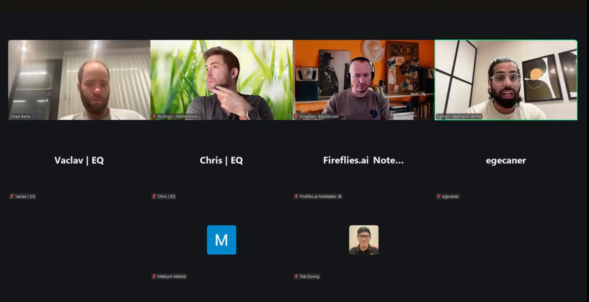

# Starknet All Core Devs Meeting #37
## Meeting Details

- **Date & Time:** Thursday, October 9, 2025, 11:00-11:30 AM UTC
- **Duration:** 30 minutes
- **YouTube:** https://www.youtube.com/live/ioXc1xvrAWs
- **Agenda:** https://github.com/starknet-io/pm/issues/27
- **Moderator:** [Ohad Barta](https://github.com/ob1337)

## Meeting Screenshot

## Executive Summary

This stability milestone meeting occurred 38 days after the September 1st mainnet v0.14.0 deployment, marking **Ohad Barta's first time moderating** an All Core Devs call (Aayush asked him on a one-time basis). The community assessed continued recovery progress. Key outcomes included:

- **Network operating "almost flawlessly"** over the past two weeks
- **Minor 2-minute downtime incident occurred hours before call** due to Aerospike issues with committer (same root cause as September 12th)
- **v0.14.2 will eliminate Aerospike dependency** with Rust committer implementation
- v0.14.2 will include robust stress testing to prevent committer falling >10 blocks behind block production
- Continuous stability improvements: more accurate alerts, improved Grafana dashboards for faster investigation
- **L1 handler transaction resilience improved**: nodes will offer L1 handlers every few blocks instead of every block to handle flaky L1 providers
- **v0.14.1 planned for late November** with SNIP-34 and RPC 1.0 RC; prioritizing stability over new versions
- v0.14.1 integration network deployment: end of October/early November; 2-week integration + 2-week testnet periods
- Pathfinder making progress on consensus implementation; integration testing with Apollo for P2P communication validation
- Juno releasing next week with bug fixes and **Pprof support in RPC** for performance profiling
- **Madara RPC 0.9 closing soon** enabling full v0.14.0 sequencer support
- Madara full node reorg in internal testing, performing well; merge imminent
- Madara optimizing full node sync speed with snap sync calculating global state root after block batches
- **Madara Bootstrapper v2 releasing**: deprecates v1 with much better optimization and faster deployment

## Meeting Notes

The meeting opened with [Ohad Barta](https://github.com/ob1337) noting that **Aayush asked him to be the moderator in this call on a one-time basis**. Ohad began with the agenda, noting the first item was prepared for him to give an update on Starknet stability after the September incidents.

### 1. Network Stability Milestone - 38 Days Post-Deployment

**Ohad Barta** (Starkware):

**Overall Assessment:**

Over the last two weeks, **Starknet continued to operate almost flawlessly**.

**Recent Incident (Hours Before Call):**

The network had a **relatively minor incident actually a few hours ago** (October 9th morning). There were **2 minutes of downtime**. This is **again due to some Aerospike issues with the committer**—the same problem experienced in September.

**v0.14.2 Fix Scheduled:**

The **fix is scheduled for v0.14.2** with the **Rust committer that will not be dependent on Aerospike** and will work faster.

**v0.14.2 Stress Testing:**

As part of v0.14.2 preparations, Starkware will also do **robust stress testing of the committer** to ensure that **under no circumstances does the committer fall too far behind block production**. There is a **maximum 10-block gap** between the two—if the committer stops after 10 blocks, everything stops.

**Ongoing Stability Improvements:**

Despite the recent incident, Starkware has delivered many **small improvements to stability on mainnet**, mostly around:
- **More accurate alerts**
- **More accurate and robust Grafana dashboards** to allow faster investigation

**Future Robustness Features:**

Starkware is also working on further improvements, such as:

**Improving consensus behavior when L1 third-party providers or nodes are flaky.** For example, **nodes will not offer L1 handler transactions every block**—they will **do it every few blocks**. So if there's an issue or discrepancy in the L1 handlers, the network will resume.

There are **many more small robustness features planned for the next few months**.

Ohad asked if anyone has questions around this update.

**v0.14.1 Timeline and Scope:**

Ohad added: **v0.14.1 is also planned** obviously between now and v0.14.2. It will include mostly **SNIP-34** that he released kind of late, just so the version will match the SNIP. It will **introduce RPC 1.0**, which still has its first release candidate published, but they're **still considering a new release candidate for it**.

He expects it to **hit mainnet at end of November, give or take**. Starkware is currently **prioritizing robustness and stability improvements over new versions**, which is why it was delayed a bit.

Ohad asked for any questions around that, or should they move to client team performance updates.

**Krisztian's Question on Integration Network:**

Krisztian noted this was also asked on the JSON-RPC channel or maybe somewhere else: **When can they expect v0.14.1 to be deployed onto the integration network?**

Ohad responded: **There is no concrete date yet.** He would say **in a few weeks, probably end of October or early November**. They aim for **2 weeks integration and 2 weeks testnet period** because it's a relatively minor version.

Krisztian explained: Usually they use the integration network and new features exposed on the integration network to do **validation testing of their implementation**. That's pretty much why he's asking.

Ohad acknowledged and thanked him.

### 2. Client Team Production Performance Updates

**Pathfinder** ([Krisztian Kovacs](https://github.com/kkovaacs)):

Ohad invited Pathfinder updates.

**Release Status:**

There's **not much to update this time**. Since the last call, they've **released a new minor release fixing a few bugs**. They're also **accumulating some more bug fixes**, so they're **expecting to release a new version of Pathfinder soon, probably next week**. Those fixes are still in testing.

**Consensus Implementation Progress:**

They're **making some progress with the consensus implementation**—various issues they've found there. Krisztian didn't really want to go too much into detail here.

They're also **trying to integration test their own consensus implementation with Apollo**, just to see **if the consensus-related peer-to-peer communication is working at all**.

That's pretty much it for Pathfinder.

Ohad asked for any questions; hearing none, he moved to Juno.

**Juno** ([Rodrigo Pino](https://github.com/rodiazet)):

**Release Status:**

On their side: also **no major updates**—only that they've also been **solving bugs** and **preparing for a release next week**, which will have these bug fixes and also **some improvements**.

**Pprof Support:**

This includes **the use of Pprof in the RPC**, so you get the **full benefits from that** (performance profiling).

Generally: **bug fixes**—that's most of their updates.

Ohad acknowledged.

**Madara/Karnot** ([Heemank Verma](https://github.com/hemantwasthere), Karnot):

Ohad asked for updates from Karnot.

Heemank checked if he's properly audible. Ohad confirmed yes.

**RPC 0.9 Completion:**

They're **soon to close RPC 0.9.0**, which will allow them **v0.14.0 update with the sequencer**.

**Full Node Reorg Status:**

In the last full node call, they updated everyone about their **full node reorg**. That has been **in internal testing**—**it's performing really well**. It will be **merged really soon**.

**Madara Orchestrator Updates:**

Apart from that, they have a few updates on the **Madara orchestrator side**: they're **validating the v0.14.0 aggregator**, and hopefully they'll have it completely done with the **end-to-end pipeline** so they have Madara orchestrator and state update happening properly.

**Multi-Block SNOS Integration:**

They have **multi-block SNOS integration** ongoing in the operator side, given that **in v0.14.0, a single SNOS can run multiple blocks together**. That's what they're focusing on.

**L3 Support:**

On top of that, they're **pushing forward for L3 support in v0.14.0** so that all the L3s they're currently supporting can be bumped up to that particular version.

**Full Node Syncing Optimization:**

There are a few updates on the **full node syncing side of Madara**. They've been **testing and trying to optimize the full node syncing speed** of Madara. They've **contacted the Pathfinder team**—**thanks a lot to Krisztian** for helping them out with all the evaluations they've done on the Pathfinder side.

With that, they're **trying to speed up the process of full node syncing in Madara**. They have a few **optimizations coming**: they're working on a **snap sync optimization** that will allow them to **calculate the global state root after a batch of blocks**. That will help increase the speed.

**Sequencer SNOS v0.14.0:**

Lastly, on the sequencer side: they've **raised all the PRs for SNOS v0.14.0**. The **only two things left are block zero support and zero fee support**, and **all these PRs are now merged**.

**Madara Bootstrapper v2:**

Finally, on the **Madara bootstrapper**: Bootstrapper is actually a **service that allows them to deploy all the necessities for Madara as a chain to run**—for example, the core contract, the UDC (Universal Deployer Contract), and everything.

They had a bootstrapper before, but now they're **deprecating it for the much better Bootstrapper v2**, which is **much more optimized and much faster**. That is also **around the corner—it's going to get released soon**.

Those are the major updates from their side.

### 3. Wrap-up and Next Steps

Ohad asked for any questions around that or otherwise—this was the last item on the agenda.

Hearing none, Ohad thanked everyone: **"See you in the next call in two weeks at the same hour. Have a great day."**

## Key Decisions Summary

| Decision | Rationale | Impact |
|----------|-----------|---------|
| v0.14.2 will replace committer with Rust implementation removing Aerospike | October 9th 2-minute downtime (same Aerospike root cause as September 12th) | Eliminates entire class of Aerospike-related failures; faster committer performance |
| v0.14.2 will include robust committer stress testing | Prevent committer falling >10 blocks behind block production (causes full network halt) | Validates committer can keep pace under all load scenarios |
| L1 handler transactions offered every few blocks instead of every block | Improves resilience when L1 third-party providers or nodes are flaky | Network continues operating despite L1 discrepancies or provider issues |
| v0.14.1 prioritized for stability over new features; late November mainnet | Currently prioritizing robustness improvements post-September incidents | Delayed timeline allows focus on network reliability |
| v0.14.1 integration network deployment: end October/early November | 2-week integration + 2-week testnet validation periods for relatively minor version | Client teams can validate implementations on integration network before mainnet |
| Pathfinder integration testing consensus implementation with Apollo | Validate consensus-related P2P communication works correctly | Ensures interoperability before production deployment |
| Juno releasing Pprof support in RPC next week | Enable performance profiling and debugging capabilities | Operators can diagnose performance issues more effectively |
| Madara closing RPC 0.9 to enable full v0.14.0 sequencer support | Complete feature parity with other clients for sequencer mode | Madara achieves full v0.14.0 capabilities |
| Madara implementing snap sync optimization | Calculate global state root after block batches instead of per block | Significantly faster full node synchronization |
| Madara Bootstrapper v2 replacing v1 | v1 less optimized; v2 much faster and better for chain deployment | Faster Madara chain deployment and initialization |

## Action Items Tracker

| Action Item | Owner | Target Date | Status |
|-------------|-------|-------------|--------|
| Deploy v0.14.2 with Rust committer (no Aerospike dependency) | Starkware (Ohad) | TBD | Planned |
| Execute robust stress testing of new committer for v0.14.2 | Starkware (Ohad) | Pre-v0.14.2 release | Planned |
| Continue implementing small robustness features (alerts, dashboards) | Starkware (Ohad) | Ongoing | In Progress |
| Implement L1 handler transaction batching (every few blocks) | Starkware (Ohad) | Next few months | Planned |
| Deploy v0.14.1 to integration network | Starkware (Ohad) | End Oct/Early Nov 2025 | Planned |
| Deploy v0.14.1 to testnet (2-week period) | Starkware (Ohad) | Mid-November 2025 | Planned |
| Deploy v0.14.1 to mainnet with SNIP-34 and RPC 1.0 | Starkware (Ohad) | End of November 2025 | Planned |
| Release Pathfinder minor version with accumulated bug fixes | Equilibrium (Krisztian) | Week of October 14, 2025 | In Progress |
| Continue consensus implementation development and issue resolution | Equilibrium (Krisztian) | Ongoing | In Progress |
| Complete Pathfinder/Apollo consensus P2P integration testing | Equilibrium (Krisztian) | Ongoing | In Progress |
| Release Juno with bug fixes and Pprof RPC support | Juno (Rodrigo) | Week of October 14, 2025 | In Progress |
| Close Madara RPC 0.9.0 implementation | Karnot (Heemank) | ASAP | Nearly Complete |
| Merge Madara full node reorg (from internal testing) | Karnot (Heemank) | Imminent | In Progress |
| Complete Madara v0.14.0 aggregator validation with E2 pipeline | Karnot (Heemank) | Ongoing | In Progress |
| Complete multi-block SNOS integration in Madara operator | Karnot (Heemank) | Ongoing | In Progress |
| Implement L3 support in Madara v0.14.0 | Karnot (Heemank) | Ongoing | In Progress |
| Implement snap sync optimization for Madara full node syncing | Karnot (Heemank) | Ongoing | In Progress |
| Merge remaining SNOS v0.14.0 PRs (block zero + zero fee support) | Karnot (Heemank) | ASAP | Nearly Complete |
| Release Madara Bootstrapper v2 | Karnot (Heemank) | Soon | Imminent |
| Hold next All Core Devs call | Moderator TBD | October 23, 2025 | Scheduled |

## Attendees

- **Moderator:** Ohad Barta | Starkware
- Rodrigo Pino | Nethermind
- Krisztian Kovacs | Equilibrium
- Heemank Verma | Karnot
- Vaclav | Equilibrium
- Chris | Equilibrium
- egecaner
- Maksym Malicki
- Dat Duong

## Glossary

- **v0.14.1**: Planned Starknet upgrade for late November 2025 including SNIP-34 and RPC 1.0
- **v0.14.2**: Future Starknet upgrade replacing committer with Rust implementation
- **SNIP-34**: Starknet Improvement Proposal #34; specific upgrade being included in v0.14.1
- **RPC 1.0**: First major version of JSON-RPC specification; RC (release candidate) published
- **Aerospike**: High-performance NoSQL database causing committer failures; being removed in v0.14.2
- **Committer**: Component calculating hashes after blocks are ready; has 10-block gap limit before halting network
- **Rust committer**: New committer implementation in Rust programming language; faster and Aerospike-independent
- **Stress testing**: Testing system behavior under high load to ensure performance under all scenarios
- **10-block gap**: Maximum distance committer can fall behind block production before network halts
- **Grafana dashboards**: Monitoring visualization tool for investigating network performance and incidents
- **L1 handler transactions**: Transactions originating from Ethereum Layer 1 and processed on Starknet
- **Flaky L1 providers**: Unreliable third-party Ethereum node providers with intermittent connectivity
- **Integration network**: Testing environment for validating new features before testnet deployment
- **Testnet**: Public testing network (Sepolia) for community validation before mainnet
- **Validation testing**: Client team testing to ensure implementation correctness against specification
- **Consensus implementation**: Code implementing consensus protocol for block finalization
- **P2P communication**: Peer-to-peer networking between nodes for consensus coordination
- **Apollo**: Starkware sequencer implementation used for integration testing
- **Pprof**: Go profiling tool for analyzing performance and resource usage; being added to Juno RPC
- **Performance profiling**: Analysis of system resource usage (CPU, memory) to identify bottlenecks
- **RPC 0.9**: JSON-RPC specification version 0.9; Madara closing implementation for v0.14.0 support
- **Full node reorg**: Reorganization handling for nodes storing complete blockchain state
- **Madara orchestrator**: Component coordinating multiple Madara system components
- **Aggregator**: Component collecting and aggregating data or proofs
- **End-to-end pipeline**: Complete testing workflow from input through all system components to output
- **State update**: Changes to blockchain state between blocks
- **Multi-block SNOS**: SNOS (Starknet OS) capability to process multiple blocks in single execution (v0.14.0 feature)
- **SNOS (Starknet OS)**: Operating system layer for Starknet implemented in Cairo
- **Operator**: Service or component managing system operations
- **L3 (Layer 3)**: Blockchain layers built on top of Starknet (L2); Madara supports L3 deployments
- **Snap sync**: Synchronization optimization calculating state at intervals rather than continuously
- **Global state root**: Cryptographic hash representing entire blockchain state at specific block height
- **Block batch**: Group of blocks processed together for efficiency
- **Block zero**: Genesis block or initial block of blockchain
- **Zero fee**: Transactions with no gas fees (special case requiring explicit support)
- **Madara Bootstrapper**: Service deploying infrastructure for Madara chain initialization
- **Core contract**: Essential smart contracts required for blockchain operation
- **UDC (Universal Deployer Contract)**: Standard contract for deploying other contracts on Starknet
- **Bootstrapper v2**: Second-generation bootstrapper with improved optimization and speed

---

*These notes were compiled by [Aayush Giri](https://github.com/Giri-Aayush) from the October 9, 2025 Starknet All Core Devs call. For the most accurate information, please refer to the [full recording](https://www.youtube.com/live/ioXc1xvrAWs).*
