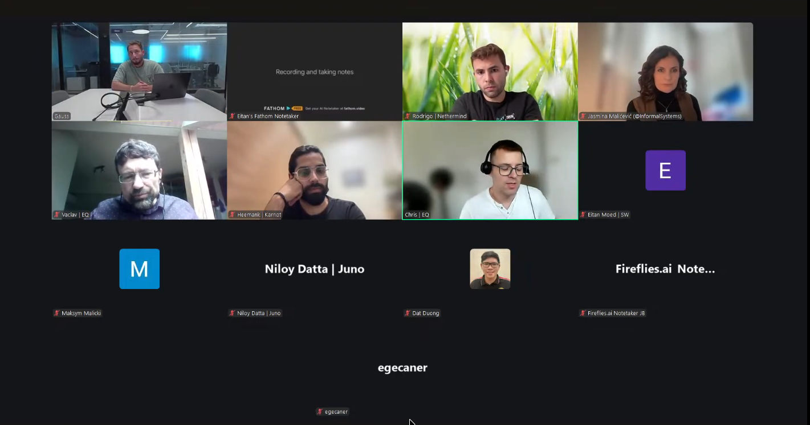

# Starknet All Core Devs Meeting #38
## Meeting Details

- **Date & Time:** Thursday, October 23, 2025, 11:00-11:30 AM UTC
- **Duration:** ~20 minutes (shorter than usual)
- **YouTube:** https://www.youtube.com/live/BjRMtKVP5Sw
- **Agenda:** https://github.com/starknet-io/pm/issues/28
- **Moderator:** Eitan Moed (Aayush on flight)

## Meeting Screenshot

## Executive Summary

This pre-v0.14.1 coordination meeting was moderated by **Eitan Moed** (Aayush on flight). Focus: v0.14.1 deployment timeline and readiness assessment one month before mainnet. Key outcomes:

- **v0.14.1 pre-release notes published**; RPC 1.0 RC1 published same day
- **Major change: Blake2 hash function replacing Poseidon** in v0.14.1
- **Integration: October 28th** | **Testnet: November 11th** | **Mainnet: November 25th**
- RPC jumping from 0.9 to 1.0—great opportunity for last-minute additions
- Pathfinder working on Kasm change; released bug fix for estimate_fee, syncing timeout, and deploy_account simulation
- **Juno implemented Blake2 cache** (Go requirement); concerned about class hash trie handling across v0.14.1 boundary
- Juno adding WebSocket latest UX improvement to subscription-based requests; release next week
- Madara currently bumping to v0.14.0; v0.14.1 evaluation not yet started
- **Two stability incidents in past two weeks**: (1) transaction runtime miscalculation caused 5min block proposal failures; mitigated by increasing max block time to 9s; (2) preconfirmed queries overloaded database, stalling committer; mitigated with better caching
- **Malachite v0.6 releasing in ~2 weeks**; Informal Systems and Circle forks now matching; no critical bugs blocking release
- Network stable since incidents; "knock on wood"

## Meeting Notes

The meeting opened with Eitan Moed noting this is the bi-weekly call this week and **he'll be moderating as Aayush is on a flight**. For today's agenda, he'll start with v0.14.1.

### 1. v0.14.1 Integration Deployment Update

**Eitan Moed** (Starkware):

Eitan wasn't present during the last call (Call #37, moderated by Ohad), so he wasn't sure how much everyone's been updated. He **just published the pre-release notes** and would love feedback when people get a chance. He saw Rodrigo already posted something and will get back to it.

**Major Changes:**

The **big thing in v0.14.1 is the implementation of Blake usage as a hash function from Poseidon**.

Around that, **a new RPC version 1.0.0** will be introduced as well. The **next release candidate (RC1) was also published in the past hour**. If anyone has notes or anything else they'd like to introduce, **it's a great opportunity because we're jumping from 0.9 to 1.0**—please let Eitan know in the coming days. General feedback is more than welcome.

**Timeline:**

- **Integration: October 28th**
- **Testnet ETA: November 11th**
- **Mainnet: November 25th**

This gives about **one month from today to reach mainnet**.

Those are the main things regarding v0.14.1 logistics.

### 2. Client Team v0.14.1 Readiness

**Pathfinder** (Chris / [Vaclav](https://github.com/vaclav)):

Eitan asked Pathfinder for readiness updates.

(Eitan's video froze briefly.)

Chris responded: **they're working on it**. Essentially, they're **just starting work on the Kasm change**.

Is there anything else they should mention?

Vaclav added: they **started on RPC 1.0**—have a 1.0 API which is the same as 0.9—and are **going through the changes now**. They're all **very small except the new hash**, which is the main one. As Chris said, they're working on that.

**Recent Release:**

Eitan noted they had a recent release while he was out of office, with a **deploy account simulation fix**. Any words to share?

Chris confirmed: it was a **bug fix release with three fixes**:
1. **`starknet_estimateFee`** fix
2. **Syncing**: decreased the timeout when there's a non-standard error on the sequencer
3. **`simulate_transactions`**: when the skip fee charge flag is not set, it sometimes failed for deploy_account

Chris can link the issues and PRs—would take a few minutes to explain everything in detail.

Vaclav noted the **fixes are in the release notes** so they should be visible. If anyone wants more details, they have to jump into the code.

**Juno** ([Rodrigo Pino](https://github.com/rodiazet)):

Eitan asked Juno about v0.14.1 readiness or preparation. He knows release notes just came out, so he's not expecting anything beyond taking that into consideration.

Rodrigo confirmed: on their side, they've **already implemented Blake2 cache**—they have to implement it because they're in Go.

**Next steps** (not yet done, but shouldn't be particularly painful):
- **Updating the RPC** (should be easy)

**Class Hash Trie Concern:**

The thing they're **worried about is more in syncing**: they posted a question about **what happens with the class hash tries when there's a new class hash**:
- What happens if they use a class hash in a block **previous to v0.14.1**?
- What happens if they get the **same class hash in a block that is v0.14.1**?
- **How do they keep track of all those duplicated things?**

They're mostly worried about this—they'll have to be more careful around it.

Eitan acknowledged it's a **good question**. Rodrigo posted it right before the call, so Eitan didn't have time to get the perfect answer. He's **holding back from giving his thoughts for now**.

**Recent Updates:**

Juno has some **simple stability improvements** regarding issues—they had the **same issues as Pathfinder**. They still haven't made a release but are **aiming to release next week** with a bunch of things.

Mainly: they already had **WebSocket latest UX improvement** integrated as part of normal HTTP requests, but now they're **adding it to subscription-based requests** too. Users can have all that information. This will be part of the next release, including these bug fixes and other smaller Juno-specific improvements.

Eitan asked if there's anything else. Rodrigo said no, not so far.

**Madara/Karnot** ([Heemank Verma](https://github.com/hemantwasthere)):

On the Madara side: they're **currently bumping Madara to v0.14.0**. They **have not yet evaluated the work towards v0.14.1**. Hopefully they'll have something soon.

One of the agenda items was also the **SNOS integration status**—Heemank confirmed yes.

### 3. Network Stability Updates

**Eitan Moed** (Starkware):

Also, there were some **network stability hiccups over the past two weeks** from Eitan's understanding. Again, he was off the radar. He assumes the teams didn't receive too much update on that unless there's something he doesn't know that reached them.

**Quick Summary:**

**Incident ~1.5 Weeks Ago (Transaction Runtime Miscalculation):**

About a week and a half ago, there was a **miscalculation of a transaction runtime** which caused **proposing blocks to fail for about 5 minutes**.

Essentially: the **first transaction entering the block**—the **length of it was miscalculated**, meaning it took more time to run than they thought it should. So **each proposer tried to put it into its block**, and **each time the proposer failed to include that transaction** because the **block time would timeout before the transaction completed running**.

**Mitigation:** **Increased block time to a max of 9 seconds** for now. This allowed them to understand that if a miscalculation happens, by **increasing max block time by 50%**, they're pretty much covered in terms of this type of situation.

**Why it only lasted 5 minutes:** At a certain point, **transactions leave the mempool if they're not included into a block**. Essentially they had this issue until the transaction was aborted from the mempool.

**Incident ~2 Weeks Ago (Preconfirmed Database Overload):**

About two weeks ago (must have been right after the bi-weekly call), the **preconfirmed was having too many queries**—or not too many, but was **creating an overload on the database**. Due to this, the **committer (which also uses the database) was not working fast enough**, and this created a **backlog that stalled the network**.

It took some time to realize this was causing the issue with the committer.

**Mitigation:** **Including better cache functionality for pre-confirmations** so there would be **less overhead on the database** when users choose to query at scale on pre-confirmations.

Those are the two updates in terms of performance and network stability. As far as Eitan's understanding, **since then, knock on wood, they've been stable**.

### 4. Consensus Implementation Updates

**Jasmina Malicevic** (Informal Systems):

Last time they talked about whether a new Malachite release is coming out.

Jasmina has discussed this with the folks now at **Circle** (the team that spun out). They **pushed a small bug fix on the WAL into their repo** as well.

They're **planning to put out a new release in the next coming weeks**—could be maybe **two weeks or so** if nothing changes.

At some point they were debating: if this isn't going to happen very soon, they might release from their own crates so people are up to date. But given that **this bug is not really critical** and that **the forks at this point are pretty much a match** (Informal's fork and the Circle fork are really matching), it makes sense to **just wait till they do an official release**.

If something comes up in the meantime where they find a bug that's really important to be released immediately, they can handle it and she'll update everyone. But for the moment, **there's going to be a v0.6 release in the coming weeks**.

They've also fixed some things—Circle has also pushed some things that were cosmetic. Jasmina doesn't think there are **too many breaking changes for folks** when the upgrade comes around. If anything changes between this and the next call and they decide to release sooner, she'll let everyone know.

**Things have been stable**—there's **not really any major threads of work with regards to consensus changes** at this point.

### 5. Communication and Coordination Improvements

**Eitan Moed** (Starkware):

The last note on today's call: just **general communication and coordination improvements**.

Obviously they're always open for **feedback on this front**. In this industry, it's very important to have **clear communication and coordination**. Release notes are part of it, pre-release notes are part of it, RPC pre-releases—all that stuff.

If there's need for **documentation or better documentation**, all these things are good to be shared as feedback so they can make the required improvements wherever they may be.

On that note, is there anything else anyone would like to share? Any other business?

### 6. Wrap-up

Hearing nothing, Eitan concluded: **that's it for this week**. **Shorter call than usual, but I guess that's also a good thing—means we're well coordinated.**

The **next call is scheduled for Thursday, November 6 at 11:00 AM UTC**. All parties, all interested parties are encouraged to join. See you guys then.

## Key Decisions Summary

| Decision | Rationale | Impact |
|----------|-----------|---------|
| v0.14.1 mainnet deployment November 25th | One month timeline from October 23rd; integration Oct 28, testnet Nov 11 | Gives client teams 4 weeks to implement Blake2 and RPC 1.0 |
| RPC version jumping from 0.9 to 1.0 | Opportunity for consolidated major version bump | Last chance for teams to request additions before v1.0 finalization |
| Max block time increased to 9 seconds | 50% increase covers transaction runtime miscalculation scenarios | Prevents 5-minute block proposal failures from recurring |
| Better caching for preconfirmed data queries | Prevents database overload that stalls committer | Reduces database overhead during high-volume preconfirmed queries |
| Malachite v0.6 release delayed ~2 weeks | Bug not critical; Informal and Circle forks now matching | Wait for official Circle release rather than releasing from Informal crates |

## Action Items Tracker

| Action Item | Owner | Target Date | Status |
|-------------|-------|-------------|--------|
| Review v0.14.1 pre-release notes and provide feedback | All client teams | ASAP | Pending |
| Submit any last additions for RPC 1.0 | All teams | Coming days | Open |
| Deploy v0.14.1 to integration network | Starkware (Eitan) | October 28, 2025 | Scheduled |
| Deploy v0.14.1 to testnet | Starkware (Eitan) | November 11, 2025 | Scheduled |
| Deploy v0.14.1 to mainnet | Starkware (Eitan) | November 25, 2025 | Scheduled |
| Implement Kasm (Blake2) change in Pathfinder | Equilibrium | Pre-Nov 25, 2025 | In Progress |
| Implement RPC 1.0 in Pathfinder | Equilibrium | Pre-Nov 25, 2025 | In Progress |
| Answer Juno's class hash trie question for v0.14.1 boundary | Starkware (Eitan) | ASAP | Pending |
| Release Juno with WebSocket subscription UX improvements | Juno (Rodrigo) | Week of Oct 28, 2025 | Planned |
| Evaluate Madara v0.14.1 work after completing v0.14.0 bump | Karnot (Heemank) | TBD | Not Started |
| Release Malachite v0.6 | Circle (coordinated with Informal) | ~2 weeks (~Nov 6, 2025) | Planned |
| Hold next All Core Devs call | Moderator TBD | November 6, 2025 | Scheduled |

## Attendees

- **Moderator:** Eitan Moed | Starkware
- Rodrigo Pino | Nethermind
- Jasmina Malicevic | Informal Systems
- Vaclav | Equilibrium
- Heemank Verma | Karnot
- Chris | Equilibrium
- Maksym Malicki
- Niloy Datta | Juno
- Dat Duong
- egecaner

## Glossary

- **v0.14.1**: Starknet upgrade introducing Blake2 hash function and RPC 1.0; deploying November 25, 2025
- **Blake2**: Cryptographic hash function replacing Poseidon in v0.14.1
- **Poseidon**: Previous hash function being replaced by Blake2 in v0.14.1
- **Kasm**: Related to Blake2 implementation (specific component requiring changes)
- **RPC 1.0**: First major version of JSON-RPC API specification; significant jump from 0.9
- **RC (Release Candidate)**: Pre-release version for testing before final release
- **Pre-release notes**: Documentation published before release describing upcoming changes
- **Integration network**: First testing environment for validating new versions
- **Class hash**: Unique identifier for smart contract class definition
- **Class hash trie**: Data structure storing class hashes; concerns about handling across v0.14.1 boundary
- **Blake2 cache**: Caching mechanism for Blake2 hash computations (Go implementation requirement)
- **Transaction runtime**: Time required to execute a transaction
- **Runtime miscalculation**: Underestimating transaction execution time, causing block proposal failures
- **Block proposal**: Process where validator proposes new block for consensus
- **Block time**: Maximum time allowed for block creation and execution
- **Max block time**: Upper limit on block creation duration; increased from 6s to 9s (50% increase)
- **Mempool**: Memory pool holding unconfirmed transactions awaiting block inclusion
- **Preconfirmed data**: Block data available before final consensus confirmation
- **Database overload**: Excessive queries causing performance degradation
- **Committer**: Component calculating hashes after blocks are ready
- **Backlog**: Queue of pending work when system cannot keep pace
- **Cache functionality**: Storing frequently accessed data in memory to reduce database load
- **Malachite v0.6**: Upcoming consensus engine release from Circle/Informal Systems
- **WAL (Write-Ahead Log)**: Crash recovery mechanism; minor bug fix pushed to Circle repo
- **Circle fork**: Code fork maintained by Circle team (spun out from Informal Systems)
- **Informal fork**: Code fork maintained by Informal Systems
- **Cosmetic changes**: Minor non-functional improvements (formatting, naming, etc.)
- **Breaking changes**: Modifications requiring code updates in dependent systems
- **WebSocket**: Protocol enabling real-time bidirectional communication
- **Subscription-based requests**: Long-lived connections streaming data updates
- **Latest UX improvement**: User experience enhancement for accessing most recent data
- **SNOS integration**: Starknet OS integration status for Madara

---

*These notes were compiled from the October 23, 2025 Starknet All Core Devs call moderated by Eitan Moed. For the most accurate information, please refer to the [full recording](https://www.youtube.com/live/BjRMtKVP5Sw).*
