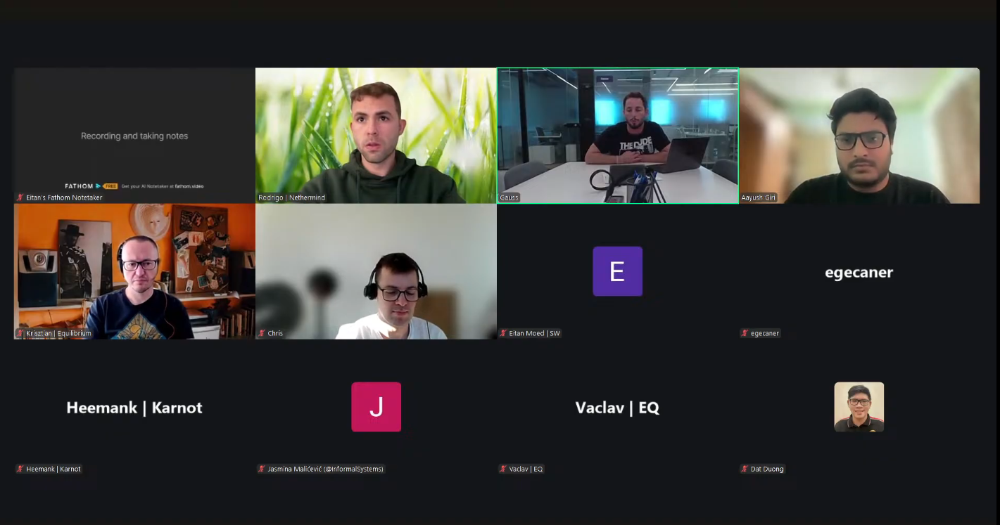

# Starknet All Core Devs Meeting #39
## Meeting Details

- **Date & Time:** Thursday, November 6, 2025, 12:00-12:30 PM UTC
- **Duration:** 30 minutes
- **YouTube:** https://www.youtube.com/live/UtKwgM8DV4U
- **Agenda:** https://github.com/starknet-io/pm/issues/29
- **Moderator:** [Aayush Giri](https://github.com/Giri-Aayush)

**Note:** **Meeting time permanently changed from 11:00 AM to 12:00 PM UTC** effective November 2025 through end of March 2026.

## Meeting Screenshot

## Executive Summary

This pre-v0.14.1 deployment meeting occurred with **Aayush back as moderator** (after being on flight in Call #38). The community focused on final readiness assessment. Key outcomes included:

- **Meeting time permanently shifted from 11:00 AM to 12:00 PM UTC** (November 2025 through March 2026)
- **v0.14.1 deployment potentially delayed up to 1 week** due to starknet.rs SDK ownership transfer to SVM; integration on track but testnet/mainnet dates uncertain
- **No RPC 1.0 RC1 feedback = good news**; indicates smooth adoption with no pushback on new calls
- **Blake2 hash computation computationally expensive**; Starkware coordinating with Pathfinder/Juno to **precompute hashes ahead of time** to prevent RPC call delays (e.g., `starknet_simulateTransaction`)
- **Pathfinder merged main v0.14.1 PR**; integration network syncing successful; implementing Blake2 hash precomputation for blockifier; release targeting early next week
- Pathfinder fixed preconfirmed state execution bug (missing state updates in certain cases)
- **Juno clarified class hash trie concern**: Kasm class hash updating, but trie keys use Sierra class hash—no trie impact
- Juno question on migrated classes in state diffs; **Eitan clarified: exclude from state diffs except in `starknet_getStateUpdate`**
- Juno refactoring sync/execution packages; release Friday with faster syncing (optimized for 6s blocks vs previous 30s assumption)
- **Madara v0.14.0 and SNOS pre-releases ready**; v0.14.1 evaluation starting soon
- **Madara snap sync optimization: 5x faster syncing** by batching state trie calculations
- Madara orchestrator supports automatic version migration (X→Y without restart)
- **Madara blocked on Herodotus for v0.14.2 aggregator**; expecting resolution by next call
- Malachite v0.6: still waiting for Circle to cut release; no major developments or issues
- **v0.14.2 discussions ongoing** but nothing concrete yet; Eitan will update next call

## Meeting Notes

The meeting opened with [Aayush Giri](https://github.com/Giri-Aayush) welcoming participants to **Starknet All Core Devs Call #39**. Before beginning, he covered quick housekeeping items:

**Housekeeping:**
- The session will be **recorded** for those who couldn't join live
- Please **stay muted when not speaking** to minimize background noise
- **Important reminder: calls have moved from 11:00 AM UTC to the new 12:00 PM UTC slot**
- **This new time will remain in effect through the end of March** (2026)

Aayush noted they have **five main agenda items** to cover and would like to keep on schedule to respect everyone's time.

### 1. v0.14.1 Network Updates and Timeline

**Eitan Moed** (Starkware):

Aayush introduced the first agenda item: v0.14.1 network updates and timeline. He invited Eitan to provide current status, specifically:
- Integration network deployment status and experience
- RPC feedback and any new updates
- Poseidon to Blake2 hash migration—any issues or edge cases

Eitan thanked Aayush and began the update.

**Integration Deployment Status:**

Regarding v0.14.1: **they are on track in terms of integration deployment status**—all things to do with development are proceeding well.

**Starknet.rs SDK Ownership Transfer Challenge:**

One of the **challenges that has risen over the past week or so**: the **starknet.rs SDK ownership has moved to SVM**. As part of their **onboarding onto the SDK**, Starkware thinks they **might need to give them a bit more time** to get on top of things **before the release of testnet and mainnet**.

Therefore, **Eitan is not able to confirm that they will release testnet and mainnet v0.14.1 as scheduled**. There **might be a pushback by a couple of days**. That's what they're looking at in regards to timeline.

**RPC 1.0 Feedback:**

In terms of the RPC: they **haven't gotten too much feedback from RPC 1.0.0**. In Eitan's interpretation, **"no feedback is good feedback"**—it means people have been able to **work with it well** and there's **no pushback on any of the new calls** that were added to the RPC.

**Poseidon to Blake2 Migration Updates:**

In terms of Poseidon to Blake2 migration updates: **one of the discussions on the full node channel this week** was that **calculating Blake2 hashes is computationally consuming**. This means Starkware is trying to **work with the Juno and Pathfinder teams on how they can calculate these hashes ahead of time** so that certain RPC calls—**like `starknet_simulateTransaction` and whatnot—won't take up as much time** as they would if they need to calculate these hashes in real time.

That is probably **the main focus in terms of Poseidon to Blake2 migration** and the full node teams.

Aside from that, Eitan doesn't have anything else to really update.

**Timeline Clarification:**

Aayush asked: could Eitan give a timeline for testnet and mainnet deployments, even though they're very vague, just so they can have something in mind?

Eitan responded: **If they get pushed back, the assumption is they could be pushed back up to a week**. That is what they're looking at. He'll have more—

(Aayush started to ask something but stopped.)

Eitan was going to add: he'll have more information as it becomes available.

**Other Blockers or Concerns:**

Aayush asked: are there any more **blockers or concerns that everyone should be aware of** at this stage, apart from the Poseidon to Blake2 cache migration?

Eitan confirmed: **No, not as far as he's aware at this time.** The blocker seems to be **starknet.rs**. It's **even unrelated to these things they're working on** (the hash precomputation, etc.).

Once they get a better picture on **how long it will take SVM to onboard**, then they'll know exactly the timeline—if it's pushed to a week, half a week, a couple of days. But they have that hanging in the background, and that's why they're updating the community now.

Aayush thanked Eitan for the comprehensive update.

### 2. Client Team v0.14.1 Readiness Updates

Aayush transitioned: let's move to client teams. They'll hear from each team on their v0.14.1 readiness. He asked each team to **keep updates to approximately 3 minutes** if possible so they can hear from everyone.

**Pathfinder** ([Krisztian Kovacs](https://github.com/kkovaacs)):

Aayush invited Krisztian to share Pathfinder's progress on:
- v0.14.1 implementation progress and status
- Integration network syncing experience
- Recent releases or bug fixes

**v0.14.1 Implementation:**

Krisztian confirmed: they have **pretty much just merged the main PR that enables Pathfinder to sync Starknet v0.14.1**. They've **tested this over the integration network and there were no issues**.

**Blake2 Hash Precomputation:**

As Eitan mentioned, they're still **working on improving execution by precomputing Blake2 hashes for compiled classes ahead of time**. Actually, they **realized pretty late during development that this is a new requirement for execution**.

Up to that point, they **thought they could avoid recomputing these class hashes altogether** and just **use the data published by the feeder gateway in blocks**—but then they **realized this is not the case**. They **do need to be able to do that calculation for execution**, specifically for **blockifier purposes**.

So they're just working on that. They **do have a plan** for it. They hope to be able to **release Pathfinder with the Kasm/Blake2 hash precomputation in place hopefully by early next week** or something like that.

**RPC 1.0 Implementation:**

They also **have a complete implementation of JSON-RPC 1.0 RC1**—the latest spec that has been published.

**Recent Bug Fixes:**

They've also **fixed a couple of JSON-RPC issues**, particularly an **issue related to execution on top of the preconfirmed state** where **in certain cases they were missing some state updates**. But this has hopefully been **improved a lot since their last release**. The **release they're cutting early next week will include those fixes too**.

**Consensus Implementation:**

Aayush asked: are there any updates on consensus implementation testing?

Krisztian confirmed: **Absolutely. They're continuously working on their consensus implementation.** There were **no major breakthroughs this time**, but they're **constantly implementing missing stuff**.

Aayush thanked Krisztian.

**Juno** ([Rodrigo Pino](https://github.com/rodiazet)):

Aayush invited Rodrigo to provide Juno's update on:
- v0.14.1 implementation progression and status
- Follow-up on the technical question from last call (class hash tries)
- Recent releases and improvements

He also asked: **did they receive any clarity on the class hash tries question** raised in the last call?

**Class Hash Trie Clarification:**

Rodrigo confirmed: **Yeah, actually they talked after the call.** The clarification: **what's updating is the Kasm class hash**, and **the keys that the trie uses is the Sierra class hash**. So **it's not as big a change—it doesn't have to affect the tries at any point**. So they got clarification on that regard.

**v0.14.1 Implementation:**

On Starknet v0.14.1: **they also have a branch which is syncing with v0.14.1**. They **haven't fully implemented RPC 1.0 yet**. They still have **some questions**—it's **not very clear to them**:

**When should the migrated class be part of the state diff, and when shouldn't it be?** Because you have to—the blockifier doesn't give them, for example. So **when you trace an execution, should they include them or shouldn't they?** If they include them, then they need to store the change in the blockchain. If they don't include them, they don't need to.

There are **some things that are not very clear to them**. The discussion is continuing in the full node channel, so Rodrigo thinks he'll have answers for those after.

**Eitan's Clarification:**

Eitan jumped in to **quickly answer it now**: the idea is to **not include them in the state diff unless it's a `starknet_getStateUpdate`**. As Rodrigo was asking. They can discuss it more in the channel.

Rodrigo acknowledged: Okay, okay. That makes their life a lot easier.

**Recent Work and Upcoming Release:**

Rodrigo continued: so that's basically it. They're also **doing a lot of internal work**—**refactoring the syncing package, refactoring the execution package**. They hope to **make a release this Friday** (November 7th) with **a couple of bug fixes** which include **faster syncing**.

The syncing was **geared towards syncing when Starknet blocks were 30 seconds**, and now **with v0.14.0, blocks are very fast**. Juno's **default behavior was assuming 30 seconds**, so it was **not catching up with the network as fast as it should**. Now with these **new values, it's always on top of the network** plus other bug fixes they found.

That should be **ready later today or early tomorrow** (November 7th)—that will be **just bug fixes**. Then **another release with Starknet v0.14.1** they aim at **maybe not next week but the week after that** (approximately November 17-21).

Aayush confirmed: anyway they're going to discuss this on the Slack channel, right, about the doubt regarding class hashes?

Rodrigo confirmed Eitan already answered, so they only include it as part of `getStateUpdate`—that makes their life a lot easier.

Aayush thanked Rodrigo.

**Madara/Karnot** ([Heemank Verma](https://github.com/heemankv)):

Aayush invited Heemank to share updates regarding:
- v0.14.0 completion status or v0.14.1 work evaluation and timelines
- Multi-block SNOS integration, L3 support progress
- Snap sync optimization

Heemank thanked Aayush for the opportunity.

**v0.14.0 and v0.14.1 Status:**

They **have had v0.14.1 in the roadmap**, but they've been **heavily pushing forward with v0.14.0 releases for both Madara and SNOS**. Heemank is **happy to announce they are ready with the pre-releases for both of them** and will **soon be picking up v0.14.1 and evaluating its timeline and everything**.

So that's a **big thing done from their side—they're ready with Madara and SNOS pre-releases** and will be getting the releases out soon.

**Full Node Reorg:**

On the **full node reorg side, that has been completed**. They've been able to do a **proper full node reorg implementation**.

**Snap Sync Optimization:**

They've also been **working on a snap sync implementation that possibly optimizes the syncing operation that their full node does by 5x**. It's **playing around with the state trie logic a lot** and allows them to have a **better syncing approach**. It's **going to be released really soon**.

That's majorly been on the Madara and SNOS side.

**Orchestrator Version Handling:**

Also on the **orchestrator side**, they have **better version handling system**. So let's say **Starknet grows from version X to version Y—they don't have to shut down their orchestrator and restart it**. It **just goes along with that**. It **supports multiple versions of Starknet** along with it. That's been working and is **ready now**.

**Herodotus Blocker:**

One thing: they are **blocked on Herodotus still for v0.14.2 aggregator**. They had a chat with them recently, and Heemank thinks **they'll be able to finish it up real quick**. He hopes **by the next call they're done with that**.

That's on the orchestrator side.

**Bootstrapper v2:**

Apart from that, on the **bootstrapper side, they're ready with v2**. It's been **added to the repo itself and it's working very well**.

Heemank concluded that covers all the updates they have.

Aayush thanked Heemank for the update.

### 3. Network Stability and Performance

Aayush noted the next item is **network stability and performance**, but he believes **Eitan has already given them information about this** (in the v0.14.1 section).

(No additional discussion on this topic.)

### 4. Consensus Implementation Updates

**Jasmina Malicevic** (Informal Systems):

Aayush moved to consensus but noted he doesn't see Jasmina present.

Jasmina spoke up: **"I'm here. Sorry for the video—my Wi-Fi is a bit spooky at this point."**

Aayush acknowledged her and asked her to carry on.

Jasmina started but her connection was clearly having issues. Aayush said sorry, no worries, just turn off the video if needed.

**Malachite v0.6 Update:**

Jasmina confirmed: **there's not really a major update** because they're still **waiting from the Circle folks when they cut the release**. Hopefully **sometime soon**, and she'll **keep everyone posted most likely on the Slack channel** when that happens so everyone gets a heads-up.

But other than that, there **hasn't been much new development that's relevant here**, and **no hiccups or anything worth mentioning**. So **nothing major really on her side**.

Aayush thanked Jasmina.

### 5. Any Other Business (AOB)

**v0.14.2 Planning:**

Aayush asked a question to Eitan: **Is there planning being done for v0.14.2 by any chance right now, or no?**

Eitan responded: **Good question.** v0.14.2—he'll have **more information on it for the next call**. Currently, once they get some of the— It's a good question. He'll get back to Aayush on it in the next call.

Currently there are **discussions on it**, but there's **nothing concrete** for them to put out there now. Hopefully they'll have **more to say on it next time**.

Aayush acknowledged: Okay.

**Open Discussion:**

Aayush asked: does anyone have any other topics they'd like to discuss or questions for the group? They still have **five to six minutes left**. If anyone has anything to say, they can raise their hand.

(No one raised additional topics.)

### 6. Wrap-up and Next Steps

Aayush concluded: all right, if there's nothing else, then they can proceed to close the call.

**Thank you everyone** for joining today's call and for all the updates shared.

**Just a few reminders before closing:**

- **Next call is scheduled for Thursday, November 20th at 12:00 PM UTC**—that's 2 weeks from today, same time
- **Remember: staying at this 12:00 PM UTC time slot through the end of March**
- **Recording for this call will be published on YouTube** and all the other places
- **Meeting notes will be shared on GitHub**

Thank you for your time and contribution. Have a great rest of your day, and they'll see everyone in two weeks again.

## Key Decisions Summary

| Decision | Rationale | Impact |
|----------|-----------|---------|
| Meeting time permanently changed from 11:00 AM to 12:00 PM UTC (Nov 2025-March 2026) | Scheduling optimization for participants across time zones | All future calls until end of March at new time |
| v0.14.1 testnet/mainnet deployment potentially delayed up to 1 week | Starknet.rs SDK ownership transferred to SVM; need time for onboarding | Uncertain timeline; integration on track but final deployment dates TBD |
| Blake2 hashes to be precomputed ahead of time by client teams | Blake2 computation computationally expensive; prevents RPC call delays | Faster `starknet_simulateTransaction` and related calls; coordination with Pathfinder/Juno |
| Migrated classes excluded from state diffs except in `starknet_getStateUpdate` | Clarifies v0.14.1 specification ambiguity for client teams | Simplifies Juno implementation; reduces blockchain storage requirements |
| Pathfinder targeting early next week for v0.14.1 release with Blake2 precomputation | Main PR merged; integration testing successful; need to complete hash precomputation | Ready for testnet/mainnet deployment pending Starkware timeline |
| Juno releasing Friday (Nov 7) with syncing optimizations for 6s blocks | Previous 30s block assumption causing sync lag; v0.14.0 blocks now 6s | Juno nodes stay current with network in real-time |
| Madara prioritizing v0.14.0 completion before v0.14.1 evaluation | Pre-releases ready for both Madara and SNOS v0.14.0 | v0.14.1 work begins after v0.14.0 releases |
| v0.14.2 discussions ongoing but nothing concrete yet | Still evaluating features and timeline | Eitan will provide update in next call (Nov 20) |

## Action Items Tracker

| Action Item | Owner | Target Date | Status |
|-------------|-------|-------------|--------|
| Coordinate with SVM on starknet.rs SDK onboarding timeline | Starkware (Eitan) | ASAP | In Progress |
| Determine final v0.14.1 testnet/mainnet deployment dates | Starkware (Eitan) | Within 1 week | Pending |
| Coordinate Blake2 hash precomputation strategy with client teams | Starkware (Eitan) + Pathfinder + Juno | Ongoing | In Progress |
| Release Pathfinder v0.14.1 with Blake2 precomputation | Equilibrium (Krisztian) | Early next week (~Nov 11-13) | In Progress |
| Continue Pathfinder consensus implementation development | Equilibrium (Krisztian) | Ongoing | In Progress |
| Clarify migrated class state diff questions on Slack channel | Starkware (Eitan) + Juno (Rodrigo) | Ongoing | In Progress |
| Release Juno with syncing optimizations and bug fixes | Juno (Rodrigo) | November 7, 2025 | In Progress |
| Complete Juno RPC 1.0 implementation | Juno (Rodrigo) | Before v0.14.1 mainnet | In Progress |
| Release Juno v0.14.1 | Juno (Rodrigo) | ~Nov 17-21, 2025 | Planned |
| Release Madara v0.14.0 and SNOS v0.14.0 from pre-releases | Karnot (Heemank) | Soon | In Progress |
| Evaluate Madara v0.14.1 work and timeline | Karnot (Heemank) | After v0.14.0 release | Not Started |
| Release Madara snap sync optimization (5x faster) | Karnot (Heemank) | Really soon | In Progress |
| Resolve Herodotus blocker for v0.14.2 aggregator | Herodotus + Karnot (Heemank) | By next call (Nov 20) | In Progress |
| Wait for Circle to cut Malachite v0.6 release | Circle (coordinated with Informal) | Sometime soon | Pending |
| Update community on Malachite v0.6 release via Slack | Informal Systems (Jasmina) | Upon release | Pending |
| Provide v0.14.2 planning update | Starkware (Eitan) | November 20, 2025 | Scheduled |
| Hold next All Core Devs call at new time | Aayush Giri | November 20, 2025, 12:00 PM UTC | Scheduled |

## Attendees

- **Moderator:** Aayush Giri | Nethermind
- Rodrigo Pino | Nethermind
- Gaius
- Krisztian Kovacs | Equilibrium
- Chris | Equilibrium
- Eitan Moed | Starkware
- egecaner
- Heemank Verma | Karnot
- Jasmina Malicevic | Informal Systems
- Vaclav | Equilibrium
- Dat Duong

## Glossary

- **v0.14.1**: Starknet upgrade introducing Blake2 hash function and RPC 1.0; deployment delayed pending starknet.rs onboarding
- **v0.14.2**: Future Starknet upgrade; planning discussions ongoing but nothing concrete yet
- **Blake2**: Cryptographic hash function replacing Poseidon in v0.14.1
- **Poseidon**: Previous hash function being replaced by Blake2 in v0.14.1
- **Starknet.rs**: Rust SDK for Starknet development; ownership transferred to SVM
- **SVM**: Organization taking over starknet.rs SDK maintenance; onboarding process impacting v0.14.1 timeline
- **SDK (Software Development Kit)**: Libraries and tools for developers building on Starknet
- **RPC 1.0**: First major version of JSON-RPC API specification; RC1 published
- **RC (Release Candidate)**: Pre-release version for testing before final release
- **`starknet_simulateTransaction`**: RPC call for simulating transaction execution without submitting to network
- **Hash precomputation**: Calculating Blake2 hashes ahead of time to avoid real-time computation delays
- **Kasm**: Cairo assembly format; related to Blake2 implementation
- **Blockifier**: Component responsible for executing transactions and creating blocks
- **Integration network**: First testing environment for validating new versions
- **Preconfirmed state**: Block state before final consensus confirmation
- **State updates**: Changes to blockchain state between blocks
- **Class hash**: Unique identifier for smart contract class definition
- **Class hash trie**: Data structure storing class hashes using Sierra class hash as keys
- **Sierra class hash**: Identifier for Sierra (high-level Cairo) contract class
- **Casm class hash**: Identifier for Kasm (compiled Cairo assembly) contract class; what actually updates in v0.14.1
- **Migrated class**: Contract class migrated from Poseidon to Blake2 hashing
- **State diff**: Changes to blockchain state between blocks
- **`starknet_getStateUpdate`**: RPC call retrieving state changes for a block; only place to include migrated classes
- **Syncing package**: Code module handling blockchain synchronization
- **Execution package**: Code module handling transaction execution
- **30-second blocks**: Previous Starknet block time assumption (pre-v0.14.0)
- **6-second blocks**: Actual v0.14.0 block time; much faster than previous 30s
- **SNOS (Starknet OS)**: Operating system layer for Starknet implemented in Cairo
- **Pre-release**: Version ready for final testing before official release
- **Full node reorg**: Reorganization handling for nodes storing complete blockchain state
- **Snap sync**: Synchronization optimization calculating state at intervals rather than continuously
- **5x faster syncing**: Madara optimization achieving 5x speed improvement through state trie batching
- **State trie**: Data structure storing blockchain state efficiently
- **Orchestrator**: Component coordinating multiple Madara system components
- **Version handling**: Capability to migrate between Starknet versions without service restart
- **Herodotus**: External team providing aggregator functionality
- **v0.14.2 aggregator**: Component for Madara requiring Herodotus development
- **Bootstrapper v2**: Second-generation service for deploying Madara chain infrastructure
- **Malachite v0.6**: Upcoming consensus engine release from Circle/Informal Systems
- **Circle**: Company where part of Informal Systems team spun out; maintaining Malachite fork
- **Feeder gateway**: API endpoint providing transaction execution traces and blockchain data
- **JSON-RPC**: Remote procedure call protocol using JSON for Starknet API

---

**Next Meeting:** Thursday, November 20, 2025, 12:00 PM UTC

**Note:** These Starknet All Core Devs Calls occur bi-weekly at the same time. All interested parties are encouraged to join and contribute to the ongoing discussions and development efforts.
