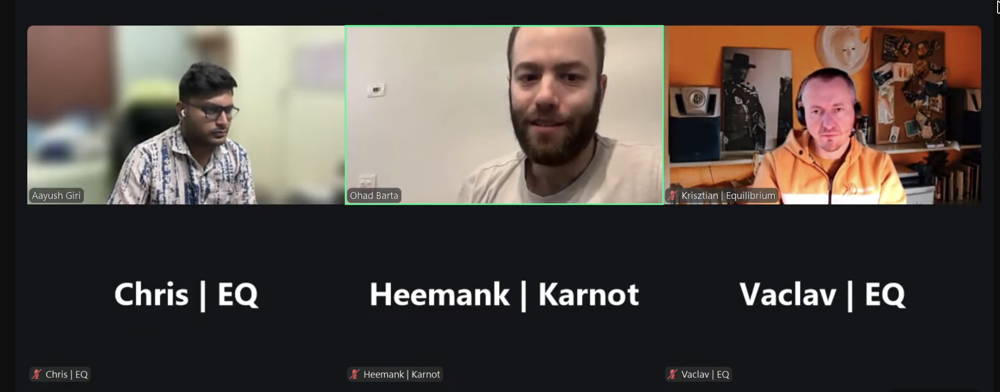

# Starknet All Core Devs Meeting #40
## Meeting Details

- **Date & Time:** Wednesday, November 20, 2025, 12:00-12:30 PM UTC
- **Duration:** 30 minutes
- **YouTube:** [TBD]
- **Agenda:** https://github.com/starknet-io/pm/issues/30
- **Moderator:** [Aayush Giri](https://github.com/Giri-Aayush)

## Meeting Screenshot

## Executive Summary

This critical pre-mainnet deployment meeting occurred during Devcon week with reduced attendance. The v0.14.1 testnet deployment on November 19 experienced significant issues:

- **30 minutes of unexpected downtime** on testnet due to backward compatibility issues during upgrade from v0.14.0 to v0.14.1
- **Mainnet deployment pushed from December 3 to December 10** to avoid collision with other applicative layer integrations
- **Ohad in emergency meetings with engineers** during call to improve upgrade process
- **End-to-end testing gaps identified** - bugs surfaced in testnet that should have been caught in integration environment
- **Pathfinder released v0.21.1 hotfix** on November 20 to address execution layer bug affecting block traces for declare transactions
- **Juno team absent** (Devcon attendance); no updates provided
- **Karnot progressing on v0.14.0 final release** and started v0.14.1 evaluation with ~2 week timeline
- **Starkware committed to roadmap transparency** after acknowledging undercommunication; promised public posting of development plans

## Meeting Notes

The meeting opened with [Aayush Giri](https://github.com/Giri-Aayush) welcoming participants to **Starknet All Core Devs Call #40**. Before beginning, he covered housekeeping items:

**Housekeeping:**
- The session will be **recorded** for those who couldn't join live
- Please **stay muted when not speaking** to minimize background noise
- **Important reminder: calls have permanently moved to 12:00 PM UTC** (through end of March 2026)
- Most regular participants were absent due to **Devcon**, but all relevant update providers were present

Aayush noted they have **five main agenda items** to cover and would keep on schedule to respect everyone's time.

### 1. v0.14.1 Deployment Timeline and Network Status

Aayush introduced the first agenda item, noting that in Call #39 (November 6), [Eitan Moed](https://github.com/eitanm-starkware) mentioned having timeline clarity by this call. The previous call also flagged potential delay due to starknet.rs SDK transition to SVM. Aayush asked for deployment timeline updates and clarity on this blocker.

**Ohad Barta** (Starkware) provided the update, as Eitan was unavailable.

**Testnet and Mainnet Timeline:**

Ohad confirmed that **testnet v0.14.1 deployment happened the previous day** (November 19, 2025). **Mainnet v0.14.1 is currently planned for December 10, 2025**. The deployment was **pushed one week from the original December 3 date** to avoid collision with other integrations they expect to have in the near future in the applicative layer.

**Testnet Deployment Issues:**

Ohad stated candidly: **"I will say that the testnet upgrade went not as good as we hoped."** As they spoke, **Eitan was in emergency meetings with engineers** to see how they can improve the upgrade process and what additional preparations they want to make so the mainnet upgrade will be smoother.

Because of these issues, it's **possible that some action items will postpone v0.14.1 by a bit more**. Ohad committed to providing a **final date the following week** (week of November 25).

**Nature of Testnet Issues:**

Aayush asked Ohad to elaborate on what blockers or concerns happened during testnet deployment.

Ohad explained the **major issue that caused 30 minutes of downtime**:

On the integration environment, they had updated from v0.14.0 to an initial version of v0.14.1 that had a bug. They found and fixed this bug on integration, then upgraded from the old v0.14.1 to a newer v0.14.1 flavor.

However, on testnet they went **straight from v0.14.0 to the newer v0.14.1 flavor**, skipping the intermediate version. In this direct jump, they **created a backward incompatibility issue that wasn't present in integration** when they had the intermediate version.

Their engineers were quick to identify what wasn't working and how to revert or adapt the code so the end-to-end flow would work. This rapid response resolved the 30-minute downtime.

**Post-Upgrade Issues:**

After completing the upgrade, they discovered **bugs in the end-to-end transaction flow** that were also present on integration. Ohad expressed frustration that these should have surfaced in integration testing with full nodes and SDKs, but **for some reason they were only discovered during testnet deployment**.

**Network Stability and Performance:**

Aayush asked about network stability, performance, and Blake hash computation work progress with client teams, specifically whether there were notable performance impacts on RPC calls.

Ohad noted he didn't have much news in that direction. He mentioned that **on the day of the call, they experienced a spike in RPC calls** due to **overload on the Feeder Gateway**. Some users were requesting trace calls for all transactions—expensive requests that consume significant CPU. They were applying fixes for this.

Prior to that day, Ohad wasn't aware of any major stability issues in the latency front.

Aayush thanked Ohad for the comprehensive update.

### 2. Client Team Implementation Updates and Release Status

Aayush transitioned to client team updates, starting with Pathfinder.

#### **Pathfinder** ([Krisztian Kovacs](https://github.com/kkovaacs)):

Aayush reminded participants that in the last call, Krisztian mentioned planning a release for early November with Blake hash computation. He asked for deployment status updates and any issues or feedback on JSON RPC production validation.

**v0.14.1 Release and Execution Bug:**

Krisztian confirmed they **released Pathfinder v0.21.0 last week** in preparation for the Sepolia testnet upgrade. Unfortunately, there was **a bug in their execution layer** causing issues with producing block traces for blocks containing declared transactions. Several other use cases were affected as well, including transaction simulation with certain transactions.

To address this, they **released a new version v0.21.1 that morning** (November 20) that fixed the issue. Krisztian noted that **some RPC providers had already upgraded to the new version**, while others were still planning to do so. Apart from this bug, they knew of no major issues.

**JSON RPC v0.10 Implementation:**

Regarding JSON RPC v0.10, they **haven't received much feedback**. They're **still waiting for starknet.rs PRs with JSON RPC v0.10 support to be merged and released**. Once that happens, they'll continue with their own tests.

They'll also be **migrating their validator attestation tool to the new JSON RPC version** sooner or later, or at least begin testing with it.

**End-to-End Testing Discussion:**

Krisztian noted there has been **discussion about adding end-to-end flows that run on the integration network**. It turns out the particular problem with **L2 gas prices that had to be fixed after yesterday's upgrade was also present on Sepolia integration**.

It **really could have been found if they had better end-to-end tests** doing a complete flow involving estimation for a transaction and then submitting that transaction. This is **another work item for them and many other participants in the ecosystem**.

Aayush thanked Krisztian for the update.

#### **Juno** (Rodrigo Pino - Absent):

Aayush noted that Rodrigo wasn't available in the call, so they'd skip the Juno update and move to Karnot.

#### **Madara/Karnot** ([Heemank Verma](https://github.com/heemankv)):

Aayush recalled that in the last call, Heemank mentioned that Madara and SNOS v0.14.0 releases were ready and they were planning to put out full releases. He asked for updates on:
- Madara v0.14.0 and SNOS v0.14.0 release status
- v0.14.1 work evaluation and timeline

**v0.14.0 Release Status:**

Heemank thanked Aayush for the opportunity and provided updates. For v0.14.0, they **made two pre-releases and are almost ready to get a proper release out**. They had some fixes to complete, but those were **all done and dusted**. They're **pretty confident about the v0.14.0 updates** they've made to Madara and SNOS.

**v0.14.1 Evaluation:**

From there, they've **moved on to v0.14.1 compatibility**. They've **understood the work changes and requirements**, and they're **going for a timeline of about two weeks**. Heemank hoped that **by the next call (December 4) they would have something substantial** on v0.14.1 compatibility for Madara and SNOS—the RPCs and everything.

**Snap Sync:**

The evaluation of v0.14.1 has been their major focus. Apart from that, there have been **production-ready changes**. In the last call, Heemank mentioned a type of sync they were working on called **snap sync**. That has **completely been merged**. They've been able to put significant time into this work.

**Cairo Native:**

They've also invested heavily in **Cairo Native work**. They're **almost ready with it and are testing it out**. It's been running on the mock tests they use, and they're **almost done with it**.

**L3 Compatibility:**

On the L3 side, they've been **pushing forward to get L3s working with the main branch of Madara**. Hopefully they'll have compatibility very soon.

Heemank concluded that these were all the updates.

**Snap Sync Benchmarking:**

Aayush asked if they'd be releasing benchmarking numbers for how fast the optimization is for the snap sync they released.

Heemank confirmed they did **extensive benchmarking, available in the PR description**. He'll **share that with everyone on the full node channel soon** so people can see how it works. They'll give a detailed description of how it works and how it improves the sync they have.

Aayush thanked Heemank for the update.

### 3. v0.14.2 Planning and Development Roadmap

Aayush noted that in the last call when he asked about v0.14.2 planning, Eitan specifically mentioned he would have concrete information by this call. He asked Ohad if he had details to share with the group about v0.14.2 planning.

**Why No Clear v0.14.2 Timeline:**

Ohad acknowledged he could share details, but they would be **mostly around why there isn't a good answer to v0.14.2 planning**.

**Internal and Transparent Improvements:**

Ohad explained that **most of the features they currently work on or see as high priority will not require a new Starknet version**. Some of them are **100% internal**, such as:
- More robust stress testing framework for all scenarios
- Platform to mimic mainnet traffic to testnet environment for better compatibility testing

Others **do change Starknet but are totally transparent and don't touch the Starknet OS**.

**Gateway Throughput Improvements:**

One example: currently their **gateways are tested only up to roughly 35-40 requests per second for each gateway**. This puts a **global threshold of around 120 TPS on the network**. When they actually receive that many requests, **validation time goes up, creating suboptimal UX**. Additionally, **some requests are invalid**, meaning people start to get 429 (too many requests) errors **even when there's only 20 TPS**, because the vast majority of requests are actually not valid transaction requests.

This is something they'll work on. **It will change the gateways but doesn't affect the Starknet OS**, so it **doesn't require a new Starknet version**.

There are also **bottlenecks around throughput in areas not correlated to Starknet OS** that they'll try to work on.

**Commitment to Transparency:**

Ohad acknowledged that **a lot of internal features can be transparently applied over v0.14.1 and don't require a version bump**. He committed: **"Obviously I'll work on increasing the transparency of what we are doing and why."**

He invited feedback: **"If you have some suggestions on what you'd like to see here communication-wise from our side, I'd love to get your feedback and improve because it's definitely undercommunicated at the moment."**

**Publishing Venue Discussion:**

Aayush suggested that if Ohad could have a research post or any type of post from Starkware—either on the research forums or somewhere more public—that would help. He'd try to decide where they could post it, but if they could have transparency about the roadmap, changes that would be happening, they could share it with all the people in the community.

Ohad said he'd give it a shot, **hopefully by the following week** (week of November 25).

**Starknet PM Repository Suggestion:**

Aayush asked if Ohad was aware of the Starknet PM repository where they post agendas and meeting notes. He suggested maybe they could use the same repo to post those types of updates.

Ohad responded: **"That's an interesting suggestion."**

Aayush confirmed that would be good.

### 4. Consensus Implementation Updates

Aayush moved to the consensus and implementation updates agenda item but noted he didn't see Jasmina present.

(No consensus updates were provided as Jasmina Malicevic from Informal Systems was absent, likely due to Devcon.)

### 5. Any Other Business (AOB)

Aayush asked if anyone had any other topics they'd like to discuss or questions for the group.

He noted they were **"barely a group today"** given the reduced attendance due to Devcon.

No additional topics were raised.

### 6. Wrap-up and Next Steps

Aayush concluded that if there was nothing else, they could proceed to close.

He thanked everyone for joining today's call and for the updates they shared.

**Reminders:**
- **Next call is scheduled for Thursday, December 4, 2025 at 12:00 PM UTC**—two weeks from the current call, same time
- Recording will be published on the YouTube channel
- Meeting notes will be shared on GitHub in the Starknet PM repository

Aayush thanked everyone for their time and contribution and wished them a great rest of their day. They'd see each other in two weeks.

## Key Decisions Summary

| Decision | Rationale | Impact |
|----------|-----------|---------|
| Mainnet v0.14.1 delayed from December 3 to December 10 | Avoid collision with other applicative layer integrations; allow time to address testnet issues | Provides additional week to improve upgrade process and implement safeguards |
| Ohad to provide final mainnet date by week of November 25 | Testnet experienced 30 minutes of downtime due to backward compatibility issues; Eitan in emergency meetings to improve upgrade process | Timeline may shift further based on upgrade process improvements |
| Pathfinder v0.21.1 hotfix released November 20 | Execution layer bug in v0.21.0 affecting block traces for declare transactions and transaction simulation | RPC providers can upgrade immediately to resolve execution issues |
| End-to-end testing improvements to be implemented across ecosystem | L2 gas price bugs surfaced in testnet that were present in integration but not caught by testing | Prevent future production issues; better validation before testnet deployment |
| Most upcoming work won't require Starknet version bumps | Many improvements are internal (stress testing framework, mainnet traffic mimic platform) or transparent gateway changes (throughput optimization) | Faster delivery of improvements without coordination overhead of version upgrades |
| Starkware to publish transparent roadmap and development plans | Acknowledged undercommunication of development priorities and roadmap | Improved community awareness; potentially via research forums or Starknet PM repository |
| Karnot targeting ~2 weeks for v0.14.1 evaluation completion | Completed v0.14.0 work; need to assess v0.14.1 requirements for Madara and SNOS | Substantial progress expected by December 4 call |

## Action Items Tracker

| Owner | Action | Target Date/Call | Status |
|-------|--------|------------------|--------|
| [Eitan Moed](https://github.com/eitanm-starkware) / Ohad Barta | Provide final mainnet v0.14.1 deployment date | Week of November 25, 2025 | Open |
| [Eitan Moed](https://github.com/eitanm-starkware) / Ohad Barta | Complete emergency upgrade process improvements | Before mainnet deployment | In Progress |
| Ohad Barta | Publish transparent development roadmap and priorities | Week of November 25, 2025 | Open |
| Ohad Barta | Decide on publication venue (research forums vs Starknet PM repo) | Week of November 25, 2025 | Open |
| Starkware | Apply fixes for Feeder Gateway overload causing RPC call spikes | ASAP | In Progress |
| Starkware | Resolve end-to-end testing gaps that missed L2 gas price bugs | Before mainnet deployment | In Progress |
| [Krisztian Kovacs](https://github.com/kkovaacs) | Validate Pathfinder v0.21.1 execution bug fix in production | Ongoing | In Progress |
| Pathfinder team | Implement end-to-end testing flows on integration network | Ongoing | Open |
| Pathfinder team | Continue JSON RPC v0.10 testing upon starknet.rs PR merge | Post starknet.rs release | Pending |
| Pathfinder team | Migrate validator attestation tool to JSON RPC v0.10 | Future | Open |
| [Heemank Verma](https://github.com/heemankv) | Release Madara v0.14.0 and SNOS v0.14.0 final versions | Soon | In Progress |
| [Heemank Verma](https://github.com/heemankv) | Complete v0.14.1 evaluation for Madara and SNOS | Call #41 (December 4, 2025) | In Progress |
| [Heemank Verma](https://github.com/heemankv) | Share snap sync benchmarking data on full node channel | Soon | Open |
| [Heemank Verma](https://github.com/heemankv) | Complete Cairo Native testing and release | Soon | In Progress |
| [Heemank Verma](https://github.com/heemankv) | Finalize L3 compatibility with main Madara branch | Soon | In Progress |

## Attendees

- **Moderator:** Aayush Giri | Nethermind
- Chris | Equilibrium
- Heemank Verma | Karnot
- Krisztian Kovacs | Equilibrium
- Ohad Barta | Starkware
- Vaclav | Equilibrium

**Note:** Reduced attendance due to Devcon. Absent teams: Juno (Rodrigo Pino), Informal Systems (Jasmina Malicevic), and several regular participants.

## Glossary

- **v0.14.0**: Current Starknet version deployed on mainnet; features 6-second blocks
- **v0.14.1**: Upcoming Starknet upgrade introducing Blake2 hash function and JSON RPC v0.10; testnet deployed November 19 with issues
- **v0.14.2**: Future Starknet upgrade; no clear timeline as most upcoming work doesn't require version bumps
- **Blake2**: Cryptographic hash function replacing Poseidon in v0.14.1
- **Backward compatibility**: Ability of new version to work correctly when upgrading from previous version
- **Integration environment**: First testing environment for validating new versions before testnet
- **Testnet (Sepolia)**: Public test network for validating upgrades before mainnet deployment
- **Mainnet**: Production Starknet network
- **End-to-end testing**: Complete flow testing from transaction estimation through submission and execution
- **L2 gas prices**: Resource pricing for Layer 2 execution; bug in this area caused testnet issues
- **Feeder Gateway**: Centralized API endpoint serving blockchain data; experienced overload on November 20
- **JSON RPC v0.10**: Latest version of Starknet's JSON-RPC API specification
- **starknet.rs**: Rust SDK for Starknet development; ownership transferred to SVM
- **SDK (Software Development Kit)**: Libraries and tools for developers building on Starknet
- **RPC (Remote Procedure Call)**: API protocol for interacting with Starknet nodes
- **Block traces**: Detailed execution information for transactions in a block
- **Declare transaction**: Transaction type that publishes a new contract class to Starknet
- **Transaction simulation**: Executing a transaction without submitting it to the network
- **Validator attestation tool**: Tool used by validators to attest to block validity
- **Execution layer**: Component responsible for executing transactions and updating state
- **Pathfinder v0.21.0**: Pathfinder release with v0.14.1 support; contained execution bug
- **Pathfinder v0.21.1**: Hotfix release on November 20 addressing execution layer bug
- **Snap sync**: Madara optimization for faster syncing by batching state trie calculations
- **Cairo Native**: Native compilation of Cairo code for performance improvements
- **L3**: Layer 3 networks built on top of Starknet (Layer 2)
- **SNOS (Starknet OS)**: Starknet operating system responsible for state transitions
- **Madara**: Full node implementation by Karnot (formerly Kasar Labs)
- **Juno**: Full node implementation by Nethermind
- **Applicative layer**: Application-level components and integrations
- **Gateway throughput**: Number of requests per second the gateway can handle
- **TPS (Transactions Per Second)**: Network transaction processing capacity
- **429 error**: HTTP "Too Many Requests" error returned when rate limits are exceeded
- **Devcon**: Annual Ethereum developer conference; caused reduced attendance in this call

---

**Next Meeting:** Thursday, December 4, 2025, 12:00 PM UTC

**Note:** These Starknet All Core Devs Calls occur bi-weekly at the same time. All interested parties are encouraged to join and contribute to the ongoing discussions and development efforts.

**⏰ TIME REMINDER: Calls are at 12:00 PM UTC through the end of March 2026.**
