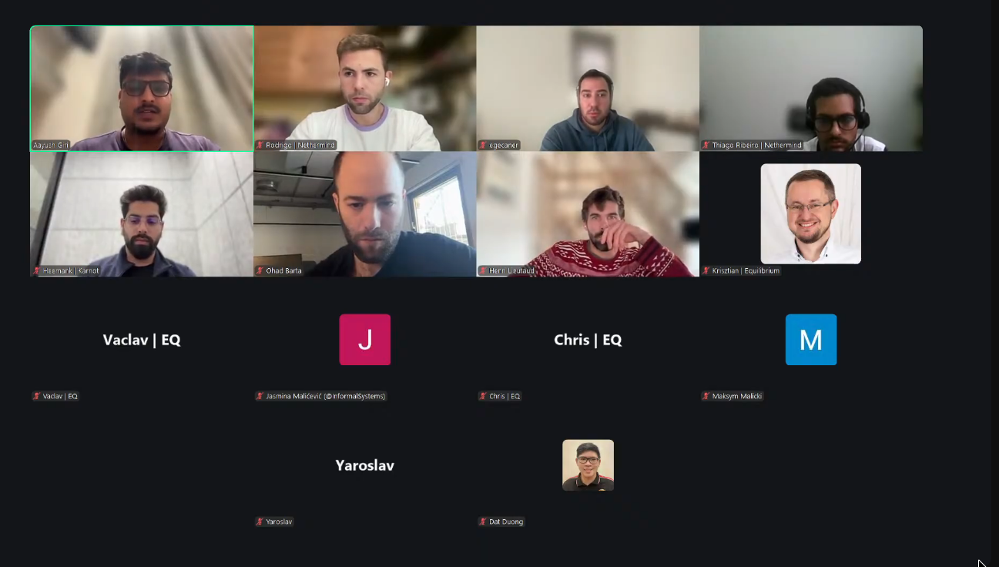

# Starknet All Core Devs Meeting #41
## Meeting Details

- **Date & Time:** Thursday, December 4, 2025, 12:00-12:30 PM UTC
- **Duration:** 30 minutes
- **YouTube:** https://www.youtube.com/live/czfsMHOCviI
- **Agenda:** https://github.com/starknet-io/pm/issues/31
- **Moderator:** [Aayush Giri](https://github.com/Giri-Aayush)

## Meeting Screenshot

## Executive Summary

This critical pre-mainnet deployment meeting occurred just 6 days before the December 10 mainnet v0.14.1 deployment. Key outcomes included:

- **Mainnet v0.14.1 deployment confirmed for December 10, 2025** - still on track despite testnet issues
- **Testnet backward compatibility issues fully resolved** - will be triple-checked with back-to-back 0.14.0→0.14.1 upgrade test on December 8 (Sunday)
- **Major testnet incident resolved** - blockifier/SHARP inconsistency in specific syscall revert scenarios fixed; rigorous checks completed on all similar syscalls
- **All client teams ready for mainnet deployment** - Pathfinder v0.21.3, Juno with full v0.14.1 support, Karnot completing v0.14.1 with 6-7K blocks tested
- **RPC v1.0 adoption progressing** - final spec supported by Pathfinder and Juno; wider adoption expected as API libraries roll out support
- **Roadmap communication postponed** - Starkware evaluating 2026 priorities (cost/throughput improvements, decentralized validation by mid-year) before publishing detailed roadmap
- **Malachite v0.6 release imminent** - API breaking changes expected; Circle coordinating release timing
- **Starknet Foundation governance announcement** - upcoming poll for token holders in December; call for developer delegates

## Meeting Notes

The meeting opened with [Aayush Giri](https://github.com/Giri-Aayush) welcoming participants to **Starknet All Core Devs Call #41**. Before beginning, he covered housekeeping items:

**Housekeeping:**
- The session will be **recorded** for those who couldn't join live
- Please **stay muted when not speaking** to minimize background noise
- **Reminder: calls remain at 12:00 PM UTC** through end of March 2026
- Four main agenda items to cover

**Critical Context:**

Aayush emphasized that **mainnet v0.14.1 deployment is scheduled for December 10th—just 6 days away**. This call was **particularly important for confirming final readiness** given the testnet issues experienced in Call #40.

### 1. v0.14.1 Mainnet Deployment and Testnet Post-Mortem

Aayush began by recalling that in the last call (November 20), testnet had deployed the day before with **significant issues including 30 minutes of downtime due to backward compatibility problems**. **Ohad Barta** had mentioned he would have the final mainnet date confirmed, and they were now 6 days away from the December 10 target.

**Mainnet Timeline Confirmation:**

Aayush asked Ohad to confirm whether they're still on track for December 10.

**Ohad Barta** (Starkware) confirmed: **"Yes, we are still on track for December 10."**

**Resolution of Testnet Issues:**

The issues they experienced in the testnet upgrade have been **isolated and fixed**. They've prepared and **will try on Sunday (December 8) a back-to-back upgrade with the v0.14.0 and v0.14.1 images exactly as they will be on mainnet**. This will confirm everything works smoothly during the upgrade and they can complete it in **less than 10 minutes of downtime**.

**Confidence in Fix:**

Aayush asked if they're confident the issues faced during testnet have been fully resolved so they won't face them again on mainnet.

Ohad confirmed: **"Yes."**

**Testnet Post-Mortem - Root Cause:**

Aayush asked Ohad to walk through the learnings from the testnet deployment issues and what they've done since then.

Ohad explained that **at a high level, the issues were around backward compatibility**. Basically, **more code entered v0.14.1 since they did the upgrade on integration**. The exact v0.14.0 to v0.14.1 upgrade that was done on testnet **was actually never done before** on integration (where they had an intermediate version).

The engineering team **saw exactly what happened, fixed the upgrade procedure accordingly**, and will **try it end-to-end exactly with these images before going on mainnet this Sunday**. This will **triple-check that they will not encounter this issue**.

Ohad clarified it **wasn't really a bug—more like a compatibility breaking change in their code** that they neglected to consider when planning the testnet upgrade.

**Network Stability Update:**

Aayush asked for a quick update on network stability since the last call.

**Major Testnet Incident Resolved:**

Ohad reported they had a **major incident on testnet last week**. **Mainnet is fully stable.**

On testnet, they detected an issue: there was **inconsistency between the blockifier and what SHARP expects to prove** when a very specific combination of syscalls are reverted, but then the transaction catches them and continues to run successfully.

In this specific case, there was **not enough information registered around the revert details of this syscall**, which caused the component that prepares things to SHARP to fail.

**Rigorous Verification:**

This issue is **now completely solved**. The team also did **rigorous checks around all other similar syscalls to ensure they're not in a place where this syscall is fixed but a syscall near it will create a similar issue**.

Ohad confirmed: **"Yes, this bug is fixed."**

Aayush thanked Ohad for the comprehensive update.

### 2. Client Team Implementation Updates and Release Status

Aayush transitioned to client team updates, asking each team to keep updates to approximately 4 minutes so they could hear from everyone.

#### **Pathfinder** ([Krisztian Kovacs](https://github.com/kkovaacs)):

Aayush recalled that in the last call, Krisztian had just released v0.21.1 as a hotfix on the same day to fix an execution layer bug. He asked for production performance updates, JSON RPC v0.10 adoption status, and starknet.rs progress.

**Recent Releases - v0.21.2 and v0.21.3:**

Krisztian reported they've **released two more hotfix releases since then**. The latest is from the previous day (December 3): **Pathfinder v0.21.3**. These releases **mostly just include small fixes**.

**Blockifier Inconsistency Fix:**

The latest release (v0.21.3) is **probably important because it upgrades blockifier to a version that fixes the inconsistency issue that Ohad just mentioned**. The **execution layer in Pathfinder should now be fully in sync with the actual sequencers**.

This inconsistency had been **causing problems last week—there were reports of some transaction traces not matching the results on the sequencer or the output from the Feeder Gateway**. This should now be fixed.

**Starknet Go Test Cases:**

They've also found **a couple of smaller inconsistencies**. In particular, **thanks to the Starknet Go team from Nethermind**, they fixed a few issues that were exposed by their test cases. Most of these fixes are also in the v0.21.3 release.

**Mainnet Readiness:**

Krisztian stated: **"As far as we understand, this latest release of Pathfinder is now ready for the mainnet upgrade next week."** He doesn't really expect **any showstopper issues to show up** with that.

**RPC v1.0 Support:**

Aayush asked about RPC v1.0 adoption status.

Krisztian confirmed the latest release **does support the latest version of the specification—the final version**. He doesn't know of any potential issues with that, but they'll see as **adoption for the new JSON RPC version becomes more widespread**.

As far as he understands, **various API libraries are just rolling out releases which add support for this new version**. He thinks **the majority of users are probably still not using this**, so **it's a bit early to tell if there are any issues** with the new version.

**Validator Attestation Tool Migration:**

Aayush asked about the validator attestation tool migration planning they were doing last time.

Krisztian explained that **this upgrade to the new JSON RPC version is not really required, as all nodes will continue supporting JSON RPC v0.9**. They're **not really rushing that upgrade**.

On their end, upgrading to the new JSON RPC release will require **upgrading Starknet RS (or now it's called Starknet Rust)**—Krisztian admitted he'd probably lost track of what the current name is.

All in all, **it's not a required upgrade—not even for the mainnet upgrade next week**. Things should be **working fine even after next week's upgrade with the current release**. The only thing that needs to be upgraded is **nodes to be compatible with the new version of mainnet**. But the **attestation tool itself should work as is**.

Aayush thanked Krisztian for the update.

#### **Juno** ([Rodrigo Pino](https://github.com/rodiazet)):

Aayush noted they didn't hear from Rodrigo in the last call—he believed Rodrigo was at Devcon/EthCC at that time. He asked for a comprehensive update on where Juno stands with v0.14.1 and readiness for the December 10 mainnet deployment, plus RPC v1.0 implementation progress and any recent releases or improvements since early November.

**v0.14.1 Readiness:**

Rodrigo confirmed: **"By this point we already have full support for Starknet v0.14.1."** Anyone who has the **latest version of Juno is going to have full support for RPC v1.0 and will also be able to support the latest network**. Everyone who's a **Juno manager should already be upgraded**.

**Inconsistency Fixes:**

As Krisztian was mentioning with Starknet Go finding inconsistencies, there were also **some inconsistencies in Juno that they're planning to fix and put a release for**.

**Recent Work Focus:**

Aayush asked about any other recent releases or improvements since early November.

Rodrigo noted there have **mostly been releases related to RPC and Starknet v0.14.1**. They don't have anything else ready to share right now. Everything has been supporting Starknet v0.14.1, plus **some internal things and refactoring**.

Aayush thanked Rodrigo for the update.

#### **Madara/Karnot** ([Heemank Verma](https://github.com/heemankv)):

Aayush reminded participants that in the last call, Heemank mentioned Madara v0.14.0 was almost ready with just final fixes remaining, and they'd started v0.14.1 evaluation with about a 2-week timeline. That timeline was now up, so he asked for updates on both.

**v0.14.0 Release Complete:**

Heemank confirmed: **"Release v0.14.0 is done and dusted from both sides—Madara as well as SNOS."** They've moved on from it. They've **made sure it works perfectly well and it's being rigorously tested right now on top of Ithaca** (a platform), so that's ongoing for v0.14.0.

**v0.14.1 Progress:**

On v0.14.1, they've **made a good amount of progress and have done the majority of the code work that was required**. They're in **internal testing right now**.

Heemank is **very sure that by the next call (December 18) they'll be done with v0.14.1 compatibility as well** on both SNOS and Madara.

**Testing Status:**

On SNOS, they're **already testing and have tested 6,000-7,000 blocks that are already running perfectly well**. Everything is being **regressively tested** to make sure they haven't missed anything or introduced any bugs. As of now, they don't have any bugs.

Heemank concluded that's majorly it on the v0.14.0 and v0.14.1 side.

Aayush thanked Heemank for the update.

### 3. Development Roadmap Communication Follow-up

Aayush moved to the next topic. He reminded Ohad that in the last call, Ohad acknowledged the **roadmap and development plans were undercommunicated** and committed to **posting something transparent about what's being worked on**. Ohad said he would do something by the following week from that call (week of November 25).

Aayush asked if Ohad had something in mind about the roadmap in terms of communication.

**Roadmap Evaluation in Progress:**

Ohad acknowledged: **"You're fully right."** They're **right now in the midst of basically evaluating what they'll do next year**. They'll then derive a **3-6 month detailed roadmap and another 6-month vague roadmap** based on that.

**Timing Decision:**

When Ohad saw that these discussions were happening and understood the timescope, he **opted to wait slightly more so he'd have better things to say**.

**2026 Priorities Under Evaluation:**

They're **currently investigating future cost and throughput improvements**. They also want to **move towards decentralizing at least validation by mid-next year**.

They're thinking about **what features it will include, what compromises they need to make** in order that it will be **mid-next year and not end of the year towards 2027** and so on.

**Option for Interim Update:**

Ohad asked: **"If you think it's worthwhile, I can also publish something a bit more vague."** But he has **nothing concrete**—for example, the things they're working on like **reducing finality times on preconfirmations** is a **transparent upgrade that will not require a Starknet version**. Even if they **change the fee structure, it potentially will not require a new Starknet version**.

Aayush thanked Ohad for the update.

### 4. Consensus Implementation Updates

Aayush moved to consensus updates. He noted **Jasmina is back**—they missed her update in the last call as well, likely due to Devcon. He asked for an update on Malachite and consensus implementation work, especially Malachite v0.6 release status, client team integration coordination, and general consensus updates.

**[Jasmina Malicevic](https://github.com/jmalicevic)** (Informal Systems):

Jasmina apologized about the video—her WiFi wasn't at its best that day.

**Malachite v0.6 Release Status:**

She's **waiting for a response from the team at Circle about the release date** because she's seen they've pushed new changes and are working on the documentation, so she expects it to be **soon**.

**API Breaking Changes Warning:**

Jasmina gave a **heads-up that there are apparently some API breaking changes** in the **Malachite consensus core package and the core types package**.

From what she's seen, it's **mostly signatures or arguments on the functions**, but there might be additional functionality. She hopes that **by the next call (December 18) they'll have clear insights** because she's going to sync with Circle to coordinate on that.

**Nature of Changes:**

All of these are **not really bug fixes—there's nothing majorly concerning**. They're just **removing and cleaning up some things that are not used or not needed**—just kind of code cleanup.

**Client Team Coordination:**

On the client teams coordination front, there **hasn't been any news lately** because she doesn't think they had any open work streams. If something comes up, she'll report at the next call.

Jasmina concluded that's pretty much the latest status on the consensus engine. They **haven't had any new problems that are concerning or worth noting to the rest of the teams**.

Aayush thanked Jasmina for the updates.

### 5. Any Other Business (AOB)

**Starknet Foundation Governance Announcement (Henry Lietart):**

Aayush noted they had **Henry present who would like to share some important information** with everyone.

**Henry Lietart** (Starknet Foundation) introduced himself, noting he was making a quick appearance to mention something important.

**Upcoming Token Holder Poll:**

They have a **poll coming soon**. They've **collaborated with Starkware to come up with a few questions**. But since attendees are **at the forefront of developing Starknet infrastructure**, if there are **questions they want to ask token holders, this is the right place to do so**.

Henry invited everyone to **send them questions—product questions or whatever question they feel may be valuable to get the opinion of token holders on**. This is something that **will happen in December**.

**Call for Delegates:**

Henry's second point: **all attendees are very involved in the development of the Starknet network**. The Foundation is **distributing voting power** (not voting on proposals and polls themselves)—**they're giving voting power to delegates** who want to voice their opinion.

If that describes anyone present—if they **have an opinion on what should be the future of the network and want to get involved, they should definitely be a delegate**. Henry would **love to have these people or anyone on their team who's keen to take some time to participate in Starknet governance**.

He shared links in the chat and concluded: **"That's just my call to action—register as a delegate."**

**Open Floor:**

Aayush asked if anyone had any other topics they'd like to discuss or questions for the group—this was an opportunity to raise anything they hadn't covered.

No additional topics were raised.

### 6. Wrap-up and Next Steps

Aayush proceeded to close the meeting, thanking everyone for joining and for all the updates shared.

**Important Reminders:**

- **Mainnet v0.14.1 deployment is happening on December 10 (this coming Tuesday)—just 6 days away** - please ensure everyone is prepared
- **Next call is scheduled for Thursday, December 18, 2025 at 12:00 PM UTC**—2 weeks from this call, same time
- **This will be the last call before the holidays**, so they'll be able to discuss how the mainnet deployment went
- Recording will be published on YouTube channel
- Meeting notes will be shared on GitHub

Aayush thanked everyone for their time and contribution, wished them a great rest of their day, and said he'd see them in two weeks.

## Key Decisions Summary

| Decision | Rationale | Impact |
|----------|-----------|---------|
| Mainnet v0.14.1 deployment confirmed for December 10, 2025 | Testnet issues isolated and fixed; back-to-back upgrade test scheduled for December 8 to triple-check | Final go-ahead just 6 days before deployment; <10 min downtime expected |
| Back-to-back v0.14.0→v0.14.1 upgrade test on Sunday, December 8 | Exact images that will be used on mainnet; ensures no repeat of testnet backward compatibility issues | Triple verification before production deployment |
| All client teams cleared for mainnet deployment | Pathfinder v0.21.3, Juno with full v0.14.1 support, Karnot completing v0.14.1 testing | Ecosystem ready for December 10 upgrade |
| RPC v0.9 backward compatibility maintained | Not requiring immediate RPC v1.0 migration allows gradual adoption | Validator attestation tools and existing infrastructure continue working |
| Roadmap communication postponed until 2026 priorities finalized | Starkware evaluating cost/throughput improvements and mid-2026 decentralized validation plans | More concrete roadmap expected in coming weeks after internal evaluation |
| Malachite v0.6 API breaking changes announced | Code cleanup removing unused functionality; Circle coordinating release | Client teams need to update consensus integration; details by December 18 call |

## Action Items Tracker

| Owner | Action | Target Date/Call | Status |
|-------|--------|------------------|--------|
| Starkware | Execute back-to-back v0.14.0→v0.14.1 upgrade test with exact mainnet images | Sunday, December 8, 2025 | Scheduled |
| Starkware | Deploy mainnet v0.14.1 | Tuesday, December 10, 2025 | Scheduled |
| [Krisztian Kovacs](https://github.com/kkovaacs) | Monitor Pathfinder v0.21.3 in production ahead of mainnet upgrade | December 4-10, 2025 | In Progress |
| Pathfinder team | Monitor RPC v1.0 adoption and issues as API libraries roll out support | Ongoing | In Progress |
| [Rodrigo Pino](https://github.com/rodiazet) | Release Juno with Starknet Go inconsistency fixes | Soon | In Progress |
| Juno team | Ensure all Juno node operators upgrade to latest version before December 10 | Before December 10, 2025 | In Progress |
| [Heemank Verma](https://github.com/heemankv) | Complete v0.14.1 compatibility for Madara and SNOS | Call #42 (December 18, 2025) | In Progress |
| [Heemank Verma](https://github.com/heemankv) | Continue regression testing on 6K-7K blocks for SNOS | Ongoing | In Progress |
| Ohad Barta | Publish detailed 3-6 month roadmap and vague 6-month roadmap after 2026 priorities finalized | After internal evaluation (Q1 2026) | Pending |
| Ohad Barta | Consider publishing interim vague roadmap update if community desires | Optional | Open |
| [Jasmina Malicevic](https://github.com/jmalicevic) | Sync with Circle on Malachite v0.6 release date and API breaking changes details | Before Call #42 (December 18, 2025) | In Progress |
| [Jasmina Malicevic](https://github.com/jmalicevic) | Document Malachite v0.6 API breaking changes for client teams | Upon release | Pending |
| Henry Lietart / Starknet Foundation | Collect questions from core devs for December token holder poll | December 2025 | Open |
| Henry Lietart / Starknet Foundation | Recruit core developers as governance delegates | Ongoing | Open |
| Core developer community | Consider registering as Starknet governance delegates | Ongoing | Open |
| Core developer community | Submit questions for token holder poll | December 2025 | Open |

## Attendees

- **Moderator:** Aayush Giri | Nethermind
- Chris | Equilibrium
- Dat Duong
- egecaner
- Heemank Verma | Karnot
- Henry Lietart | Starknet Foundation
- Jasmina Malicevic | Informal Systems
- Krisztian Kovacs | Equilibrium
- Maksym Malicki
- Ohad Barta | Starkware
- Rodrigo Pino | Nethermind
- Thiago Ribeiro | Nethermind
- Vaclav | Equilibrium
- Yaroslav

## Glossary

- **v0.14.0**: Current Starknet version deployed on mainnet; features 6-second blocks
- **v0.14.1**: Upcoming Starknet upgrade introducing Blake2 hash function and JSON RPC v1.0; mainnet deployment December 10, 2025
- **Backward compatibility**: Ability of new version to work correctly when upgrading from previous version; testnet issues stemmed from breaking changes
- **Back-to-back upgrade**: Testing v0.14.0→v0.14.1 upgrade with exact production images; scheduled for December 8
- **Testnet (Sepolia)**: Public test network for validating upgrades before mainnet deployment
- **Mainnet**: Production Starknet network
- **Integration environment**: First testing environment for validating new versions before testnet
- **Blockifier**: Component responsible for executing transactions and creating blocks
- **SHARP (Shared Prover)**: Starknet's proving system that generates validity proofs for state transitions
- **Syscall (System Call)**: Low-level function call from smart contract to the Starknet OS
- **Revert**: Transaction execution failure that rolls back state changes; specific revert scenarios caused blockifier/SHARP inconsistency
- **JSON RPC v1.0**: Latest version of Starknet's JSON-RPC API specification; final version released
- **JSON RPC v0.9**: Previous JSON RPC version; backward compatibility maintained for gradual migration
- **Pathfinder v0.21.3**: Latest Pathfinder release (December 3) with blockifier consistency fixes; ready for mainnet
- **Starknet Go**: Nethermind's Go implementation providing test cases that exposed inconsistencies
- **Starknet RS / Starknet Rust**: Rust SDK for Starknet development; name in transition
- **RPC (Remote Procedure Call)**: API protocol for interacting with Starknet nodes
- **API libraries**: Developer libraries wrapping RPC calls; rolling out RPC v1.0 support
- **Validator attestation tool**: Tool used by validators to attest to block validity; doesn't require RPC v1.0 migration
- **Feeder Gateway**: Centralized API endpoint serving blockchain data
- **Transaction traces**: Detailed execution information for transactions in a block
- **Madara**: Full node implementation by Karnot
- **SNOS (Starknet OS)**: Starknet operating system responsible for state transitions; Karnot testing 6K-7K blocks
- **Juno**: Full node implementation by Nethermind
- **Ithaca**: Platform where Karnot is conducting rigorous v0.14.0 testing
- **Regression testing**: Testing to ensure new changes don't break existing functionality
- **Malachite**: BFT consensus engine implementation by Informal Systems/Circle
- **Malachite v0.6**: Upcoming release with API breaking changes; primarily code cleanup
- **API breaking changes**: Changes to function signatures/arguments requiring code updates by integrators
- **Consensus core package**: Core Malachite library handling consensus logic
- **Core types package**: Malachite package defining fundamental data types
- **Circle**: Company maintaining Malachite fork; coordinating v0.6 release
- **Preconfirmations**: Early transaction confirmations before final consensus; Starkware working on finality time reduction
- **Decentralized validation**: Moving from centralized to decentralized validator set; target mid-2026
- **Cost improvements**: Optimizations to reduce transaction costs; part of 2026 roadmap evaluation
- **Throughput improvements**: Enhancements to increase transactions per second; part of 2026 roadmap
- **Fee structure**: Transaction fee calculation model; potential changes may not require version bump
- **Starknet Foundation**: Organization governing Starknet protocol development and ecosystem growth
- **Token holder poll**: Governance mechanism for gathering Starknet token holder opinions; December 2025
- **Delegates**: Community members with voting power in Starknet governance; Foundation recruiting core developers
- **Governance**: Decentralized decision-making process for Starknet protocol evolution

---

**Next Meeting:** Thursday, December 18, 2025, 12:00 PM UTC

**Note:** This will be the last Starknet All Core Devs Call before the holidays. The meeting will discuss the mainnet v0.14.1 deployment results and provide year-end updates. These calls occur bi-weekly at the same time. All interested parties are encouraged to join and contribute to the ongoing discussions and development efforts.

**⏰ TIME REMINDER: Calls are at 12:00 PM UTC through the end of March 2026.**

**🎉 MAINNET DEPLOYMENT: December 10, 2025 - 6 days away!**
