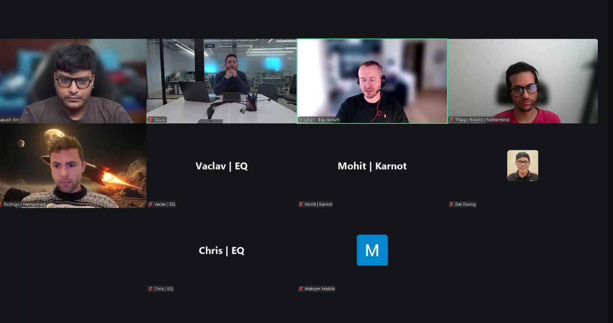
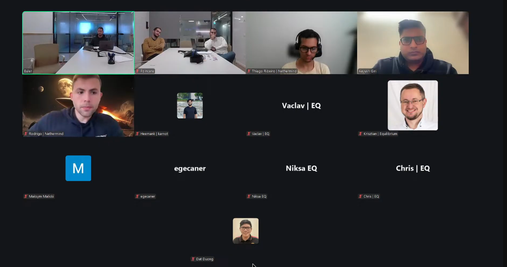
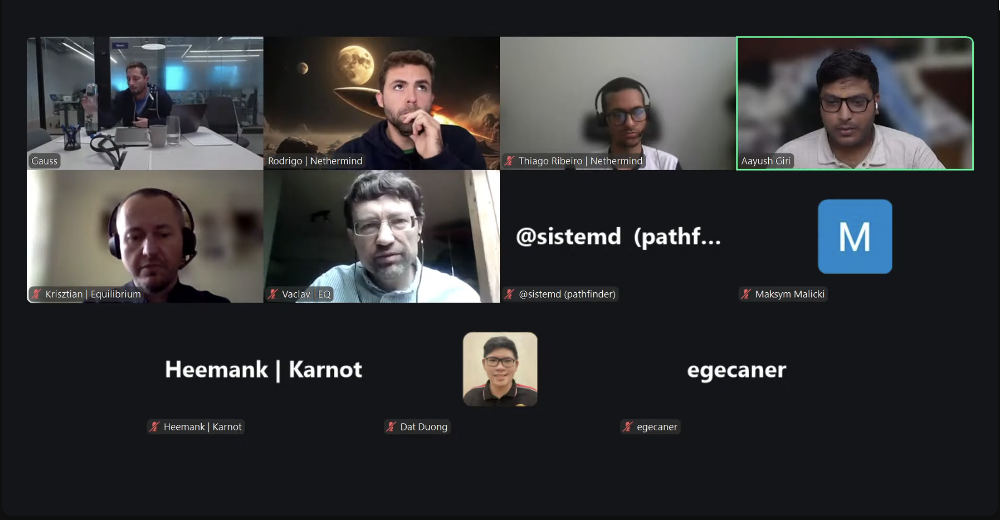

# Starknet Project Management Repository

This repository serves as the central coordination hub for [Starknet](https://www.starknet.io/) protocol development. It provides comprehensive documentation of Starknet All Core Devs meetings, technical discussions, and protocol evolution decisions. Meeting agendas are tracked in the [Issues](https://github.com/starknet-io/pm/issues) tab of this repository, enabling transparent and collaborative planning across the Starknet ecosystem.

## Quick Links

- [Meeting Schedule & Agendas](https://github.com/starknet-io/pm/issues)
- [Latest Meeting Notes](AllCoreDevs-Full-Nodes-Meetings/call_039.md)
- [Video Recordings](https://www.youtube.com/@starknet_foundation/playlists)
- [Starknet Forum](https://community.starknet.io/)

## Latest Topics Under Discussion

Recent calls have focused on:

- **v0.14.1 Protocol Upgrade** - Blake2 hash function replacing Poseidon, RPC 1.0 implementation, potential deployment delays due to starknet.rs SDK ownership transfer
- **Network Stability & Performance** - Post-v0.14.0 stability improvements, Aerospike dependency elimination, committer resilience, L1 handler transaction optimization
- **Client Implementation Progress** - Pathfinder v0.14.1 integration, Juno syncing optimizations for 6-second blocks, Madara snap sync 5x performance improvements
- **RPC Specification Evolution** - JSON-RPC 1.0 adoption, Blake2 hash precomputation strategies, state diff handling for migrated classes
- **Consensus Development** - Malachite v0.6 release coordination, Pathfinder consensus implementation, interoperability testing
- **State Management** - Class hash trie handling, preconfirmed state execution, global state root calculations

## Recent Meetings

<table>
  <tr>
    <td align="center">
      <b>Call #44</b> 
      Jan 29, 2026 
      
    </td>
    <td align="center">
      <b>Call #43</b> 
      Jan 15, 2026 
      
    </td>
    <td align="center">
      <b>Call #42</b> 
      Dec 18, 2025 
      
    </td>
  </tr>
</table>

## Starknet All Core Devs Meetings Overview
### Purpose
Starknet All Core Devs is a regular meeting held by the Starknet development community to discuss technical issues and coordinate work on the Starknet protocol. The meetings are attended by core contributors from various organizations. During the call, participants discuss potential protocol changes, testing and other related issues. The calls primarily focus on Starknet client implementations, RPC specifications, networking layer, versioning, and more recently, consensus-related topics.

The calls are streamed and saved on the [Starknet YouTube channel](https://www.youtube.com/@starknet_foundation/playlists).

### Agendas
The agendas for calls are tracked in the [Issues](https://github.com/starknet-io/pm/issues) tab of this repository. To add an item to an agenda, simply add a comment to one of the agenda issues.

Anyone is welcome to add an item to the agenda as long as it follows these guidelines:

- The topic is technical in nature.
- The topic involves the Starknet protocol at a low-level. This means Starknet applications are generally not allowed as topics, unless their mention relates to protocol changes.
- The topic should not be philosophical. The core developer meetings are not meant to decide philosophical contentious issues that should be decided by the community. There are exceptions to this, but generally these topics distract from more productive technical discussions. [Starknet Forum](https://community.starknet.io/) is a better venue for such discussions.

### Who Can Attend
Protocol developers, client developers, researchers and [SNIP](https://github.com/starknet-io/SNIPs) authors are encouraged to attend the meetings. If you feel you would contribute to the meetings by your attendance, please reach out to [Aayush Giri](mailto:aayush@nethermind.io) or [Leonardo Lerer](mailto:leo@starkware.co).

### Who Manages the Meetings
Agenda preparation, call moderation, and repository management are handled by [Aayush Giri](https://github.com/Giri-Aayush) from Nethermind. The agenda is open to community input - anyone can propose topics by commenting on the meeting issues or requesting inclusion in upcoming calls. Contact [Aayush](mailto:aayush@nethermind.io) with questions or to suggest agenda items.

The meetings are facilitated with support from the Starknet Foundation (SNF) and are broadcast on SNF channels, reflecting the collaborative nature of the Starknet ecosystem.

### Participating Organizations

Core contributors include teams from:

- **[Starkware](https://starkware.co/)** - Protocol development and sequencer coordination
- **[Nethermind](https://www.nethermind.io/)** - Juno client implementation
- **[Equilibrium](https://equilibrium.co/)** - Pathfinder client implementation
- **[Karnot](https://karnot.xyz/)** - Madara client implementation and SNOS development
- **[Informal Systems](https://informal.systems/)** - Malachite consensus engine
- **Independent Researchers** - Protocol research and SNIP development

### How to Contribute

1. **Propose Agenda Items** - Add comments to upcoming meeting issues to suggest discussion topics
2. **Join Meetings** - Protocol developers, client developers, and researchers are encouraged to attend. Contact [Aayush Giri](mailto:aayush@nethermind.io) for calendar invites
3. **Review Meeting Notes** - Provide technical feedback and corrections via GitHub issues
4. **Participate in Technical Discussions** - Join the conversation in Slack channels and the [Starknet Forum](https://community.starknet.io/)
5. **Contribute to SNIPs** - Propose protocol improvements through the [SNIP process](https://github.com/starknet-io/SNIPs)

### Previous AllCoreDevs Meetings

**Note:** Comprehensive meeting notes are published within 3 business days following each call.

Full Node Calls

| № | Date | Agenda | Notes | Recording |
| --- | ------ | ----- | ----- | ----- |
| 39 | Thursday, November 6, 2025, 12:00-12:30 PM UTC | [agenda](https://github.com/starknet-io/pm/issues/29) | [notes](https://github.com/starknet-io/pm/blob/main/AllCoreDevs-Full-Nodes-Meetings/call_039.md) | [video](https://www.youtube.com/live/UtKwgM8DV4U) |
| 38 | Thursday, October 23, 2025, 11:00-11:30 AM UTC | [agenda](https://github.com/starknet-io/pm/issues/28) | [notes](https://github.com/starknet-io/pm/blob/main/AllCoreDevs-Full-Nodes-Meetings/call_038.md) | [video](https://www.youtube.com/live/BjRMtKVP5Sw) |
| 37 | Thursday, October 9, 2025, 11:00-11:30 AM UTC | [agenda](https://github.com/starknet-io/pm/issues/27) | [notes](https://github.com/starknet-io/pm/blob/main/AllCoreDevs-Full-Nodes-Meetings/call_037.md) | [video](https://www.youtube.com/live/ioXc1xvrAWs) |
| 36 | Thursday, September 25, 2025, 11:00-11:30 AM UTC | [agenda](https://github.com/starknet-io/pm/issues/26) | [notes](https://github.com/starknet-io/pm/blob/main/AllCoreDevs-Full-Nodes-Meetings/call_036.md) | [video](https://www.youtube.com/live/9WLahsTnfsc) |
| 35 | Thursday, September 11, 2025, 11:00-11:30 AM UTC | [agenda](https://github.com/starknet-io/pm/issues/25) | [notes](https://github.com/starknet-io/pm/blob/main/AllCoreDevs-Full-Nodes-Meetings/call_035.md) | [video](https://www.youtube.com/live/6rrlUwF_5bU) |
| 34 | Thursday, August 28, 2025, 11:00-11:30 AM UTC | [agenda](https://github.com/starknet-io/pm/issues/24) | [notes](https://github.com/starknet-io/pm/blob/main/AllCoreDevs-Full-Nodes-Meetings/call_034.md) | [video](https://www.youtube.com/watch?v=o3vvBnQNJOU&list=PLMXIoXErTTYW7_3FjybBzJXhfZwvSchPa&index=1) |
| 33 | Thursday, August 14, 2025, 11:00-11:30 AM UTC | [agenda](https://github.com/starknet-io/pm/issues/23) | [notes](https://github.com/starknet-io/pm/blob/main/AllCoreDevs-Full-Nodes-Meetings/call_033.md) | [video](https://www.youtube.com/live/bhly4N1B1GQ) |
| 32 | Thursday, July 31, 2025, 11:00-11:30 AM UTC | [agenda](https://github.com/starknet-io/pm/issues/22) | [notes](https://github.com/starknet-io/pm/blob/main/AllCoreDevs-Full-Nodes-Meetings/call_032.md) | [video](https://www.youtube.com/live/XSCYZUVZ-d0) |
| 31 | Thursday, July 17, 2025, 11:00-11:30 AM UTC | [agenda](https://github.com/starknet-io/pm/issues/21) | [notes](https://github.com/starknet-io/pm/blob/main/AllCoreDevs-Full-Nodes-Meetings/call_031.md) | [video](https://www.youtube.com/live/7askHSXeP3s) |
| 30 | Thursday, July 3, 2025, 11:00-11:30 AM UTC | [agenda](https://github.com/starknet-io/pm/issues/20) | [notes](https://github.com/starknet-io/pm/blob/main/AllCoreDevs-Full-Nodes-Meetings/call_030.md) | [video](https://www.youtube.com/live/DDiBTVZeZAk) |
| 29 | Thursday, June 19, 2025, 11:00-11:30 AM UTC | [agenda](https://github.com/starknet-io/pm/issues/19) | [notes](https://github.com/starknet-io/pm/blob/main/AllCoreDevs-Full-Nodes-Meetings/call_029.md) | [video](https://www.youtube.com/live/vcX2UO9zWyk) |
| 28 | Thursday, June 5, 2025, 11:00-11:30 AM UTC | [agenda](https://github.com/starknet-io/pm/issues/18) | [notes](https://github.com/starknet-io/pm/blob/main/AllCoreDevs-Full-Nodes-Meetings/call_028.md) | [video](https://www.youtube.com/live/EEqyonZXIm4) |
| 27 | Thursday, May 22, 2025, 11:00-11:30 AM UTC | [agenda](https://github.com/starknet-io/pm/issues/17) | [notes](https://github.com/starknet-io/pm/blob/main/AllCoreDevs-Full-Nodes-Meetings/call_027.md) | [video](https://www.youtube.com/live/RfY-W62jQxw) |
| 26 | Thursday, May 8, 2025, 11:00-11:30 AM UTC | [agenda](https://github.com/starknet-io/pm/issues/16) | [notes](https://github.com/starknet-io/pm/blob/main/AllCoreDevs-Full-Nodes-Meetings/call_026.md) | [video](https://www.youtube.com/live/fmdEtDpVFpw) |
| 25 | Thursday, April 24, 2025, 11:00-11:30 AM UTC | [agenda](https://github.com/starknet-io/pm/issues/15) | [notes](https://github.com/starknet-io/pm/blob/main/AllCoreDevs-Full-Nodes-Meetings/call_025.md) | [video](https://www.youtube.com/live/1jTe8vL72II) |
| 24 | Thursday, April 10, 2025, 11:00-11:30 AM UTC | [agenda](https://github.com/starknet-io/pm/issues/14) | [notes](https://github.com/starknet-io/pm/blob/main/AllCoreDevs-Full-Nodes-Meetings/call_024.md) | [video](https://www.youtube.com/live/FajAn70HHRA) |
| 23 | Thursday, March 27, 2025, 11:00-11:30 AM UTC | [agenda](https://github.com/starknet-io/pm/issues/13) | [notes](https://github.com/starknet-io/pm/blob/main/AllCoreDevs-Full-Nodes-Meetings/call_023.md) | [video](https://www.youtube.com/watch?v=Z_-3LktkmCY&list=PLMXIoXErTTYW7_3FjybBzJXhfZwvSchPa&index=7) |
| 22 | Thursday, March 13, 2025, 11:00-11:30 AM UTC | [agenda](https://github.com/starknet-io/pm/issues/12) | [notes](https://github.com/starknet-io/pm/blob/main/AllCoreDevs-Full-Nodes-Meetings/call_022.md) | [Part 1](https://www.youtube.com/watch?v=fCIikziOhDg&list=PLMXIoXErTTYW7_3FjybBzJXhfZwvSchPa&index=9) [Part 2](https://www.youtube.com/watch?v=D-RrtbUL87s&list=PLMXIoXErTTYW7_3FjybBzJXhfZwvSchPa&index=8) |
| 21 | Thursday, February 27, 2025, 12:00-12:30 PM UTC | [agenda](https://github.com/starknet-io/pm/issues/11) | [notes](https://github.com/starknet-io/pm/blob/main/AllCoreDevs-Full-Nodes-Meetings/call_021.md) | [video](https://www.youtube.com/watch?v=x84vu_AJlkM&list=PLMXIoXErTTYW7_3FjybBzJXhfZwvSchPa&index=10) |
| 20 | Thursday, February 13, 2025, 12:00-12:30 PM UTC | [agenda](https://github.com/starknet-io/pm/issues/10) | [notes](https://github.com/starknet-io/pm/blob/main/AllCoreDevs-Full-Nodes-Meetings/call_020.md) | [video](https://www.youtube.com/watch?v=QHUOB6oHoJo&list=PLMXIoXErTTYW7_3FjybBzJXhfZwvSchPa&index=11) |
| 19 | Thursday, January 30, 2025, 12:00-12:30 PM UTC | [agenda](https://github.com/starknet-io/pm/issues/9) | [notes](https://github.com/starknet-io/pm/blob/main/AllCoreDevs-Full-Nodes-Meetings/call_019.md) | [video](https://www.youtube.com/watch?v=JQoMZTtZbJU&list=PLMXIoXErTTYW7_3FjybBzJXhfZwvSchPa&index=12) |
| 18 | Thursday, January 16, 2025, 12:00-12:30 PM UTC | [agenda](https://github.com/starknet-io/pm/issues/8) | [notes](https://github.com/starknet-io/pm/blob/main/AllCoreDevs-Full-Nodes-Meetings/call_018.md) | [video](https://www.youtube.com/watch?v=93t37QP8DME&list=PLMXIoXErTTYW7_3FjybBzJXhfZwvSchPa&index=13) |
| 17 | Thursday, December 19, 2024, 12:00-12:30 PM UTC | [agenda](https://github.com/starknet-io/pm/issues/7) | [notes](https://github.com/starknet-io/pm/blob/main/AllCoreDevs-Full-Nodes-Meetings/call_017.md) | [video](https://www.youtube.com/watch?v=TOFQG5ic8UA&list=PLMXIoXErTTYW7_3FjybBzJXhfZwvSchPa&index=1) |
| 16 | Thursday, December 5, 2024, 12:00-12:30 PM UTC | [agenda](https://github.com/starknet-io/pm/issues/6) | [notes](https://github.com/starknet-io/pm/blob/main/AllCoreDevs-Full-Nodes-Meetings/call_016.md) | [video](https://www.youtube.com/watch?v=-HWTvHMBQIQ&list=PLMXIoXErTTYW7_3FjybBzJXhfZwvSchPa&index=2&t=1298s) |
| 15 | Thursday, November 21, 2024, 12:00-12:30 PM UTC | [agenda](https://github.com/starknet-io/pm/issues/5) | [notes](https://github.com/starknet-io/pm/blob/main/AllCoreDevs-Full-Nodes-Meetings/call_015.md) | [video](https://www.youtube.com/watch?v=QeSYeCxswfo&list=PLMXIoXErTTYW7_3FjybBzJXhfZwvSchPa) |
| 14 | Thursday, November 7, 2024, 12:00-12:30 PM UTC | [agenda](https://github.com/starknet-io/pm/issues/3) | [notes](https://github.com/starknet-io/pm/blob/main/AllCoreDevs-Full-Nodes-Meetings/call_014.md) | [video](https://www.youtube.com/watch?v=6W8C9XzqKAw&list=PLMXIoXErTTYW7_3FjybBzJXhfZwvSchPa) |
| 13 | Thursday, October 24, 2024, 11:00-11:30 AM UTC | [agenda](https://github.com/starknet-io/pm/issues/2) | [notes](https://github.com/starknet-io/pm/blob/main/AllCoreDevs-Full-Nodes-Meetings/call_013.md) | [video](https://www.youtube.com/watch?v=qhKjI9v4SjA) |
| 12 | Thursday, October 10, 2024, 11:00-11:30 AM UTC | [agenda](https://github.com/starknet-io/pm/issues/1) | [notes](https://github.com/starknet-io/pm/blob/main/AllCoreDevs-Full-Nodes-Meetings/call_012.md) | [video](https://www.youtube.com/watch?v=vvHvVMeUgRw) |

---

## About Starknet

Starknet is a permissionless decentralized Validity-Rollup (often referred to as a "ZK-Rollup") that operates as an Ethereum Layer 2 network and Bitcoin DeFi layer. It enables decentralized applications to achieve massive scalability using STARK proofs (Scalable Transparent ARgument of Knowledge) to bundle transactions off-chain before submitting them to Ethereum as a single transaction.

As of November 2025, Starknet has launched institutional Bitcoin staking. The team is working toward becoming Bitcoin's execution layer, enabling complex DeFi applications for Bitcoin holders while maintaining Ethereum's security guarantees.

**Learn More:**

---

**License:** This repository is licensed under [GPL-3.0](LICENSE).

